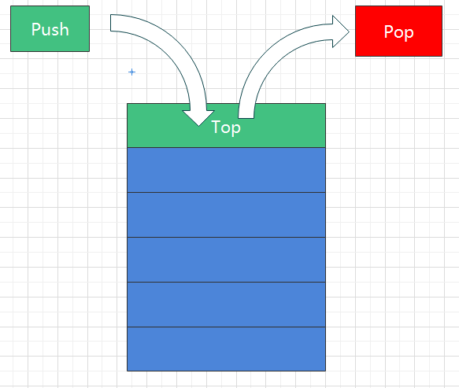

<blockquote style='padding: 10px; font-size: 1em; margin: 1em 0px; color: rgb(0, 0, 0); border-left: 5px solid rgba(0,189,170,1); background: rgb(239, 235, 233);line-height:1.5;'>
 
前文中我们简单提到了空间复杂度和时间复杂度的概念，接下来我们深入数据结构-“栈”
    
</blockquote>

# 一、栈的概念



<blockquote style='padding: 10px; font-size: 1em; margin: 1em 0px; color: rgb(0, 0, 0); border-left: 5px solid rgba(0,189,170,1); background: rgb(239, 235, 233);line-height:1.5;'>
 
栈是一种遵从后进先出（Last-In-First-Out）原则的有序集合。<br />

如上图，我们可以将元素PUSH(推)进栈中，这时这个元素就在栈的顶端，我们也可以将元素POP(弹)出栈。<br />

例子：超市货架上摞着10公斤的米。<br />

进栈：超市进米时，将米一袋一袋的叠上去，这就是压栈，也就是我们说的PUSH(推)进栈。压在最底下的那一袋米，一定是最先进栈的。<br />

出栈：顾客取米时，将米一袋一袋的拿走，这就是弹栈，也就是我们说的POP出栈。在最上面的那包米，处于栈的最顶层，一定是最先出栈的。
    
</blockquote>

# 二、JS模拟栈结构

<blockquote style='padding: 10px; font-size: 1em; margin: 1em 0px; color: rgb(0, 0, 0); border-left: 5px solid rgba(0,189,170,1); background: rgb(239, 235, 233);line-height:1.5;'>
 
前文我们提到了栈的概念，但是在Javascript中，是没有栈这种数据结构的，但是我们可以很轻松的通过JS来模拟栈这种数据结构。<br />

我们可以先模拟栈的一些方法，属性，并尝试完善它。<br />

<ul>
    <li>push(element)：添加一个或者多个元素到栈顶</li>
    <li>pop()：移除栈顶的元素，同时返回该元素</li>
    <li>peek()：查看栈顶的元素</li>
    <li>isEmpty()：判断栈是否空了，是则返回 true，否则返回 false</li>
    <li>clear()：清除栈中的所有元素</li>
    <li>size：返回栈里的元素个数，方法和 length 类似</li>
</ul>
    
</blockquote>

```js
function Stack(){
    let items=[];
    this.push=function(element){
        items.push(element);
    };
    this.pop=function(){
        return items.pop();
    }
    this.peek=function(){
        return items[items.length-1]
    }
    this.isEmpty=function(){ 
        return items.length===0; 
    }
    this.clear=function(){
        items.length=0;
    }
    this.size=function(){
        return items.length;
    }
}
```

# 三、前端相关的栈事例

## 1.十进制转二进制


<blockquote style='padding: 10px; font-size: 1em; margin: 1em 0px; color: rgb(0, 0, 0); border-left: 5px solid rgba(0,189,170,1); background: rgb(239, 235, 233);line-height:1.5;'>
 
小伙伴们还记得十进制转二进制的方法吗？大概逻辑是将一个数每次取余2，先将余数记录下来，再将每次除于2的值（向下取整，舍弃小数部位）当作下一次取余的除数，循环往复直到这个值为0，然后将记录下来的余数从下往上依次排列出来即为二进制的数值。明明是最先得出的余数反而是放在最后，而后得的余数放在了前面，这是不是很符合栈的<i>“后进先出”</i>的理念呢？
    
</blockquote>

<blockquote style='padding: 10px; font-size: 1em; margin: 1em 0px; color: rgb(0, 0, 0); border-left: 5px solid rgba(247, 31, 85,1); background: rgb(239, 235, 233);line-height:1.5;'>
    1.c/b，读作c除以b，或者b除c,其中c叫做被除数，b叫做除数，运算的结果叫做商。<br >
    2.c%b，读作c模上b，其中值为余数。
</blockquote>

<ul>
    <li>十进制35转为二进制</li> 
</ul>

```js
35 % 2 = 1   |   35 / 2 = 17
17 % 2 = 1   |   17 / 2 = 8
8 % 2 = 0    |   8 / 2 = 4
4 % 2 = 0    |   4 / 2 = 2
2 % 2 = 0    |   2 / 2 = 1
1 % 2 = 1    |   1 / 2 = 0
```
 
由上可以得出35的二进制为100011。

<blockquote style='padding: 10px; font-size: 1em; margin: 1em 0px; color: rgb(0, 0, 0); border-left: 5px solid rgba(0,189,170,1); background: rgb(239, 235, 233);line-height:1.5;'>
我们可以用栈结构的思想重构一下转化思路：<br />
1.已知十进制的值为n。<br />
2.将n模上2，将得出的余数放入栈最底部。<br />
3.将n除以2，将得出的商作为下一次循环的除数。（向下取整，舍弃小数部位）<br />
4.循环步骤 2 和步骤 3，直至 n 等于 0 为止。<br />
5.将栈的值从栈顶到栈底部依次取出来，得出最终运算结果。
</blockquote>

然后我们并不难得出Js版十进制转二进制的代码：

```js
function decimalToBinary(n){
    let stack=[];
    while(n!==0){
        stack.push(n%2);
        n=Math.floor(n/2);
    }
    return stack.reverse().join("");
}
```

## 2.十进制转十六进制内任意进制

<blockquote style='padding: 10px; font-size: 1em; margin: 1em 0px; color: rgb(0, 0, 0); border-left: 5px solid rgba(0,189,170,1); background: rgb(239, 235, 233);line-height:1.5;'>
从上文中十进制转二进制中我们可以看出二进制就是除数为2，那么十进制转十六进制内任意进制就是将除数变为对应进制，如二进制除数就是2，8进制除数就是8，那么十六进制初始就是16。
</blockquote>

<blockquote style='padding: 10px; font-size: 1em; margin: 1em 0px; color: rgb(0, 0, 0); border-left: 5px solid rgba(247, 31, 85,1); background: rgb(239, 235, 233);line-height:1.5;'>
这里有一点需要注意的是：电脑中的十六进制数，由十个数字(0、1、2、3、4、5、6、7、8、9)和六个英文字母(A、B、C、D、E、F)表示，其分别代表10、11、12、13、14、15，最大不会大于等于16。
</blockquote>

然后我们就很容易得出Js版十进制转十六进制内任意进制的代码：

```js
function decimalToAnybase(n,binary){
    const stack=[];
    const digits = '0123456789ABCDEF';
    while(n!==0){
        stack.push(digits[n%binary]);
        n=Math.floor(n/binary);
    } 
    return stack.reverse().join("");
}
```

## 3.函数调用堆栈

```js
function greeting(){
    console.log("greetring starting...");
    sayHi()
    console.log("greetring ending...")
}

function sayHi(){
    console.log("sayHi...")
}

greeting();

console.log("ending....")
```
<blockquote style='padding: 10px; font-size: 1em; margin: 1em 0px; color: rgb(0, 0, 0); border-left: 5px solid rgba(0,189,170,1); background: rgb(239, 235, 233);line-height:1.5;'>
上面这段代码执行出来console的打印顺序是：greeting starting->sayHi->greeting ending->ending...。我们不难发现，最后调用的函数，一定是最先执行完，比如我们这里的sayHi是最后执行的，但是他确实最先执行完的，是不是很符合栈中的<i>“后进先出”</i>的理念呢？JS解释器使用栈来控制函数的调用顺序。
</blockquote>

# 四、Leetcode刷题时间

<blockquote style='padding: 10px; font-size: 1em; margin: 1em 0px; color: rgb(0, 0, 0); border-left: 5px solid rgba(0,189,170,1); background: rgb(239, 235, 233);line-height:1.5;'>
其实前文铺垫了那么多，我还是想刷题，小伙伴们，让我们一起刷起来吧！Go!Go!Go!
</blockquote>

## 一、简单难度

### 1.LeetCode第20题-有效的括号

<blockquote style='padding: 10px; font-size: 1em; margin: 1em 0px; color: rgb(0, 0, 0); border-left: 5px solid rgba(0,189,170,1); background: rgb(239, 235, 233);line-height:1.5;'>

这道题是很多学算法的第一道题，因为很多编辑器都使用到了这个算法，算是一个基础了。<br />

题目描述：给定一个只包括 '('，')'，'{'，'}'，'['，']' 的字符串，判断字符串是否有效。且有效字符串需满足：1.左括号必须使用相同类型的右括号闭合。2.左括号必须以正确的顺序闭合。注意字符串可被认为是有效字符串。
</blockquote>

其实有时候题目读起来是晦涩难懂的，这个时候我们可以结合给出的测试用例来结合分析题目的意思往往能更读得懂题目。我们来看一下给出的例子：

* 实例1:
```js
输入:"()"
输出:true

结合题目发现确实满足有效字符串的条件，故肯定返回true。
```

* 实例2:
```js
输入:"()[]{}"
输出:true

结合题目发现确实满足有效字符串的条件，故肯定返回true。
```

* 实例3:
```js
输入:"(]",
输出:false

结合题目我们发现并不满足第一个条件，左括号必须使用相同类型的右括号。在这里，左括号是"("，而右括号是"]",故肯定返回false。
```

* 实例4:

```js
输入:"([)]"
输出: false

结合题目我们发现并不满足第二个条件，左括号必须按照正确的顺序闭合。在这里正确是顺序应该是"([])",故肯定返回false。
```

* 实例5:

```js
输入: "{[]}"
输出: true

结合题目发现确实满足有效字符串的条件，故肯定返回true。      
```

<blockquote style='padding: 10px; font-size: 1em; margin: 1em 0px; color: rgb(0, 0, 0); border-left: 5px solid rgba(0,189,170,1); background: rgb(239, 235, 233);line-height:1.5;'>
我们注意仔细观察，在所有的有效的括号中，一定满足这样的一个条件：对于没有闭合的左括号而言，越靠后的左括号，对应的右括号越靠前。比如"([[]])"这个有效括号字符串。这一前一后是否让你想到了栈这个数据结构呢？（哈哈哈，其实我没想到，老师说能想到就想到把，相信我们以后题目做多了就会自然而然的想到）
</blockquote>

<blockquote style='padding: 10px; font-size: 1em; margin: 1em 0px; color: rgb(0, 0, 0); border-left: 5px solid rgba(0,189,170,1); background: rgb(239, 235, 233);line-height:1.5;'>
<h5>解题思路一：</h5>

1.用栈来存储最终返回的字符串。<br />
2.从左向右扫描字符串，如果遇到了左括号，就推进栈中，如果遇到右括号，就判断是否与栈顶元素相同，如果相同就将栈顶元素弹出栈，如果不相同直接返回false。<br />
3.最后判断栈是否为空，如果是空的，即为合法的字符串，如果非空，即不合法。

</blockquote>

通过这个思路，我们不难得出相对应的代码：

```js
function isValid(s){
    //如果是奇数直接返回false
    if(s.length % 2!==0) return false;
    let stack=[];
    for(let char of s){
        if(char==="("||char==="["||char==="{"){
            stack.push(char);
        }else{
            if(
                char===")"&&stack[stack.length-1]==="("||
                char==="]"&&stack[stack.length-1]==="["||
                char==="}"&&stack[stack.length-1]==="{"
            ){
                stack.pop();
            }else{
                return false;
            }
        }
    }
    return stack.length===0;
}
```

<ul>
我们分析下这个函数的时间复杂度

<li>
时间复杂度:已知此处只有一次for循环，且循环s.length次，所以时间复杂度是O(s.length)。
</li> 
</ul>

<blockquote style='padding: 10px; font-size: 1em; margin: 1em 0px; color: rgb(0, 0, 0); border-left: 5px solid rgba(0,189,170,1); background: rgb(239, 235, 233);line-height:1.5;'>
<h5>解题思路二：</h5>

使用正则不断地把 () {} [] 替换成空字符，直到s 变成了空字符，那么结果就是 true，否则为false;

</blockquote>

```js
const isValid = function (s) {
    const reg=/\[\]|\{\}|\(\)/;
    while(reg.test(s)){
        s=s.replace(reg,"");
    }
    return s.length===0;
} 
```
<ul>
我们分析下这个函数的时间复杂度

<li>
时间复杂度:在极端情况下，假设每次只有一对括号被移除，所以时间复杂度是O(???)
</li> 
</ul> 

### 2.LeetCode第1021题-删除最外层的括号

<blockquote style='padding: 10px; font-size: 1em; margin: 1em 0px; color: rgb(0, 0, 0); border-left: 5px solid rgba(0,189,170,1); background: rgb(239, 235, 233);line-height:1.5;'>

其实和上面的有效括号很像，毕竟有括号嘛，哈哈哈哈。<br />

题目描述：有效括号字符串为空 ("")、"(" + A + ")" 或 A + B，其中 A 和 B 都是有效的括号字符串，+ 代表字符串的连接。例如，""，"()"，"(())()" 和 "(()(()))" 都是有效的括号字符串。如果有效字符串 S 非空，且不存在将其拆分为 S = A+B 的方法，我们称其为原语（primitive），其中 A 和 B 都是非空有效括号字符串。给出一个非空有效字符串 S，考虑将其进行原语化分解，使得：S = P_1 + P_2 + ... + P_k，其中 P_i 是有效括号字符串原语。对 S 进行原语化分解，删除分解中每个原语字符串的最外层括号，返回 S 。
</blockquote>

说实话，我看这个题目看了好一会都不懂什么意思，什么原句原句的，这不瞎扯淡嘛！我们还是直接看例子吧！

* 实例1

```js
输入："(()())(())"
输出："()()()"

解释：
输入字符串为 "(()())(())"，原语化分解得到 "(()())" + "(())"，
删除每个部分中的最外层括号后得到 "()()" + "()" = "()()()"。 
```

* 实例2

```js
输入："(()())(())(()(()))"
输出："()()()()(())"
解释：
输入字符串为 "(()())(())(()(()))"，原语化分解得到 "(()())" + "(())" + "(()(()))"，
删除每个部分中的最外层括号后得到 "()()" + "()" + "()(())" = "()()()()(())"。 
```

* 实例3

```js
输入："()()"
输出：""
解释：
输入字符串为 "()()"，原语化分解得到 "()" + "()"，
删除每个部分中的最外层括号后得到 "" + "" = ""。 
```

好家伙，一看解释就全明白了，就是得到一个个完整闭合有效括号字符串然后去掉外层括号拼接起来。

<blockquote style='padding: 10px; font-size: 1em; margin: 1em 0px; color: rgb(0, 0, 0); border-left: 5px solid rgba(0,189,170,1); background: rgb(239, 235, 233);line-height:1.5;'>
我们仔细想一下，如何得到完整的闭合有效括号字符串呢？这和我们上一题是不是一样的，可以新建一个临时栈，然后将每次出栈时刻栈长度为0，也就是一个完整的有效闭合字符串保存起来将前面的字符串保存起来，然后再删除第一个括号和第二个括号，拼接起来。
</blockquote>


<blockquote style='padding: 10px; font-size: 1em; margin: 1em 0px; color: rgb(0, 0, 0); border-left: 5px solid rgba(247, 31, 85,1); background: rgb(239, 235, 233);line-height:1.5;'> 
这里我们无需考虑各种情况，因为题目中已经明确了是有效字符串且都是"("")"，且"("一定是在前面的。
</blockquote>

<blockquote style='padding: 10px; font-size: 1em; margin: 1em 0px; color: rgb(0, 0, 0); border-left: 5px solid rgba(0,189,170,1); background: rgb(239, 235, 233);line-height:1.5;'>
<h5>解题思路一：</h5>
1.首先新建一个存储临时栈方便我们检测出入栈的时机、一个保存一个个完整括号字符串的数组方便我们进行后续操作、一个记录临时下标的变量方便我们截取对应的字符串。<br />
2.如果遇到左括号就进栈，遇到右括号就出栈，在栈为空时记录下此时的下标，并截取字符串存放到一个数组中。<br />
3.遍历存储截取字符串的数组，删去第一个字符和最后一个字符并拼接。
</blockquote>

通过这个思路，我们不难得出相对应的代码：

```js
var removeOuterParentheses=function(s){
    //临时栈
    let tempStack=[];
    //记录下标
    let lastIndex=0;
    //记录后值
    let res=[];

    for(let i=0;i<s.length;i++){
        let char=s[i];
        if(char==="("){
            tempStack.push(char);
        }else{
            tempStack.pop();
            if(!tempStack.length){
                res.push(s.substring(lastIndex+1,i));
                lastIndex=i+1;
            }
        }
    }
    return res.join("")
}

```
<ul>
我们分析下这个函数的时间复杂度和空间复杂度

<li>
时间复杂度：全文中只有一个for循环，所以时间复杂度为O(s.length)
</li> 

</ul>

<blockquote style='padding: 10px; font-size: 1em; margin: 1em 0px; color: rgb(0, 0, 0); border-left: 5px solid rgba(0,189,170,1); background: rgb(239, 235, 233);line-height:1.5;'>
<h5>解题思路二：</h5> 
1.因为我们这里是有效字符串，所以正常出入栈就可以。<br />
2.当栈为空时，此时的item和需要pop的item正好是需要切去的外层括号.<br />
</blockquote>

通过这个思路，我们不难得出相对应的代码：

```js
var removeOuterParentheses=function(s){
    let res="";
    let stack=[];
    for(let char of s){

        if(char===")"){
            stack.pop();
        }

        if(stack.length!==0){
            res+=char;
        }

        if(char==="("){
            stack.push(char);
        }
    }
    return res;
}
```
<ul>
我们分析下这个函数的时间复杂度和空间复杂度

<li>
时间复杂度：全文中只有一个for循环，所以时间复杂度为O(s.length)
</li> 
</ul>

<blockquote style='padding: 10px; font-size: 1em; margin: 1em 0px; color: rgb(0, 0, 0); border-left: 5px solid rgba(0,189,170,1); background: rgb(239, 235, 233);line-height:1.5;'>
<h5>解题思路三：</h5> 
第一个“(”,跟最后一个“)”不写入，当有“(”写入是变量opened加1，当遇到“)”时变量减一。
</blockquote>

<blockquote style='padding: 10px; font-size: 1em; margin: 1em 0px; color: rgb(0, 0, 0); border-left: 5px solid rgba(247, 31, 85,1); background: rgb(239, 235, 233);line-height:1.5;'> 
这一题和上一题的思路其实是一样的，只不过没有使用数组，而是使用opened代替数组的长度。
</blockquote>

```js
var removeOuterParentheses = function(S) {
  let res = '';
  let opened = 0;
  for(let c of S) {
    if(c === '(' && opened ++ > 0) res += c;
    if(c === ')' && opened -- > 1) res += c;
  }

  return res;
}; 
```
<ul>
我们分析下这个函数的时间复杂度和空间复杂度

<li>
时间复杂度：全文中只有一个for循环，所以时间复杂度为O(s.length)
</li> 

</ul>

### 3.LeetCode第1047题-删除字符串中的所有相邻重复项

<blockquote style='padding: 10px; font-size: 1em; margin: 1em 0px; color: rgb(0, 0, 0); border-left: 5px solid rgba(0,189,170,1); background: rgb(239, 235, 233);line-height:1.5;'>
题目描述：给出由小写字母组成的字符串 S，重复项删除操作会选择两个相邻且相同的字母，并删除它们。在 S 上反复执行重复项删除操作，直到无法继续删除。在完成所有重复项删除操作后返回最终的字符串。答案保证唯一。 
</blockquote>

好家伙，不知道是不是因为有那感觉了，这题目直抒胸臆，感觉比前面那2道题要简单不少

* 实例1:

```js
输入："abbaca"
输出："ca"
解释：
例如，在 "abbaca" 中，我们可以删除 "bb" 由于两字母相邻且相同，这是此时唯一可以执行删除操作的重复项。之后我们得到字符串 "aaca"，其中又只有 "aa" 可以执行重复项删除操作，所以最后的字符串为 "ca"。 
```

<blockquote style='padding: 10px; font-size: 1em; margin: 1em 0px; color: rgb(0, 0, 0); border-left: 5px solid rgba(0,189,170,1); background: rgb(239, 235, 233);line-height:1.5;'>
我们仔细想一下，是不是和前2题有异曲同工之意？将相邻的字母删除是否就相当于前文中的左括号和右括号，只要在进出栈时将栈弹出即可。
</blockquote>


<blockquote style='padding: 10px; font-size: 1em; margin: 1em 0px; color: rgb(0, 0, 0); border-left: 5px solid rgba(0,189,170,1); background: rgb(239, 235, 233);line-height:1.5;'>
<h5>解题思路一：</h5> 
1.新建一个变量存储值。<br />
2.从左向右扫描字符串，判断是否和栈顶元素也就是最后一个字符相等，如果相等直接弹栈，不相等直接推进栈中。
</blockquote>

通过这个思路，我们不难得出相对应的代码：

```js
var removeDuplicates = function(S) {
    let res="";
    for(let char of S){
        if(char !== res[res.length-1]){
            res+=char;
        }else{
            res=res.substring(0,res.length-1);
        }
    }
    return res;
};
```
<ul>
我们分析下这个函数的时间复杂度和空间复杂度

<li>
时间复杂度：全文中只有一个for循环，所以时间复杂度为O(S.length)
</li> 
</ul>

<blockquote style='padding: 10px; font-size: 1em; margin: 1em 0px; color: rgb(0, 0, 0); border-left: 5px solid rgba(0,189,170,1); background: rgb(239, 235, 233);line-height:1.5;'>
<h5>解题思路二：</h5>  

1.新建一个匹配2个相等的正则。<br />
2.不断将2个相邻的字符串使用正则替换成空字符串，知道不匹配为止。
</blockquote>

通过这个思路，我们不难得出相对应的代码：

```js
var removeDuplicates = function(S) {

    let reg=/([a-z])\1/;
    while(reg.test(S)){
        S=S.replace(reg,"");
    }
    return S;

}
```

<ul>
我们分析下这个函数的时间复杂度和空间复杂度

<li>
时间复杂度：全文中只有一个while循环，所以时间复杂度为O(logN)
</li> 

</ul>

### 4.LeetCode第682题-棒球比赛

<blockquote style='padding: 10px; font-size: 1em; margin: 1em 0px; color: rgb(0, 0, 0); border-left: 5px solid rgba(0,189,170,1); background: rgb(239, 235, 233);line-height:1.5;'>
你现在是一场采特殊赛制棒球比赛的记录员。这场比赛由若干回合组成，过去几回合的得分可能会影响以后几回合的得分。<br />
比赛开始时，记录是空白的。你会得到一个记录操作的字符串列表 ops，其中 ops[i] 是你需要记录的第 i 项操作，ops 遵循下述规则：<br />
<li>整数 x - 表示本回合新获得分数 x</li>
<li>"+" - 表示本回合新获得的得分是前两次得分的总和。题目数据保证记录此操作时前面总是存在两个有效的分数。</li>
<li>"D" - 表示本回合新获得的得分是前一次得分的两倍。题目数据保证记录此操作时前面总是存在一个有效的分数。</li>
<li>"C" - 表示前一次得分无效，将其从记录中移除。题目数据保证记录此操作时前面总是存在一个有效的分数。</li><br />
请你返回记录中所有得分的总和。
</blockquote>

<blockquote style='padding: 10px; font-size: 1em; margin: 1em 0px; color: rgb(0, 0, 0); border-left: 5px solid rgba(0,189,170,1); background: rgb(239, 235, 233);line-height:1.5;'>
我们仔细想一下，就是将具象的操作反映在代码上，其实也很简单，就是按照他的意思来做就可以。
</blockquote>

<blockquote style='padding: 10px; font-size: 1em; margin: 1em 0px; color: rgb(0, 0, 0); border-left: 5px solid rgba(0,189,170,1); background: rgb(239, 235, 233);line-height:1.5;'>
<h5>解题思路一：</h5>   
1.新建一个数组存放每一回合的获得的值。
2.扫描数组进行对应操作。
</blockquote>

通过这个思路，我们不难得出相对应的代码：

```js
var calPoints = function(ops) {
    let stack=[];
    for(let op of ops){
        if(op==="D"){
            stack.push(stack[stack.length-1]*2);
        }else if(op==="C"){
            stack.pop();
        }else if(op==="+"){
            stack.push(stack[stack.length-1]+stack[stack.length-2])
        }else{
            stack.push(Number(op));
        }
    }
    return stack.reduce((total,current)=>{
        return total+current;
    },0)
};
```
<ul>
我们分析下这个函数的时间复杂度和空间复杂度

<li>
时间复杂度：全文中只有一个for循环，所以时间复杂度为O(ops.length)
</li> 

</ul>

### 5.LeetCode第1598题-文件夹操作日志搜集器

<blockquote style='padding: 10px; font-size: 1em; margin: 1em 0px; color: rgb(0, 0, 0); border-left: 5px solid rgba(0,189,170,1); background: rgb(239, 235, 233);line-height:1.5;'>
每当用户执行变更文件夹操作时，LeetCode 文件系统都会保存一条日志记录。<br />
下面给出对变更操作的说明：<br />
<li>"../"：移动到当前文件夹的父文件夹。如果已经在主文件夹下，则 继续停留在当前文件夹 。</li>
<li>"./" - 继续停留在当前文件夹。</li>
<li>"x/" - 移动到名为 x 的子文件夹中。题目数据 保证总是存在文件夹 x 。</li><br />
给你一个字符串列表 logs ，其中 logs[i] 是用户在 ith 步执行的操作。<br />
文件系统启动时位于主文件夹，然后执行 logs 中的操作。<br />
执行完所有变更文件夹操作后，请你找出 返回主文件夹所需的最小步数 。
</blockquote>

<blockquote style='padding: 10px; font-size: 1em; margin: 1em 0px; color: rgb(0, 0, 0); border-left: 5px solid rgba(0,189,170,1); background: rgb(239, 235, 233);line-height:1.5;'>
我们仔细看一下题目，这类似于一个树形结构，主文件夹相当于根结点。当"../"操作时，将返回上一个文件夹，如果已经存在主文件夹下了，则继续停留在文件夹。当 "./"时，其实并没有任何改变。当"x/"时，会移动到下一个层级。
</blockquote>

<blockquote style='padding: 10px; font-size: 1em; margin: 1em 0px; color: rgb(0, 0, 0); border-left: 5px solid rgba(0,189,170,1); background: rgb(239, 235, 233);line-height:1.5;'>
<h5>解题思路一：</h5>   
1.新建一个变量记录当前的层级。</br >
2.操作结束层级就可以代表返回主文件夹所需的最小步数。
</blockquote>

通过这个思路，我们不难得出相对应的代码：

```js
var minOperations = function(logs) {
    let level=0;//默认在主文件夹下
    for(let log of logs){
        if(log==="../"){
            if(level === 0) continue;
            level--;
        }else if(!(/\./).test(log)){
            level++;
        }
    }
    return level;
};
```

<ul>
我们分析下这个函数的时间复杂度和空间复杂度

<li>
时间复杂度：全文中只有一个for循环，所以时间复杂度为O(logs.length)
</li> 

</ul>

### 6.LeetCode第496题-下一个更大元素
<blockquote style='padding: 10px; font-size: 1em; margin: 1em 0px; color: rgb(0, 0, 0); border-left: 5px solid rgba(0,189,170,1); background: rgb(239, 235, 233);line-height:1.5;'>
给定两个 没有重复元素 的数组 nums1 和 nums2 ，其中nums1 是 nums2 的子集。找到 nums1 中每个元素在 nums2 中的下一个比其大的值。 <br />
nums1 中数字 x 的下一个更大元素是指 x 在 nums2 中对应位置的右边的第一个比 x 大的元素。如果不存在，对应位置输出 -1 。
</blockquote>

这道题乍一看题目，我也没看懂，这个时候我们就需要查看实例了：

* 实例1

```js
输入: nums1 = [4,1,2], nums2 = [1,3,4,2].
输出: [-1,3,-1]
解释:
    对于num1中的数字4，你无法在第二个数组中找到下一个更大的数字，因此输出 -1。
    对于num1中的数字1，第二个数组中数字1右边的下一个较大数字是 3。
    对于num1中的数字2，第二个数组中没有下一个更大的数字，因此输出 -1。
```

* 实例2
```js
输入: nums1 = [2,4], nums2 = [1,2,3,4].
输出: [3,-1]
解释:
    对于 num1 中的数字 2 ，第二个数组中的下一个较大数字是 3 。
    对于 num1 中的数字 4 ，第二个数组中没有下一个更大的数字，因此输出 -1 。 
```

<blockquote style='padding: 10px; font-size: 1em; margin: 1em 0px; color: rgb(0, 0, 0); border-left: 5px solid rgba(0,189,170,1); background: rgb(239, 235, 233);line-height:1.5;'>
我们仔细看一下题目，这里我们可以使用双重for循环，算出num1中对应的num2中元素的下标，然后判断num2中下一位元素是否大于num1中的元素，如果大于，则存起来，否则存-1。
</blockquote>

<blockquote style='padding: 10px; font-size: 1em; margin: 1em 0px; color: rgb(0, 0, 0); border-left: 5px solid rgba(0,189,170,1); background: rgb(239, 235, 233);line-height:1.5;'>
<h5>解题思路一：</h5>   
1.双重for循环查看num1中对应元素在num2中的下标。<br />
2.查看num2中下一个元素是否大于num1中的元素，如果大于，则存起来，否则，存-1；
</blockquote>

通过这个思路，我们不难得出相对应的代码：

```js
var nextGreaterElement = function(nums1, nums2) {
    let temp=[];
    for(let item1 of nums1){
        for(let i=0;i<nums2.length;i++){
            let index=nums2.indexOf(item1);
            if(index===nums2.length-1) {
                temp.push(-1);
                break;
            }
            if(i>index){
                if(nums2[i]>item1){
                    temp.push(nums2[i])
                    break;
                }
                if(i===nums2.length-1){
                    temp.push(-1);
                }
            }
        }
    }
    return temp;
};
```
<ul>
我们分析下这个函数的时间复杂度和空间复杂度

<li>
时间复杂度：全文中有2个for循环，所以时间复杂度为O(nums1.length*nums2.length)
</li> 

</ul>

<blockquote style='padding: 10px; font-size: 1em; margin: 1em 0px; color: rgb(0, 0, 0); border-left: 5px solid rgba(0,189,170,1); background: rgb(239, 235, 233);line-height:1.5;'>
<h5>解题思路二：</h5>   
思路和上面是一致的，将对应nums2中的数组拿出来单独比较，但是借用了一些数组的新的API，暴力破解很炫酷。
</blockquote>

```js
var nextGreaterElement = function(nums1, nums2) {
    return nums1.map(num1=>nums2.slice(nums2.indexOf(num1)+1).find(num2=>num2>num1)||-1)
}
```
<ul>
我们分析下这个函数的时间复杂度和空间复杂度

<li>
时间复杂度：全文中有2个for循环，所以时间复杂度为O(nums1.length*nums2.length)
</li> 
</ul>

<blockquote style='padding: 10px; font-size: 1em; margin: 1em 0px; color: rgb(0, 0, 0); border-left: 5px solid rgba(0,189,170,1); background: rgb(239, 235, 233);line-height:1.5;'>
<h5>解题思路三：</h5>   
1.我们可以忽略数组 nums1，先对将 nums2 中的每一个元素，求出其下一个更大的元素。随后对于将这些答案放入哈希映射（HashMap）中，再遍历数组 nums1，并直接找出答案。对于 nums2，我们可以使用单调栈来解决这个问题。<br />
2.我们首先把第一个元素 nums2[1] 放入栈，随后对于第二个元素 nums2[2]，如果 nums2[2] > nums2[1]，那么我们就找到了 nums2[1] 的下一个更大元素 nums2[2]，此时就可以把 nums2[1] 出栈并把 nums2[2] 入栈；如果 nums2[2] <= nums2[1]，我们就仅把 nums2[2] 入栈。对于第三个元素 nums2[3]，此时栈中有若干个元素，那么所有比 nums2[3] 小的元素都找到了下一个更大元素（即 nums2[3]），因此可以出栈，在这之后，我们将 nums2[3] 入栈，以此类推。<br />
3.可以发现，我们维护了一个单调栈，栈中的元素从栈顶到栈底是单调不降的。当我们遇到一个新的元素 nums2[i] 时，我们判断栈顶元素是否小于 nums2[i]，如果是，那么栈顶元素的下一个更大元素即为 nums2[i]，我们将栈顶元素出栈。重复这一操作，直到栈为空或者栈顶元素大于 nums2[i]。此时我们将 nums2[i] 入栈，保持栈的单调性，并对接下来的 nums2[i + 1], nums2[i + 2] ... 执行同样的操作。
</blockquote>

```js
var nextGreaterElement = function(nums1, nums2) {
    let map=new Map();
    let stack=[];
    nums2.forEach((num)=>{
        while(stack.length && num>stack[stack.length-1]){
            map.set(stack[stack.length-1],num);
            stack.pop();
        }

        stack.push(num)
    });
    while(stack.length){
        map.set(stack.pop(),-1)
    }
    return nums1.map(num=>map.get(num))
}
```

<ul>
我们分析下这个函数的时间复杂度和空间复杂度

<li>
时间复杂度：全文中有1个for循环，所以时间复杂度为O(nums2.length)
</li> 

</ul>


### 7.LeetCode面试题 03.02. 栈的最小值

<blockquote style='padding: 10px; font-size: 1em; margin: 1em 0px; color: rgb(0, 0, 0); border-left: 5px solid rgba(0,189,170,1); background: rgb(239, 235, 233);line-height:1.5;'>
请设计一个栈，除了常规栈支持的pop与push函数以外，还支持min函数，该函数返回栈元素中的最小值。执行push、pop和min操作的时间复杂度必须为O(1)。 
</blockquote>

<blockquote style='padding: 10px; font-size: 1em; margin: 1em 0px; color: rgb(0, 0, 0); border-left: 5px solid rgba(0,189,170,1); background: rgb(239, 235, 233);line-height:1.5;'>
我们仔细看一下题目，是不是和上面的我们的模拟栈比较像，就是使用Array来实现最小的栈。
</blockquote>

* 实例
```js
MinStack minStack = new MinStack();
minStack.push(-2);
minStack.push(0);
minStack.push(-3);
minStack.getMin();   --> 返回 -3.
minStack.pop();
minStack.top();      --> 返回 0.
minStack.getMin();   --> 返回 -2.  
```

这道题太简单，过了。

```js
/**
 * initialize your data structure here.
 */
var MinStack = function() {
    this.stack=[];
};

/** 
 * @param {number} x
 * @return {void}
 */
MinStack.prototype.push = function(x) {
    this.stack.push(x);
};

/**
 * @return {void}
 */
MinStack.prototype.pop = function() {
    return this.stack.pop();
};

/**
 * @return {number}
 */
MinStack.prototype.top = function() {
    return this.stack[this.stack.length-1]
};

/**
 * @return {number}
 */
MinStack.prototype.min = function() {
    return Math.min(...this.stack)
};
```


### 8.LeetCode第1441题-用栈操作构建数组

<blockquote style='padding: 10px; font-size: 1em; margin: 1em 0px; color: rgb(0, 0, 0); border-left: 5px solid rgba(0,189,170,1); background: rgb(239, 235, 233);line-height:1.5;'>
给你一个目标数组 target 和一个整数 n。每次迭代，需要从  list = {1,2,3..., n} 中依序读取一个数字。<br />
请使用下述操作来构建目标数组 target ：<br />
<li>Push：从 list 中读取一个新元素， 并将其推入数组中。</li>
<li>Pop：删除数组中的最后一个元素。</li>
<li>如果目标数组构建完成，就停止读取更多元素。</li>
</blockquote>

这个乍一看我也没看懂，所以我们还是看他的实例：

* 实例1
```js
输入：target = [1,3], n = 3
输出：["Push","Push","Pop","Push"]
解释： 
读取 1 并自动推入数组 -> [1]
读取 2 并自动推入数组，然后删除它 -> [1]
读取 3 并自动推入数组 -> [1,3]
```

* 实例2
```js
输入：target = [1,2,3], n = 3
输出：["Push","Push","Push"]
```

* 实例3
```js
输入：target = [1,2], n = 4
输出：["Push","Push"]
解释：只需要读取前 2 个数字就可以停止。
```

* 实例4
```js
输入：target = [2,3,4], n = 4
输出：["Push","Pop","Push","Push","Push"]
```

<blockquote style='padding: 10px; font-size: 1em; margin: 1em 0px; color: rgb(0, 0, 0); border-left: 5px solid rgba(0,189,170,1); background: rgb(239, 235, 233);line-height:1.5;'>
我们仔细看一下题目，很快啊，啪的一下很快我就理解了题目的意思，就是记录生成数组的操作记录。
</blockquote>

<blockquote style='padding: 10px; font-size: 1em; margin: 1em 0px; color: rgb(0, 0, 0); border-left: 5px solid rgba(0,189,170,1); background: rgb(239, 235, 233);line-height:1.5;'>
<h5>解题思路一：</h5>   
1. 我们可以新建一个变量来存放操作的步骤。<br />
2. 判断当前对应的n值是否和target元素相等，如果相等推进Push，同时改变target指针的指向。<br />
3. 如果不相等，则将Push和Pop推荐栈中，并且不改变target的指针值进行下一次比较。
</blockquote>

通过这个思路，我们不难得出相对应的代码：

```js
var buildArray = function(target, n) {
    let log=[];
    let t=0;//target的指向
    let lastIndex=target[target.length-1];
    for(let i=1;i<=lastIndex;i++){
        if(target[t]===i){
            log.push("Push");
            t++;
        }else{
            log.push("Push");
            log.push("Pop");
        }
    }
    return log;
};
```

<ul>
我们分析下这个函数的时间复杂度和空间复杂度

<li>
时间复杂度：O(N)
</li>
<li>
空间复杂度：O(1) 计算空间复杂度时，不考虑返回值的空间
</li>

</ul>

<blockquote style='padding: 10px; font-size: 1em; margin: 1em 0px; color: rgb(0, 0, 0); border-left: 5px solid rgba(0,189,170,1); background: rgb(239, 235, 233);line-height:1.5;'>
<h5>解题思路二：</h5>   
1.创建一个同步的数组。<br />
2.如果2个数组相同下标值不同，就pop,否则push。<br />
</blockquote>

通过这个思路，我们不难得出相对应的代码：

```js
var buildArray = function(target, n) {
    let log=[];
    let sync=[];
    for(let i=1;i<=target[target.length-1];i++){
        sync.push(i);
        log.push("Push");
        if(sync[sync.length-1]!==target[sync.length-1]){
            log.push("Pop");
            sync.pop();
        }
    }
    return log;
};
```

<ul>
我们分析下这个函数的时间复杂度和空间复杂度

<li>
时间复杂度：O(N)
</li>
<li>
空间复杂度：O(N)  
</li>

</ul>

### 9.LeetCode第844题-比较含退格的字符串

<blockquote style='padding: 10px; font-size: 1em; margin: 1em 0px; color: rgb(0, 0, 0); border-left: 5px solid rgba(0,189,170,1); background: rgb(239, 235, 233);line-height:1.5;'>
给定 S 和 T 两个字符串，当它们分别被输入到空白的文本编辑器后，判断二者是否相等，并返回结果。 # 代表退格字符。
</blockquote>

好家伙，一看这个题目我就知道我又没看懂，那我们来看实例吧：
* 实例1
```js
输入：S = "ab#c", T = "ad#c"
输出：true
解释：S 和 T 都会变成 “ac”。
```

* 实例2
```js
输入：S = "ab##", T = "c#d#"
输出：true
解释：S 和 T 都会变成 “”。
```

* 实例3
```js
输入：S = "a##c", T = "#a#c"
输出：true
解释：S 和 T 都会变成 “c”。
```

* 实例4
```js
输入：S = "a#c", T = "b"
输出：false
解释：S 会变成 “c”，但 T 仍然是 “b”。
```

<blockquote style='padding: 10px; font-size: 1em; margin: 1em 0px; color: rgb(0, 0, 0); border-left: 5px solid rgba(0,189,170,1); background: rgb(239, 235, 233);line-height:1.5;'>
看完实例和解释，我是懂了，就是判断2个字符串再输入完以后是否是相等的。
</blockquote>

<blockquote style='padding: 10px; font-size: 1em; margin: 1em 0px; color: rgb(0, 0, 0); border-left: 5px solid rgba(0,189,170,1); background: rgb(239, 235, 233);line-height:1.5;'>
<h5>解题思路一：</h5>   
1.创建2个栈字符串。<br />
2.扫描2个输入的字符串，如果没有空格就进栈，有空格就出栈。
</blockquote>

通过这个思路，我们不难得出相对应的代码：

```js
var backspaceCompare = function(S, T) {
    S=S.split("").reduce((total,current)=>{
        if(current==="#"){
            return total.substring(0,total.length-1)
        }
        return total+current;
    },"");
    T=T.split("").reduce((total,current)=>{
        if(current==="#"){
            return total.substring(0,total.length-1)
        }
        return total+current;
    },"");
    return S===T;
};
```
<ul>
我们分析下这个函数的时间复杂度和空间复杂度

<li>
时间复杂度：O(N)
</li>
<li>
空间复杂度：O(N)  
</li>

</ul>

<blockquote style='padding: 10px; font-size: 1em; margin: 1em 0px; color: rgb(0, 0, 0); border-left: 5px solid rgba(0,189,170,1); background: rgb(239, 235, 233);line-height:1.5;'>
<h5>解题思路二：</h5>   
1.正则表达式写法：不断的匹配#，如果#前面有字符，就将字符#去掉，如果没有字符，就将#去掉
</blockquote>

通过这个思路，我们不难得出相对应的代码：

```js
var backspaceCompare = function(S, T) {
    while(S.indexOf("#")>-1||T.indexOf("#")>-1){
        //?代表有0次或者1次
        S=S.replace("/.?#/","");
        T=T.replace("/.?#/","");
    }
    return S===T;
}
```

### 10.LeetCode第1544题-整理字符串

<blockquote style='padding: 10px; font-size: 1em; margin: 1em 0px; color: rgb(0, 0, 0); border-left: 5px solid rgba(0,189,170,1); background: rgb(239, 235, 233);line-height:1.5;'>
给你一个由大小写英文字母组成的字符串 s 。<br />
一个整理好的字符串中，两个相邻字符 s[i] 和 s[i+1]，其中 0<= i <= s.length-2 ，要满足如下条件:<br />
<li>若 s[i] 是小写字符，则 s[i+1] 不可以是相同的大写字符。</li>
<li>若 s[i] 是大写字符，则 s[i+1] 不可以是相同的小写字符。</li><br />
请你将字符串整理好，每次你都可以从字符串中选出满足上述条件的 两个相邻 字符并删除，直到字符串整理好为止。
</blockquote>

看实例来更好的理解题目的意思：
* 实例1:
```js
输入：s = "leEeetcode"
输出："leetcode"
解释：无论你第一次选的是 i = 1 还是 i = 2，都会使 "leEeetcode" 缩减为 "leetcode" 。 
```

* 实例2:
```js
输入：s = "abBAcC"
输出：""
解释：存在多种不同情况，但所有的情况都会导致相同的结果。例如：
"abBAcC" --> "aAcC" --> "cC" --> ""
"abBAcC" --> "abBA" --> "aA" --> "" 
```

* 实例3:
```js
输入：s = "s"
输出："s"
```
<blockquote style='padding: 10px; font-size: 1em; margin: 1em 0px; color: rgb(0, 0, 0); border-left: 5px solid rgba(0,189,170,1); background: rgb(239, 235, 233);line-height:1.5;'>
<h5>解题思路一：</h5>   
每次将字符串推入数组时查看是否和栈顶元素为大小写关系，如果有则直接弹出栈。
</blockquote>

通过这个思路，我们不难得出相对应的代码：

```js
var makeGood = function(s) {
    return s.split("").reduce((total,current)=>{
        let top=total.substring(total.length-1);
        if(top!==current && top.toLowerCase()===current.toLowerCase()){
            return total.substring(0,total.length-1);
        }
        return total+current;
    },"");
};
```
<ul>
我们分析下这个函数的时间复杂度和空间复杂度

<li>
时间复杂度：O(s.length)
</li>
<li>
空间复杂度：O(s.length)  
</li>

</ul>

## 2.中等难度

### 1.LeetCode第921题-使括号有效的最少添加

<blockquote style='padding: 10px; font-size: 1em; margin: 1em 0px; color: rgb(0, 0, 0); border-left: 5px solid rgba(0,189,170,1); background: rgb(239, 235, 233);line-height:1.5;'>
给定一个由 '(' 和 ')' 括号组成的字符串 S，我们需要添加最少的括号（ '(' 或是 ')'，可以在任何位置），以使得到的括号字符串有效。<br />
从形式上讲，只有满足下面几点之一，括号字符串才是有效的：<br />
<li>它是一个空字符串。</li>
<li>它可以被写成 AB （A 与 B 连接）, 其中 A 和 B 都是有效字符串。</li>
<li>它可以被写作 (A)，其中 A 是有效字符串。</li>
给定一个括号字符串，返回为使结果字符串有效而必须添加的最少括号数。
</blockquote>

看完题目，我虽然是看明白了，但是还是无从下手，我们还是先分析分析实例吧！

* 实例1
```js
输入："())"
输出：1
```

* 实例2
```js
输入："((("
输出：3
```

* 实例3
```js
输入："()"
输出：0
```

* 实例4
```js
输入："()))(("
输出：4
```

<blockquote style='padding: 10px; font-size: 1em; margin: 1em 0px; color: rgb(0, 0, 0); border-left: 5px solid rgba(0,189,170,1); background: rgb(239, 235, 233);line-height:1.5;'>
通过上面的4例，我们不难发现一个规律，就是那些有效字符串是不需要添加括号的，那么我们是不是可以去除有效字符串，剩下的就都是需要补充括号的？
</blockquote>

<blockquote style='padding: 10px; font-size: 1em; margin: 1em 0px; color: rgb(0, 0, 0); border-left: 5px solid rgba(0,189,170,1); background: rgb(239, 235, 233);line-height:1.5;'>
<h5>解题思路一：</h5>   
1.将有效字符串从中剔除。<br />
2.剩下的字符串有多少个就是我们需要添加的括号数。
</blockquote>

通过这个思路，我们不难得出相对应的代码：

```js
var minAddToMakeValid = function(S) {
    return S.split("").reduce((total,current)=>{
        let top=total.substring(total.length-1);
        if(top==="(" &&  current===")"){
            return total.substring(0,total.length-1);
        }
        return total+current;
    },"").length;
};
```

<blockquote style='padding: 10px; font-size: 1em; margin: 1em 0px; color: rgb(0, 0, 0); border-left: 5px solid rgba(0,189,170,1); background: rgb(239, 235, 233);line-height:1.5;'>
<h5>解题思路二：</h5>   
1.正则表达式去除有效的括号直至没有有效字符串。
</blockquote>

```js
var minAddToMakeValid=function(S){
    let reg=/\(\)/;
    while(reg.test(S)){
        S=S.replace(reg,"");
    }
    return S.length;
}
```

### 2.LeetCode第739题-每日温度

<blockquote style='padding: 10px; font-size: 1em; margin: 1em 0px; color: rgb(0, 0, 0); border-left: 5px solid rgba(0,189,170,1); background: rgb(239, 235, 233);line-height:1.5;'>
请根据每日 气温 列表，重新生成一个列表。对应位置的输出为：要想观测到更高的气温，至少需要等待的天数。如果气温在这之后都不会升高，请在该位置用 0 来代替。<br />
例如，给定一个列表 temperatures = [73, 74, 75, 71, 69, 72, 76, 73]，你的输出应该是 [1, 1, 4, 2, 1, 1, 0, 0]。<br />
</blockquote>

嗯，仔细想了下和我们的LeetCode第496题-下一个更大元素有点异曲同工值妙，只是这里把值替换成了长度而已。

<blockquote style='padding: 10px; font-size: 1em; margin: 1em 0px; color: rgb(0, 0, 0); border-left: 5px solid rgba(0,189,170,1); background: rgb(239, 235, 233);line-height:1.5;'>
<h5>解题思路一：</h5>   
1.求出每一个元素剩余的数组。<br />
2.然后判断剩余数组是否有比当前值要大的数，如果有则返回对应下标+1，否则返回0
</blockquote>

```js
var dailyTemperatures = function(T) {
    return T.map((t,i)=>{
        let index=T.slice(i+1).findIndex((item,index)=>item>t);
        return index!==-1?index+1:0;
    });
};
```

上面这种解法leetcode提交直接崩了，很尴尬。

<blockquote style='padding: 10px; font-size: 1em; margin: 1em 0px; color: rgb(0, 0, 0); border-left: 5px solid rgba(0,189,170,1); background: rgb(239, 235, 233);line-height:1.5;'>
<h5>解题思路二：</h5>   
遍历整个数组，如果栈不空，且当前数字大于栈顶元素，所以需要取出栈顶元素，由于当前数字大于栈顶元素的数字，而且一定是第一个大于栈顶元素的数，直接求出下标差就是二者的距离。<br />

继续看新的栈顶元素，直到当前数字小于等于栈顶元素停止，然后将数字入栈，这样就可以一直保持递减栈，且每个数字和第一个大于它的数的距离也可以算出来。 
</blockquote>

<blockquote style='padding: 10px; font-size: 1em; margin: 1em 0px; color: rgb(0, 0, 0); border-left: 5px solid rgba(247, 31, 85,1); background: rgb(239, 235, 233);line-height:1.5;'> 
其实这个思路不好理解的话 都可以将其理解为括号 只是这个时候匹配的条件从等于变成了小于而已。
</blockquote>

```js
//[73,74,75,71,69,72,76,73]
//[1, 1, 4, 2, 1, 1, 0, 0]
var dailyTemperatures = function(T) {
    let stack=[];
    let res=[];
    for(let i=0;i<T.length;i++){

        while(stack.length && T[i]>T[stack[stack.length-1]]){
            res[stack[stack.length-1]]=i-stack[stack.length-1];
            stack.pop();
        }

        stack.push(i);
    }
    while(stack.length){
        res[stack.pop()]=0;
    }
    return res;
}
```

<blockquote style='padding: 10px; font-size: 1em; margin: 1em 0px; color: rgb(0, 0, 0); border-left: 5px solid rgba(0,189,170,1); background: rgb(239, 235, 233);line-height:1.5;'>
<h5>解题思路三：</h5>   
暴力破解法：<br />
题意：每个元素找到它右边第一个比它大的元素的位置，求它们的距离:<br />
<li>i 指向当前元素，jj 扫描它的右边，找到比当前元素大的元素，记录 j-ij−i.</li>
<li>i 考察下一位，重复上述过程。</li>
</blockquote>

```js
var dailyTemperatures = function(T) {
    let res=new Array(T.length).fill(0);
    for(let i=0;i<T.length;i++){
        for(let j=i+1;j<T.length;j++){
            if(T[j]>T[i]){
                res[i]=j-i;
                break;
            }
        }
    }
    return res;
};
```

### 3.LeetCode第739题-去除重复字母 ( * 理解不够深刻)


<blockquote style='padding: 10px; font-size: 1em; margin: 1em 0px; color: rgb(0, 0, 0); border-left: 5px solid rgba(0,189,170,1); background: rgb(239, 235, 233);line-height:1.5;'>
 给你一个字符串 s ，请你去除字符串中重复的字母，使得每个字母只出现一次。需保证 返回结果的字典序最小（要求不能打乱其他字符的相对位置）。
</blockquote>
好像题目提示信息很少，我们一起来看实例把！

* 实例1
```js
输入：s = "bcabc"
输出："abc"
```

* 实例2
```js
输入：s = "cbacdcbc"
输出："acdb"
```

<blockquote style='padding: 10px; font-size: 1em; margin: 1em 0px; color: rgb(0, 0, 0); border-left: 5px solid rgba(0,189,170,1); background: rgb(239, 235, 233);line-height:1.5;'>
其实看了看例子更加没法看懂了，经过我的深思熟虑，我决定直接看答案！
</blockquote>

<blockquote style='padding: 10px; font-size: 1em; margin: 1em 0px; color: rgb(0, 0, 0); border-left: 5px solid rgba(247, 31, 85,1); background: rgb(239, 235, 233);line-height:1.5;'>
要理解这道题，首先我们需要知道什么是字典序，在数学中，字典或词典顺序（也称为词汇顺序，字典顺序，字母顺序或词典顺序）是基于字母顺序排列的单词按字母顺序排列的方法。<br />
文中要求返回最小的字典序，可知<i>axxxxxxx</i>总是比<i>bxxxxxxx</i>的字典序要小，也就是能字母序能往前排就往前排！
</blockquote>

<blockquote style='padding: 10px; font-size: 1em; margin: 1em 0px; color: rgb(0, 0, 0); border-left: 5px solid rgba(0,189,170,1); background: rgb(239, 235, 233);line-height:1.5;'> 
我在这里给大家解释一下把！我们以上面的第二个例子为例：<br />
1.新建一个栈stack=[],当扫描第一个字符串c时，此时栈为空，将c推入栈中，此时栈为stack=['c']。<br />
2.扫描到第二个字符串b时，首先查看后面剩余字符串中是否还有栈顶c，发现有，而且b的字典序比c小，则移除栈顶c，将b压入栈中，此时栈为stack=['b']。<br />
3.扫描到第三个字符串a时，首先查看后面剩余字符串中是否还有栈顶b,发现有，而且a的字典序比b小，则移除栈顶b，将a压入栈中，此时栈为stack=['a']。<br />
4.扫描到第四个字符串c时，首先查看后面剩余字符串中是否还有栈顶a,发现没有，直接将c压入栈中，此时栈为stack=['a','c']。<br />
5.扫描到第五个字符串d时，首先查看后面剩余字符串中是否还有栈顶c,发现有，但是d的字典序比c要大，所以直接将d压入栈中，此时栈为stack=['a','c','d']。<br />
6.扫描到第六个字符串c时，首先查看后面剩余字符串中是否还有栈顶c,发现没有，而且原栈中已经存在c了，所以直接进行下一次循环，此时栈为stack=['a','c','d']。<br />
7.扫描到第七个字符串b时，首先查看后面剩余字符串中是否含有栈顶元素d,发现没有，并且栈中也没有b,则直接将b压入栈中，此时栈为stack=['a','c','d','b']。<br />
8.扫描到第八个字符串c时，首先查看后面剩余字符串是否含有栈顶元素b，发现没有，而且栈中已经存在c了，所以直接跳过，至此结束循环，最后栈为stack=['a','c','d','b']。
</blockquote>

<blockquote style='padding: 10px; font-size: 1em; margin: 1em 0px; color: rgb(0, 0, 0); border-left: 5px solid rgba(0,189,170,1); background: rgb(239, 235, 233);line-height:1.5;'>
<h5>解题思路一：</h5>   
1.用栈来存储最终返回的字符串，并维持字符串的最小字典序。<br />
2.每遇到一个字符，如果这个字符不存在于栈中，就需要将该字符压入栈中。如果已经存在，直接进入下一次循环。<br />
3.但在压入之前，需要先将之后还会出现，并且字典序比当前字符大的栈顶字符移除，然后再将当前字符压入。
</blockquote>

```js
var removeDuplicateLetters = function(s) {
    let stack="";
    for(let i=0;i<s.length;i++){ 
        let char=s[i];

        if(stack.indexOf(char)>-1) continue; 

        while(stack.length && s.indexOf(stack.substring(stack.length-1),i)>i && stack.substring(stack.length-1)>char){
            stack=stack.substring(0,stack.length-1);
        }

        stack+=char;
    }
    return stack;
}; 
```


