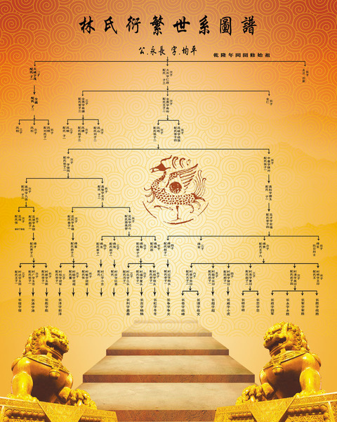
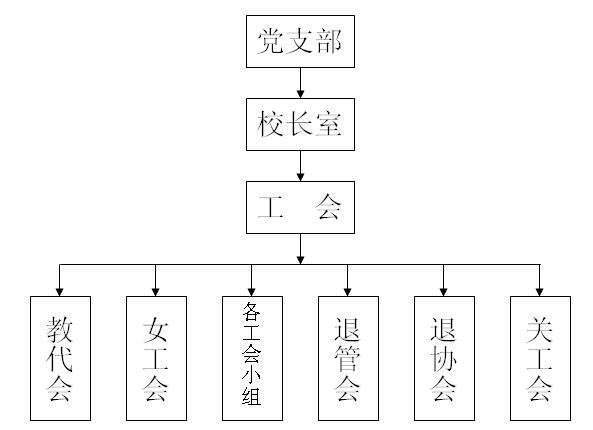
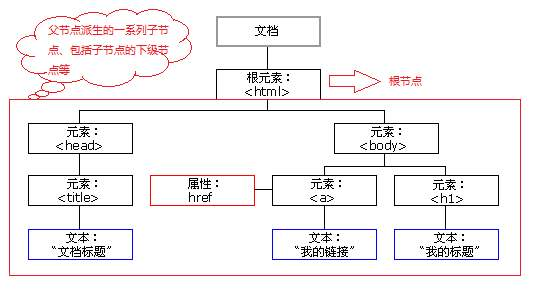
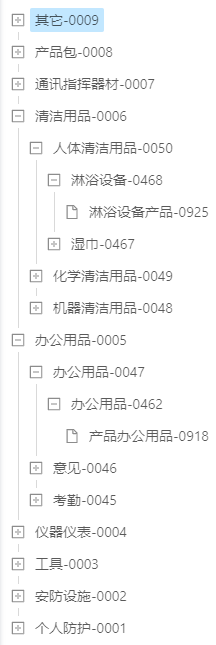
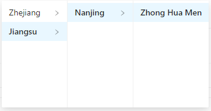
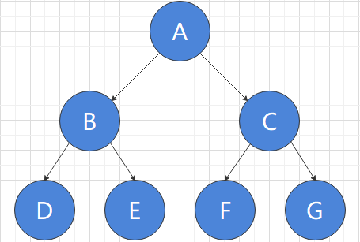

<blockquote style='padding: 10px; font-size: 1em; margin: 1em 0px; color: rgb(0, 0, 0); border-left: 5px solid rgba(247, 31, 85,1); background: rgb(239, 235, 233);line-height:1.5;'>

不知道你是否和我一样，在处理类似于树形结构的数据时，常常会想到递归，但是每次都要百度好久，而且还经常会出错，就算百度出来了，似懂非懂，而且这部分的知识也不属于自己，所以我们这次来好好研究下“树”这个数据结构。
    
</blockquote>

# 一、什么是树？


<blockquote style='padding: 10px; font-size: 1em; margin: 1em 0px; color: rgb(0, 0, 0); border-left: 5px solid rgba(0,189,170,1); background: rgb(239, 235, 233);line-height:1.5;'>

树是一种分层数据的抽象模型。一种重要的非线性数据结构，直观地看，它是数据元素（在树中称为结点）按分支关系组织起来的结构，很象自然界中的树那样。 如下都是生活中常见的树的例子：
    
</blockquote>

## 1.林氏衍繁系族谱



## 2.社会组织机构


## 3.生活中的树


# 二、前端中常见的树

<blockquote style='padding: 10px; font-size: 1em; margin: 1em 0px; color: rgb(0, 0, 0); border-left: 5px solid rgba(0,189,170,1); background: rgb(239, 235, 233);line-height:1.5;'>

在我们写前端的过程中，其实也很容易遇到树这种数据结构。
    
</blockquote>

## 1.DOM树




<blockquote style='padding: 10px; font-size: 1em; margin: 1em 0px; color: rgb(0, 0, 0); border-left: 5px solid rgba(0,189,170,1); background: rgb(239, 235, 233);line-height:1.5;'>

如上，浏览器将接收到的HTML代码，通过HTML解析器解析构建为一颗DOM树。
    
</blockquote>

## 2.前端常用组件-树形控件



<blockquote style='padding: 10px; font-size: 1em; margin: 1em 0px; color: rgb(0, 0, 0); border-left: 5px solid rgba(0,189,170,1); background: rgb(239, 235, 233);line-height:1.5;'>

如上图，一个产品的树形分类图示，可以很直观的展示产品的多级分类。
    
</blockquote>

## 3.前端常用组件-级联选择



<blockquote style='padding: 10px; font-size: 1em; margin: 1em 0px; color: rgb(0, 0, 0); border-left: 5px solid rgba(0,189,170,1); background: rgb(239, 235, 233);line-height:1.5;'>

如上图，一个选择省市县的多级联动选择器。
    
</blockquote>

<blockquote style='padding: 10px; font-size: 1em; margin: 1em 0px; color: rgb(0, 0, 0); border-left: 5px solid rgba(247, 31, 85,1); background: rgb(239, 235, 233);line-height:1.5;'>

其实JS中并没有树，但是可以用Object和Array来模拟树。如下，根节点是一个Object，children是一个Array。里面包含了多个像根节点那样结构的Object，所以可以无限的循环下去，但是并不是所有的树都满足这样的结构，如children可以使用c代替等等，根节点是数组而不是对象等。但是如果数据结构是这样满足分层结构的数据，我们就可以称之为“树”。
    
</blockquote>

```js
{
    value:"China",
    label:"中国",
    children:[
        {
            value:"anhui",
            label:"安徽省",
            children:[
                {
                    value:"hefei",
                    label:"合肥市"
                },
                {
                    value:"wuhu",
                    label:"芜湖市"
                },
            ]
        },
        {
            value:"zhejiang",
            label:"浙江省",
            children:[
                {
                    value:"hangzhou",
                    label:"杭州市"
                },
                {
                    value:"ningbo",
                    label:"宁波市"
                }
            ]
        }
    ]
}
```

# 三、树的常用操作-深度优先遍历/广度优先遍历
<blockquote style='padding: 10px; font-size: 1em; margin: 1em 0px; color: rgb(0, 0, 0); border-left: 5px solid rgba(247, 31, 85,1); background: rgb(239, 235, 233);line-height:1.5;'>

在这里我们不探讨图的深度/广度优先遍历，只讨论树的深度/广度优先遍历

</blockquote>



## 1.深度优先遍历

### 1.一句话解释

<blockquote style='padding: 10px; font-size: 1em; margin: 1em 0px; color: rgb(0, 0, 0); border-left: 5px solid rgba(0,189,170,1); background: rgb(239, 235, 233);line-height:1.5;'>

一句话解释深度优先遍历DFS(Depth-First-Traversal)：尽可能深的搜索树的分支。对于上图我们的树的遍历顺序为A、B、D、E、C、F、G。可以用读书来模拟这样的一种行为，对于上图有三层结构，我们可以将第一层（A）当作书籍的索引。第二层（B、C）当作书籍的章。第三层（D、E、F、G）当作书籍的一小节一小节。那么深度优先遍历就相当于我们按照顺序一页一页的读这本书籍。
</blockquote>

### 2.深度优先遍历算法口诀

<blockquote style='padding: 10px; font-size: 1em; margin: 1em 0px; color: rgb(0, 0, 0); border-left: 5px solid rgba(0,189,170,1); background: rgb(239, 235, 233);line-height:1.5;'>

1.访问根节点。<br />
2.对根节点的children挨个进行深度优先遍历。

</blockquote>

<blockquote style='padding: 10px; font-size: 1em; margin: 1em 0px; color: rgb(0, 0, 0); border-left: 5px solid rgba(0,189,170,1); background: rgb(239, 235, 233);line-height:1.5;'>
我们通过上图来解释一下这个口诀吧。<br />
1.首先访问根节点A，然后对根节点A的children挨个进行深度遍历。<br >
2.B节点相当于A节点的第一个children,对于B以及下面的树结构来说，B算是一个根节点，然后我们访问根节点B。然后对根节点B的children挨个进行深度遍历。<br />
3.D节点相当于对于B节点的第一个children，对于D以及下面的树结构来说，D算是一个根节点，然后我们访问根节点D。此时D节点下面已经没有节点了，所以也就没有children，这个时候开始访问B节点的第二个children-E。<br />
4.对于E以及下面的树结构来说，E算是一个根节点，然后我们访问根节点E。此时E节点下面已经没有节点了，所以也就没有children。<br />
5.此时B节点已经完全访问完了，此时我们开始访问A节点的第二个children-C。<br />
6.对于C已经下面的树结构来说，C算是一个根节点，然后我们访问根节点C。然后对根节点C的children挨个进行深度遍历。<br />
7.F节点相当于C节点的第一个children，对于F节点以及下面的树结构来说，F算是一个根节点，然后我们访问根节点F。此时F节点下面以及没有节点了，所以也就没有children，这个时候开始访问C节点的第二个children-G。<br />
8.对于G以及下面的书结构来说，G算是一个根节点，然后我们访问根节点G。此时G节点下面已经没有节点了，所以也就没有children。<br />
9.此时C节点已经完全访问完了，对于A这个根节点来说，已经没有下一个children了，所以整个树就已经遍历完成了。<br />
所以我们的树的遍历顺序为A、B、D、E、C、F、G。
</blockquote>
 
### 3.使用JS来进行深度遍历

```js

let treeData={
    value:"China",
    label:"中国",
    children:[
        {
            value:"anhui",
            label:"安徽省",
            children:[
                {
                    value:"hefei",
                    label:"合肥市"
                },
                {
                    value:"wuhu",
                    label:"芜湖市"
                },
            ]
        },
        {
            value:"zhejiang",
            label:"浙江省",
            children:[
                {
                    value:"hangzhou",
                    label:"杭州市"
                },
                {
                    value:"ningbo",
                    label:"宁波市"
                }
            ]
        }
    ]
}

const dfs=(root)=>{
    console.log(root.label);
    if(!root.children) return ;
    root.children.forEach(dfs);
}

dfs(treeData);

//dfs函数即可模拟深度优先遍历，复制代码到浏览器可查看打印顺序为中国->安徽省->合肥市->芜湖市->浙江省->杭州市->宁波市
```

## 2.广度优先遍历

### 1.一句话解释

<blockquote style='padding: 10px; font-size: 1em; margin: 1em 0px; color: rgb(0, 0, 0); border-left: 5px solid rgba(0,189,170,1); background: rgb(239, 235, 233);line-height:1.5;'>

一句话解释深度优先遍历BFS(Breadth-First-Traversal)：先访问离根节点最近的节点。对于上图我们的树的遍历顺序为A、B、C、D、E、F、G。可以用读书来模拟这样的一种行为，对于上图有三层结构，我们可以将第一层（A）当作书籍的索引。第二层（B、C）当作书籍的章。第三层（D、E、F、G）当作书籍的一小节一小节。那么广度优先遍历就相当于我们先大图阅读一下每一章，再通过每一章来阅读每一小节。
</blockquote>

### 3.广度优先遍历算法口诀

<blockquote style='padding: 10px; font-size: 1em; margin: 1em 0px; color: rgb(0, 0, 0); border-left: 5px solid rgba(0,189,170,1); background: rgb(239, 235, 233);line-height:1.5;'>

1.新建一个队列（先进先出），把根结点入队。<br />
2.把队头出队并访问。<br />
3.把队头的children挨个入队。<br />
4.重复二、三步，直到队列为空。
</blockquote>

<blockquote style='padding: 10px; font-size: 1em; margin: 1em 0px; color: rgb(0, 0, 0); border-left: 5px solid rgba(0,189,170,1); background: rgb(239, 235, 233);line-height:1.5;'>
我们通过上图来解释一下这个口诀吧。<br />
1.新建一个队列queue（想象成一个数组），把根结点A入队。此时队列queue为[A]。<br />
2.将队头A出队并访问，把队头A的children-B、C挨个入队。此时队列queue为[B,C]。<br />
3.将队头B出队并访问，把对头B的children-D、E挨个入队。此时队列queue为[C,D,E]。<br />
4.将队头C出队并访问，把对头C的children-F、G挨个入队。此时队列queue为[D,E,F,G]。<br />
5.将队头D出队并访问，此时没有children可以继续加入队列。此时队列queue为[E,F,G]。<br />
6.将队头E出队并访问，此时没有children可以继续加入队列。此时队列queue为[F,G]。<br />
7.将队头F出队并访问，此时没有children可以继续加入队列。此时队列queue为[G]。<br />
8.将队头G出队并访问，此时没有children可以继续加入队列。此时队列queue为[]。至此，广度优先遍历已全部完成。<br />
</blockquote>

### 3.使用JS来进行广度遍历

```js
let treeData={
    value:"China",
    label:"中国",
    children:[
        {
            value:"anhui",
            label:"安徽省",
            children:[
                {
                    value:"hefei",
                    label:"合肥市"
                },
                {
                    value:"wuhu",
                    label:"芜湖市"
                },
            ]
        },
        {
            value:"zhejiang",
            label:"浙江省",
            children:[
                {
                    value:"hangzhou",
                    label:"杭州市"
                },
                {
                    value:"ningbo",
                    label:"宁波市"
                }
            ]
        }
    ]
}

const bfs=(root)=>{
    let queue=[root];  
    while(queue.length>0){
        let n=queue.shift();
        console.log(n.label);
        if(!n.children) continue ;
        n.children.forEach(c=>{
            queue.push(c);
        })
    }
}

bfs(treeData);

//bfs函数即可模拟广度优先遍历，复制代码到浏览器可查看打印顺序为中国->安徽省->浙江省->合肥市->芜湖市->杭州市->宁波市
```

# 四、二叉树

## 1.什么是二叉树？

<blockquote style='padding: 10px; font-size: 1em; margin: 1em 0px; color: rgb(0, 0, 0); border-left: 5px solid rgba(0,189,170,1); background: rgb(239, 235, 233);line-height:1.5;'>
前面我们处理的属性结构往往是多叉树。<br />


二叉树（Binary tree）是树形结构的一个重要类型。许多实际问题抽象出来的数据结构往往是二叉树形式，即使是一般的树也能简单地转换为二叉树，而且二叉树的存储结构及其算法都较为简单，因此二叉树显得特别重要。二叉树特点是每个结点最多只能有两棵子树，且有左右之分 [1] 。<br />

二叉树中每个节点最多只能有俩个子节点。

</blockquote>


<blockquote style='padding: 10px; font-size: 1em; margin: 1em 0px; color: rgb(0, 0, 0); border-left: 5px solid rgba(0,189,170,1); background: rgb(239, 235, 233);line-height:1.5;'>

在JS中我们通常使用Object来模拟二叉树。<br />

</blockquote>

```js
var binaryTree={
    val:5,
    left:{
        val:2,
        left:{
            val:1,
            left:null,
            right:null
        },
        right:{
            val:3,
            left:null,
            right:null
        }
    },
    right:{
        val:8,
        left:{
            val:7,
            left:null,
            right:null
        },
        right:null
    }
};
```

## 2.二叉树的先序遍历

### 1.算法口诀

<blockquote style='padding: 10px; font-size: 1em; margin: 1em 0px; color: rgb(0, 0, 0); border-left: 5px solid rgba(0,189,170,1); background: rgb(239, 235, 233);line-height:1.5;'>

1.访问根结点。<br />
2.对根结点的左子树进行先序遍历。<br />
3.对根结点的右子数进行先序遍历。<br />

</blockquote>

<blockquote style='padding: 10px; font-size: 1em; margin: 1em 0px; color: rgb(0, 0, 0); border-left: 5px solid rgba(0,189,170,1); background: rgb(239, 235, 233);line-height:1.5;'>
我们通过上图来解释一下这个口诀吧。<br />
1.首先访问根结点5,然后对左子树进行先序遍历。<br />
2.对于左子树2以及下面的树性结构来说，2相当于根节点。访问根结点2，然后对左子数进行先序遍历。<br />
3.访问根结点1,因为根结点1并没有子节点了，无法对其左/右子树进行先序遍历，则对根结点2的右子树进行先序遍历。<br />
4.访问根结点3,因为根结点3并没有子节点了，无法对其左/右子树进行先序遍历，此时对应根结点5的左子树已经完全访问完了，则对根结点5的右子树进行先序遍历。<br />
5.对于右子树8以及下面的树形结构来说，8相当于根结点。访问根结点8，然后对左子树进行先序遍历。<br />
6.对于根结点7，因为根结点7并没有子节点了，无法对其左/右子树进行先序遍历，此时对应根结点8的左子树已经完全访问完了，则对根结点8的右子树进行先序遍历。此时我们发现根结点8的右子数无根节点，至此，这个例子的先序遍历已经完全完成了。
</blockquote>

### 2.递归版实现先序遍历
```js
var binaryTree={
    val:5,
    left:{
        val:2,
        left:{
            val:1,
            left:null,
            right:null
        },
        right:{
            val:3,
            left:null,
            right:null
        }
    },
    right:{
        val:8,
        left:{
            val:7,
            left:null,
            right:null
        },
        right:null
    }
};

const pos=(root)=>{
    if(!root) return ;
    console.log(root.val);
    pos(root.left);
    pos(root.right);
}

pos(binaryTree);
//pos就是递归版本的实现了先序遍历，复制到浏览器打印出的顺序为5->2->1->3->8->7
```


### 3.非递归版实现先序遍历

```js
var binaryTree={
    val:5,
    left:{
        val:2,
        left:{
            val:1,
            left:null,
            right:null
        },
        right:{
            val:3,
            left:null,
            right:null
        }
    },
    right:{
        val:8,
        left:{
            val:7,
            left:null,
            right:null
        },
        right:null
    }
};

const pos=(root)=>{
    if(!root) return ;
    const stack=[root];
    while(stack.length){
        const n=stack.pop();
        console.log(n.val);
        if(n.right) stack.push(n.right);
        if(n.left) stack.push(n.left);
    }
}

pos(treeData);
//pos就是非递归版本的实现了先序遍历，复制到浏览器打印出的顺序为5->2->1->3->8->7
```


## 3.二叉树的中序遍历

### 1.算法口诀

<blockquote style='padding: 10px; font-size: 1em; margin: 1em 0px; color: rgb(0, 0, 0); border-left: 5px solid rgba(0,189,170,1); background: rgb(239, 235, 233);line-height:1.5;'>

1.对根结点的左子树进行中序遍历。<br />
2.访问根结点。<br />
3.对根结点的右子树进行中序遍历。

</blockquote>

<blockquote style='padding: 10px; font-size: 1em; margin: 1em 0px; color: rgb(0, 0, 0); border-left: 5px solid rgba(0,189,170,1); background: rgb(239, 235, 233);line-height:1.5;'>
我们通过上图来解释一下这个口诀吧。<br /> 
1.对于根结点5,我们对其左子树进行中序遍历，根结点5对应的左子树是2以及下面的树形结构。对于根结点2，我们对其左子树进行中序遍历，根结点2对应的左子树是1以及下面的树形结构。此时发现根结点1并没有左子树，然后访问根结点1，然后我们发现根结点1也没有右子树。<br />
2.此时对于根结点2的来说，左子树已经完全访问完毕，然后访问根结点2，然后对其右节点进行中序遍历。<br />
3.根结点2对应的右子树是3以及下面的树形结构。此时发现根结点3并没有左子树，然后访问根结点3，然后我们发现根结点3也没有右子树。<br />
4.此时对于根结点5来说，左子树已经完全中序遍历完成，然后访问根结点5，然后对根结点5的右子树进行中序遍历。<br />
5.根结点5对应的右子树为8以及下面的树形结构，对于根结点8，对其左子树进行中序遍历。<br />
6.根结点8对应的左子树为7以及下面的树形结构，此时我们发现根结点7没有左子树，访问根结点7，然后发现根结点7也没有右子🌲。<br />
7.对于根结点8来说，左子树以及完全遍历完成，随即访问8，然后访问右子🌲，发现没有右子树，至此，中序遍历以及全部完成。
</blockquote>

### 2.递归版实现中序遍历
```js
var binaryTree={
    val:5,
    left:{
        val:2,
        left:{
            val:1,
            left:null,
            right:null
        },
        right:{
            val:3,
            left:null,
            right:null
        }
    },
    right:{
        val:8,
        left:{
            val:7,
            left:null,
            right:null
        },
        right:null
    }
};

const ios=(root)=>{
    if(!root) return ;
    ios(root.left);
    console.log(root.val);
    ios(root.right);
}

ios(binaryTree);
//ios就是递归版本的实现了中序遍历，复制到浏览器打印出的顺序为1->2->3->5->7->8
```

### 3.非递归版实现中序遍历

```js
const ios=(root)=>{
    if(!root) return ;
    const stack=[];
    let p=root;
    while(stack.length||p){
        while(p){
            stack.push(p);
            p=p.left;
        }
        const n=stack.pop();
        console.log(n.val);
        p=n.right;
    }
}
//ios就是非递归版本的实现了中序遍历，复制到浏览器打印出的顺序为1->2->3->5->7->8
```

## 4.二叉树的后序遍历

### 1.算法口诀

<blockquote style='padding: 10px; font-size: 1em; margin: 1em 0px; color: rgb(0, 0, 0); border-left: 5px solid rgba(0,189,170,1); background: rgb(239, 235, 233);line-height:1.5;'>

1.对根结点的左子树进行后序遍历。<br />
2.对根结点的右子数进行后序遍历。<br />
3.访问根结点。

</blockquote>

<blockquote style='padding: 10px; font-size: 1em; margin: 1em 0px; color: rgb(0, 0, 0); border-left: 5px solid rgba(0,189,170,1); background: rgb(239, 235, 233);line-height:1.5;'>
我们通过上图来解释一下这个口诀吧。<br /> 
1.对于根结点5，左子树为2以及下面的树形结构。对于根结点2，左子树为1以及下面的树形结构。这时我们发现，根结点1并没有左子树，也并没有右子🌲，所以我们访问根结点1。<br />
2.这时，根结点2对应的左子🌲已经完全后序遍历完成，这时候，我们对根结点2的右子🌲进行后序遍历。对于根结点2，右子树为3以及下面的树形结构。这时我们发现根结点3并没有左子🌲，也并没有右子🌲，所以我们访问根结点3。<br />
3.这时，根结点2对应的右子🌲已经完全后序遍历完成，这时候，我们访问根结点2。<br />
4.这时，根结点5对应的左子🌲已经完全后序遍历完成，这时候，我们对根结点5的右子🌲进行后序遍历。对于根结点5来说，右子🌲为8以及下面的树形结构，对于根节点8，我们先后序遍历其左子树7，我们发现根结点7并没有左子树，也并没有右子🌲，所以我们直接访问根结点7，
5.对于根结点8来说，左子树已经后序遍历完成，这个时候我们发现根结点8并没有右子🌲，所以直接访问8。<br />
6.对于根结点5来说，左子🌲和右子🌲已经完全遍历完成，这个时候我们访问根结点5。至此，我们的后序遍历已经完全结束。
</blockquote>

### 2.递归版实现后序遍历
```js
var binaryTree={
    val:5,
    left:{
        val:2,
        left:{
            val:1,
            left:null,
            right:null
        },
        right:{
            val:3,
            left:null,
            right:null
        }
    },
    right:{
        val:8,
        left:{
            val:7,
            left:null,
            right:null
        },
        right:null
    }
};

const bos=(root)=>{
    if(!root) return ;
    bos(root.left);
    bos(root.right);
    console.log(root.val);
}

bos(binaryTree);
//bos就是递归版本的实现了后序遍历，复制到浏览器打印出的顺序为1->3->2->7->8->5
```

### 3.非递归版实现后序遍历

```js
const bos=(root)=>{
    if(!root) return ;
    const stack=[root];
    const outputStack=[];
    while(stack.length){
        const n=stack.pop();
        outputStack.push(n);
        if(n.left) stack.push(n.left);
        if(n.right) stack.push(n.right);
    }
    while(outputStack.length){
        const n=outputStack.pop();
        console.log(n.val);
    } 

}
//bos就是非递归版本的实现了后序遍历，复制到浏览器打印出的顺序为1->3->2->7->8->5
```