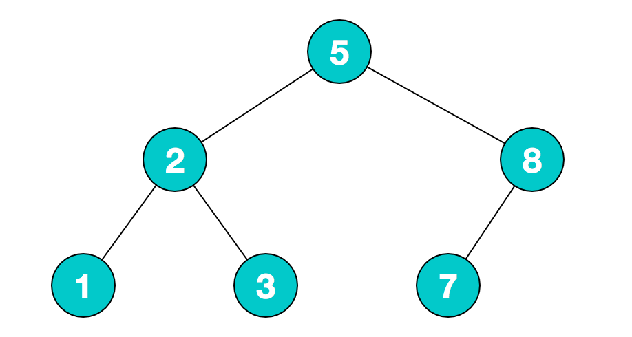

<blockquote style='padding: 10px; font-size: 1em; margin: 1em 0px; color: rgb(0, 0, 0); border-left: 5px solid rgba(247, 31, 85,1); background: rgb(239, 235, 233);line-height:1.5;'>

不知道你是否和我一样，在处理类似于树形结构的数据时，常常会想到递归，但是每次都要百度好久，而且还经常会出错，就算百度出来了，似懂非懂，而且这部分的知识也不属于自己，所以我们这次来好好研究下“树”这个数据结构。
    
</blockquote>

# 一、什么是树？


<blockquote style='padding: 10px; font-size: 1em; margin: 1em 0px; color: rgb(0, 0, 0); border-left: 5px solid rgba(0,189,170,1); background: rgb(239, 235, 233);line-height:1.5;'>

树是一种分层数据的抽象模型。一种重要的非线性数据结构，直观地看，它是数据元素（在树中称为结点）按分支关系组织起来的结构，很象自然界中的树那样。 如下都是生活中常见的树的例子：
    
</blockquote>

## 1.林氏衍繁系族谱


## 2.社会组织机构


## 3.生活中的树


# 二、前端中常见的树

<blockquote style='padding: 10px; font-size: 1em; margin: 1em 0px; color: rgb(0, 0, 0); border-left: 5px solid rgba(0,189,170,1); background: rgb(239, 235, 233);line-height:1.5;'>

在我们写前端的过程中，其实也很容易遇到树这种数据结构。
    
</blockquote>

## 1.DOM树


<blockquote style='padding: 10px; font-size: 1em; margin: 1em 0px; color: rgb(0, 0, 0); border-left: 5px solid rgba(0,189,170,1); background: rgb(239, 235, 233);line-height:1.5;'>

如上，浏览器将接收到的HTML代码，通过HTML解析器解析构建为一颗DOM树。
    
</blockquote>

## 2.前端常用组件-树形控件


<blockquote style='padding: 10px; font-size: 1em; margin: 1em 0px; color: rgb(0, 0, 0); border-left: 5px solid rgba(0,189,170,1); background: rgb(239, 235, 233);line-height:1.5;'>

如上图，一个产品的树形分类图示，可以很直观的展示产品的多级分类。
    
</blockquote>

## 3.前端常用组件-级联选择


<blockquote style='padding: 10px; font-size: 1em; margin: 1em 0px; color: rgb(0, 0, 0); border-left: 5px solid rgba(0,189,170,1); background: rgb(239, 235, 233);line-height:1.5;'>

如上图，一个选择省市县的多级联动选择器。
    
</blockquote>

<blockquote style='padding: 10px; font-size: 1em; margin: 1em 0px; color: rgb(0, 0, 0); border-left: 5px solid rgba(247, 31, 85,1); background: rgb(239, 235, 233);line-height:1.5;'>

其实JS中并没有树，但是可以用Object和Array来模拟树。如下，根节点是一个Object，children是一个Array。里面包含了多个像根节点那样结构的Object，所以可以无限的循环下去，但是并不是所有的树都满足这样的结构，如children可以使用c代替等等，根节点是数组而不是对象等。但是如果数据结构是这样满足分层结构的数据，我们就可以称之为“树”。
    
</blockquote>

```js
{
    value:"China",
    label:"中国",
    children:[
        {
            value:"anhui",
            label:"安徽省",
            children:[
                {
                    value:"hefei",
                    label:"合肥市"
                },
                {
                    value:"wuhu",
                    label:"芜湖市"
                },
            ]
        },
        {
            value:"zhejiang",
            label:"浙江省",
            children:[
                {
                    value:"hangzhou",
                    label:"杭州市"
                },
                {
                    value:"ningbo",
                    label:"宁波市"
                }
            ]
        }
    ]
}
```

# 三、树的常用操作-深度优先遍历/广度优先遍历
<blockquote style='padding: 10px; font-size: 1em; margin: 1em 0px; color: rgb(0, 0, 0); border-left: 5px solid rgba(247, 31, 85,1); background: rgb(239, 235, 233);line-height:1.5;'>

在这里我们不探讨图的深度/广度优先遍历，只讨论树的深度/广度优先遍历

</blockquote>


## 1.深度优先遍历

### 1.一句话解释

<blockquote style='padding: 10px; font-size: 1em; margin: 1em 0px; color: rgb(0, 0, 0); border-left: 5px solid rgba(0,189,170,1); background: rgb(239, 235, 233);line-height:1.5;'>

一句话解释深度优先遍历DFS(Depth-First-Traversal)：尽可能深的搜索树的分支。对于上图我们的树的遍历顺序为A、B、D、E、C、F、G。可以用读书来模拟这样的一种行为，对于上图有三层结构，我们可以将第一层（A）当作书籍的索引。第二层（B、C）当作书籍的章。第三层（D、E、F、G）当作书籍的一小节一小节。那么深度优先遍历就相当于我们按照顺序一页一页的读这本书籍。
</blockquote>

### 2.深度优先遍历算法口诀

<blockquote style='padding: 10px; font-size: 1em; margin: 1em 0px; color: rgb(0, 0, 0); border-left: 5px solid rgba(0,189,170,1); background: rgb(239, 235, 233);line-height:1.5;'>

1.访问根节点。<br />
2.对根节点的children挨个进行深度优先遍历。

</blockquote>

<blockquote style='padding: 10px; font-size: 1em; margin: 1em 0px; color: rgb(0, 0, 0); border-left: 5px solid rgba(0,189,170,1); background: rgb(239, 235, 233);line-height:1.5;'>
我们通过上图来解释一下这个口诀吧。<br />
1.首先访问根节点A，然后对根节点A的children挨个进行深度遍历。<br >
2.B节点相当于A节点的第一个children,对于B以及下面的树结构来说，B算是一个根节点，然后我们访问根节点B。然后对根节点B的children挨个进行深度遍历。<br />
3.D节点相当于对于B节点的第一个children，对于D以及下面的树结构来说，D算是一个根节点，然后我们访问根节点D。此时D节点下面已经没有节点了，所以也就没有children，这个时候开始访问B节点的第二个children-E。<br />
4.对于E以及下面的树结构来说，E算是一个根节点，然后我们访问根节点E。此时E节点下面已经没有节点了，所以也就没有children。<br />
5.此时B节点已经完全访问完了，此时我们开始访问A节点的第二个children-C。<br />
6.对于C已经下面的树结构来说，C算是一个根节点，然后我们访问根节点C。然后对根节点C的children挨个进行深度遍历。<br />
7.F节点相当于C节点的第一个children，对于F节点以及下面的树结构来说，F算是一个根节点，然后我们访问根节点F。此时F节点下面以及没有节点了，所以也就没有children，这个时候开始访问C节点的第二个children-G。<br />
8.对于G以及下面的书结构来说，G算是一个根节点，然后我们访问根节点G。此时G节点下面已经没有节点了，所以也就没有children。<br />
9.此时C节点已经完全访问完了，对于A这个根节点来说，已经没有下一个children了，所以整个树就已经遍历完成了。<br />
所以我们的树的遍历顺序为A、B、D、E、C、F、G。
</blockquote>
 
### 3.使用JS来进行深度遍历

```js

let treeData={
    value:"China",
    label:"中国",
    children:[
        {
            value:"anhui",
            label:"安徽省",
            children:[
                {
                    value:"hefei",
                    label:"合肥市"
                },
                {
                    value:"wuhu",
                    label:"芜湖市"
                },
            ]
        },
        {
            value:"zhejiang",
            label:"浙江省",
            children:[
                {
                    value:"hangzhou",
                    label:"杭州市"
                },
                {
                    value:"ningbo",
                    label:"宁波市"
                }
            ]
        }
    ]
}

const dfs=(root)=>{
    console.log(root.label);
    if(!root.children) return ;
    root.children.forEach(dfs);
}

dfs(treeData);

//dfs函数即可模拟深度优先遍历，复制代码到浏览器可查看打印顺序为中国->安徽省->合肥市->芜湖市->浙江省->杭州市->宁波市
```

## 2.广度优先遍历

### 1.一句话解释

<blockquote style='padding: 10px; font-size: 1em; margin: 1em 0px; color: rgb(0, 0, 0); border-left: 5px solid rgba(0,189,170,1); background: rgb(239, 235, 233);line-height:1.5;'>

一句话解释深度优先遍历BFS(Breadth-First-Traversal)：先访问离根节点最近的节点。对于上图我们的树的遍历顺序为A、B、C、D、E、F、G。可以用读书来模拟这样的一种行为，对于上图有三层结构，我们可以将第一层（A）当作书籍的索引。第二层（B、C）当作书籍的章。第三层（D、E、F、G）当作书籍的一小节一小节。那么广度优先遍历就相当于我们先大图阅读一下每一章，再通过每一章来阅读每一小节。
</blockquote>

### 3.广度优先遍历算法口诀

<blockquote style='padding: 10px; font-size: 1em; margin: 1em 0px; color: rgb(0, 0, 0); border-left: 5px solid rgba(0,189,170,1); background: rgb(239, 235, 233);line-height:1.5;'>

1.新建一个队列（先进先出），把根结点入队。<br />
2.把队头出队并访问。<br />
3.把队头的children挨个入队。<br />
4.重复二、三步，直到队列为空。
</blockquote>

<blockquote style='padding: 10px; font-size: 1em; margin: 1em 0px; color: rgb(0, 0, 0); border-left: 5px solid rgba(0,189,170,1); background: rgb(239, 235, 233);line-height:1.5;'>
我们通过上图来解释一下这个口诀吧。<br />
1.新建一个队列queue（想象成一个数组），把根结点A入队。此时队列queue为[A]。<br />
2.将队头A出队并访问，把队头A的children-B、C挨个入队。此时队列queue为[B,C]。<br />
3.将队头B出队并访问，把对头B的children-D、E挨个入队。此时队列queue为[C,D,E]。<br />
4.将队头C出队并访问，把对头C的children-F、G挨个入队。此时队列queue为[D,E,F,G]。<br />
5.将队头D出队并访问，此时没有children可以继续加入队列。此时队列queue为[E,F,G]。<br />
6.将队头E出队并访问，此时没有children可以继续加入队列。此时队列queue为[F,G]。<br />
7.将队头F出队并访问，此时没有children可以继续加入队列。此时队列queue为[G]。<br />
8.将队头G出队并访问，此时没有children可以继续加入队列。此时队列queue为[]。至此，广度优先遍历已全部完成。<br />
</blockquote>

### 3.使用JS来进行广度遍历

```js
let treeData={
    value:"China",
    label:"中国",
    children:[
        {
            value:"anhui",
            label:"安徽省",
            children:[
                {
                    value:"hefei",
                    label:"合肥市"
                },
                {
                    value:"wuhu",
                    label:"芜湖市"
                },
            ]
        },
        {
            value:"zhejiang",
            label:"浙江省",
            children:[
                {
                    value:"hangzhou",
                    label:"杭州市"
                },
                {
                    value:"ningbo",
                    label:"宁波市"
                }
            ]
        }
    ]
}

const bfs=(root)=>{
    let queue=[root];  
    while(queue.length>0){
        let n=queue.shift();
        console.log(n.label);
        if(!n.children) continue ;
        n.children.forEach(c=>{
            queue.push(c);
        })
    }
}

bfs(treeData);

//bfs函数即可模拟广度优先遍历，复制代码到浏览器可查看打印顺序为中国->安徽省->浙江省->合肥市->芜湖市->杭州市->宁波市
```

# 四、二叉树

## 1.什么是二叉树？

<blockquote style='padding: 10px; font-size: 1em; margin: 1em 0px; color: rgb(0, 0, 0); border-left: 5px solid rgba(0,189,170,1); background: rgb(239, 235, 233);line-height:1.5;'>
前面我们处理的属性结构往往是多叉树。<br />


二叉树（Binary tree）是树形结构的一个重要类型。许多实际问题抽象出来的数据结构往往是二叉树形式，即使是一般的树也能简单地转换为二叉树，而且二叉树的存储结构及其算法都较为简单，因此二叉树显得特别重要。二叉树特点是每个结点最多只能有两棵子树，且有左右之分 [1] 。<br />

二叉树中每个节点最多只能有俩个子节点。

</blockquote>



<blockquote style='padding: 10px; font-size: 1em; margin: 1em 0px; color: rgb(0, 0, 0); border-left: 5px solid rgba(0,189,170,1); background: rgb(239, 235, 233);line-height:1.5;'>

在JS中我们通常使用Object来模拟二叉树。<br />

</blockquote>

```js
var binaryTree={
    val:5,
    left:{
        val:2,
        left:{
            val:1,
            left:null,
            right:null
        },
        right:{
            val:3,
            left:null,
            right:null
        }
    },
    right:{
        val:8,
        left:{
            val:7,
            left:null,
            right:null
        },
        right:null
    }
};
```

## 2.二叉树的先序遍历

### 1.算法口诀

<blockquote style='padding: 10px; font-size: 1em; margin: 1em 0px; color: rgb(0, 0, 0); border-left: 5px solid rgba(0,189,170,1); background: rgb(239, 235, 233);line-height:1.5;'>

1.访问根结点。<br />
2.对根结点的左子树进行先序遍历。<br />
3.对根结点的右子数进行先序遍历。<br />

</blockquote>

<blockquote style='padding: 10px; font-size: 1em; margin: 1em 0px; color: rgb(0, 0, 0); border-left: 5px solid rgba(0,189,170,1); background: rgb(239, 235, 233);line-height:1.5;'>
我们通过上图来解释一下这个口诀吧。<br />
1.首先访问根结点5,然后对左子树进行先序遍历。<br />
2.对于左子树2以及下面的树性结构来说，2相当于根节点。访问根结点2，然后对左子数进行先序遍历。<br />
3.访问根结点1,因为根结点1并没有子节点了，无法对其左/右子树进行先序遍历，则对根结点2的右子树进行先序遍历。<br />
4.访问根结点3,因为根结点3并没有子节点了，无法对其左/右子树进行先序遍历，此时对应根结点5的左子树已经完全访问完了，则对根结点5的右子树进行先序遍历。<br />
5.对于右子树8以及下面的树形结构来说，8相当于根结点。访问根结点8，然后对左子树进行先序遍历。<br />
6.对于根结点7，因为根结点7并没有子节点了，无法对其左/右子树进行先序遍历，此时对应根结点8的左子树已经完全访问完了，则对根结点8的右子树进行先序遍历。此时我们发现根结点8的右子数无根节点，至此，这个例子的先序遍历已经完全完成了。
</blockquote>

### 2.递归版实现先序遍历
```js
var binaryTree={
    val:5,
    left:{
        val:2,
        left:{
            val:1,
            left:null,
            right:null
        },
        right:{
            val:3,
            left:null,
            right:null
        }
    },
    right:{
        val:8,
        left:{
            val:7,
            left:null,
            right:null
        },
        right:null
    }
};

const pos=(root)=>{
    if(!root) return ;
    console.log(root.val);
    pos(root.left);
    pos(root.right);
}

pos(binaryTree);
//pos就是递归版本的实现了先序遍历，复制到浏览器打印出的顺序为5->2->1->3->8->7
```


### 3.非递归版实现先序遍历

```js
var binaryTree={
    val:5,
    left:{
        val:2,
        left:{
            val:1,
            left:null,
            right:null
        },
        right:{
            val:3,
            left:null,
            right:null
        }
    },
    right:{
        val:8,
        left:{
            val:7,
            left:null,
            right:null
        },
        right:null
    }
};

const pos=(root)=>{
    if(!root) return ;
    const stack=[root];
    while(stack.length){
        const n=stack.pop();
        console.log(n.val);
        //因为栈是后进先出的，所以要先push right进去 再push left进去
        if(n.right) stack.push(n.right);
        if(n.left) stack.push(n.left);
    }
}

pos(treeData);
//pos就是非递归版本的实现了先序遍历，复制到浏览器打印出的顺序为5->2->1->3->8->7
```


## 3.二叉树的中序遍历

### 1.算法口诀

<blockquote style='padding: 10px; font-size: 1em; margin: 1em 0px; color: rgb(0, 0, 0); border-left: 5px solid rgba(0,189,170,1); background: rgb(239, 235, 233);line-height:1.5;'>

1.对根结点的左子树进行中序遍历。<br />
2.访问根结点。<br />
3.对根结点的右子树进行中序遍历。

</blockquote>

<blockquote style='padding: 10px; font-size: 1em; margin: 1em 0px; color: rgb(0, 0, 0); border-left: 5px solid rgba(0,189,170,1); background: rgb(239, 235, 233);line-height:1.5;'>
我们通过上图来解释一下这个口诀吧。<br /> 
1.对于根结点5,我们对其左子树进行中序遍历，根结点5对应的左子树是2以及下面的树形结构。对于根结点2，我们对其左子树进行中序遍历，根结点2对应的左子树是1以及下面的树形结构。此时发现根结点1并没有左子树，然后访问根结点1，然后我们发现根结点1也没有右子树。<br />
2.此时对于根结点2的来说，左子树已经完全访问完毕，然后访问根结点2，然后对其右节点进行中序遍历。<br />
3.根结点2对应的右子树是3以及下面的树形结构。此时发现根结点3并没有左子树，然后访问根结点3，然后我们发现根结点3也没有右子树。<br />
4.此时对于根结点5来说，左子树已经完全中序遍历完成，然后访问根结点5，然后对根结点5的右子树进行中序遍历。<br />
5.根结点5对应的右子树为8以及下面的树形结构，对于根结点8，对其左子树进行中序遍历。<br />
6.根结点8对应的左子树为7以及下面的树形结构，此时我们发现根结点7没有左子树，访问根结点7，然后发现根结点7也没有右子🌲。<br />
7.对于根结点8来说，左子树以及完全遍历完成，随即访问8，然后访问右子🌲，发现没有右子树，至此，中序遍历以及全部完成。
</blockquote>

### 2.递归版实现中序遍历
```js
var binaryTree={
    val:5,
    left:{
        val:2,
        left:{
            val:1,
            left:null,
            right:null
        },
        right:{
            val:3,
            left:null,
            right:null
        }
    },
    right:{
        val:8,
        left:{
            val:7,
            left:null,
            right:null
        },
        right:null
    }
};

const ios=(root)=>{
    if(!root) return ;
    ios(root.left);
    console.log(root.val);
    ios(root.right);
}

ios(binaryTree);
//ios就是递归版本的实现了中序遍历，复制到浏览器打印出的顺序为1->2->3->5->7->8
```

### 3.非递归版实现中序遍历

```js
const ios=(root)=>{
    if(!root) return ;
    const stack=[];
    let p=root;
    while(stack.length||p){
        while(p){
            stack.push(p);
            p=p.left;
        }
        const n=stack.pop();
        console.log(n.val);
        p=n.right;
    }
}
//ios就是非递归版本的实现了中序遍历，复制到浏览器打印出的顺序为1->2->3->5->7->8
```

## 4.二叉树的后序遍历

### 1.算法口诀

<blockquote style='padding: 10px; font-size: 1em; margin: 1em 0px; color: rgb(0, 0, 0); border-left: 5px solid rgba(0,189,170,1); background: rgb(239, 235, 233);line-height:1.5;'>

1.对根结点的左子树进行后序遍历。<br />
2.对根结点的右子数进行后序遍历。<br />
3.访问根结点。

</blockquote>

<blockquote style='padding: 10px; font-size: 1em; margin: 1em 0px; color: rgb(0, 0, 0); border-left: 5px solid rgba(0,189,170,1); background: rgb(239, 235, 233);line-height:1.5;'>
我们通过上图来解释一下这个口诀吧。<br /> 
1.对于根结点5，左子树为2以及下面的树形结构。对于根结点2，左子树为1以及下面的树形结构。这时我们发现，根结点1并没有左子树，也并没有右子🌲，所以我们访问根结点1。<br />
2.这时，根结点2对应的左子🌲已经完全后序遍历完成，这时候，我们对根结点2的右子🌲进行后序遍历。对于根结点2，右子树为3以及下面的树形结构。这时我们发现根结点3并没有左子🌲，也并没有右子🌲，所以我们访问根结点3。<br />
3.这时，根结点2对应的右子🌲已经完全后序遍历完成，这时候，我们访问根结点2。<br />
4.这时，根结点5对应的左子🌲已经完全后序遍历完成，这时候，我们对根结点5的右子🌲进行后序遍历。对于根结点5来说，右子🌲为8以及下面的树形结构，对于根节点8，我们先后序遍历其左子树7，我们发现根结点7并没有左子树，也并没有右子🌲，所以我们直接访问根结点7，
5.对于根结点8来说，左子树已经后序遍历完成，这个时候我们发现根结点8并没有右子🌲，所以直接访问8。<br />
6.对于根结点5来说，左子🌲和右子🌲已经完全遍历完成，这个时候我们访问根结点5。至此，我们的后序遍历已经完全结束。
</blockquote>

### 2.递归版实现后序遍历
```js
var binaryTree={
    val:5,
    left:{
        val:2,
        left:{
            val:1,
            left:null,
            right:null
        },
        right:{
            val:3,
            left:null,
            right:null
        }
    },
    right:{
        val:8,
        left:{
            val:7,
            left:null,
            right:null
        },
        right:null
    }
};

const bos=(root)=>{
    if(!root) return ;
    bos(root.left);
    bos(root.right);
    console.log(root.val);
}

bos(binaryTree);
//bos就是递归版本的实现了后序遍历，复制到浏览器打印出的顺序为1->3->2->7->8->5
```

### 3.非递归版实现后序遍历

```js
const bos=(root)=>{
    if(!root) return ;
    const stack=[root];
    const outputStack=[];
    while(stack.length){
        const n=stack.pop();
        outputStack.push(n);
        if(n.left) stack.push(n.left);
        if(n.right) stack.push(n.right);
    }
    while(outputStack.length){
        const n=outputStack.pop();
        console.log(n.val);
    } 

}
//bos就是非递归版本的实现了后序遍历，复制到浏览器打印出的顺序为1->3->2->7->8->5
```

# 5.Leetcode分类刷题-树

## 1.简单难度

### 1.Leetcode第104题-二叉树的最大深度

<blockquote style='padding: 10px; font-size: 1em; margin: 1em 0px; color: rgb(0, 0, 0); border-left: 5px solid rgba(0,189,170,1); background: rgb(239, 235, 233);line-height:1.5;'>
给定一个二叉树，找出其最大深度。<br />
二叉树的深度为根节点到最远叶子节点的最长路径上的节点数。<br />
说明: 叶子节点是指没有子节点的节点。
</blockquote>

我们先看示例把！

示例：
给定二叉树 [3,9,20,null,null,15,7]

```js
     3
    / \
   9   20
       / \  
      15  7
```

返回它的最大深度 3 。

<blockquote style='padding: 10px; font-size: 1em; margin: 1em 0px; color: rgb(0, 0, 0); border-left: 5px solid rgba(0,189,170,1); background: rgb(239, 235, 233);line-height:1.5;'>
根据前文我们学习的JS表示的二叉树结构，我们可以很快地得出该题的数据结构如下：
</blockquote>

```js
var binaryTree={
    val:3,
    left:{
        val:9,
        left:null,
        right:null
    },
    right:{
        val:20,
        left:{
            val:15,
            left:null,
            right:null
        },
        right:{
            val:7,
            left:null,
            right:null
        }
    }
}
```

<blockquote style='padding: 10px; font-size: 1em; margin: 1em 0px; color: rgb(0, 0, 0); border-left: 5px solid rgba(0,189,170,1); background: rgb(239, 235, 233);line-height:1.5;'>
<h4>解题1:深度优先遍历</h4>
解题思路：<br />题目中求它的最大深度，这里我们考虑前文学到的深度优先遍历，因为深度优先遍历是尽可能深的访问我们的节点，这和我们的题目不谋而合。计算最大深度其实也就是求二叉树的最大层级，在深度优先遍历的过程中，记录每个节点所在的层级，找出最大的层级即可。<br />
解题步骤：<br />
1.新建一个变量，记录最大深度。<br />
2.深度优先遍历整颗树，并记录每个节点的层级，同时不断刷新最大深度这个变量。<br />
3.遍历结束返回最大深度这个变量。
</blockquote>

```js
var maxDepth = function(root) {
    let max=0;

    const dfs=(root,level)=>{
        if(!root) return ; 
        //深度优先遍历第一步访问根节点
        //只有在到达叶子节点才刷新最大深度这个变量
        if(!root.left && !root.right){
            max=Math.max(level,max);
        }
        //深度优先遍历第二步对根节点的children挨个进行深度优先遍历。
        //之前我们是对多叉树进行深度遍历，这里二叉树其实并没有children这个数组，而left和right就相当于我们的children
        dfs(root.left,level+1);
        dfs(root.right,level+1);
    }

    //初始时层级为第一层
    dfs(root,1);

    return max;
    
};
```

<blockquote style='padding: 10px; font-size: 1em; margin: 1em 0px; color: rgb(0, 0, 0); border-left: 5px solid rgba(0,189,170,1); background: rgb(239, 235, 233);line-height:1.5;'>
<h4>解题2:广度优先遍历</h4>
解题思路：<br />前文中我们使用了深度优先遍历来求解，其实我们使用广度优先遍历也是可以解答我们这题的，因为不管是广度优先遍历还是深度优先遍历都是需要完整的遍历这颗二叉树的。<br />
解题步骤：<br />
1.新建一个变量，记录最大深度。新建一个队列，将根节点放进队列中。<br />
2.广度优先遍历这棵树，如果队列中有值，记录此时队列的大小，先将队头出队，然后将队头的左节点和右节点不断加入队列中，在这次循环时不断清空上一次队列的值，同时将孩子节点添加进队列。即可保证每个楼层只执行一次。<br />
3.遍历结束返回最大深度这个变量。
</blockquote>

```js
var maxDepth = function(root) {
    let count=0;
    if(root===null){
        return count;
    }
    let queue=[root];
    while(queue.length>0){
        let size=queue.length;
        while(size-->0){
            const n=queue.shift(); 
            if(n.left){
                queue.push(n.left);
            }
            if(n.right){
                queue.push(n.right);
            }
        }
        count++;
    }
    return count;
};
```

### 2.Leetcode第111题-二叉树的最小深度


<blockquote style='padding: 10px; font-size: 1em; margin: 1em 0px; color: rgb(0, 0, 0); border-left: 5px solid rgba(0,189,170,1); background: rgb(239, 235, 233);line-height:1.5;'>
给定一个二叉树，找出其最小深度。<br />
最小深度是从根节点到最近叶子节点的最短路径上的节点数量。<br />
说明：叶子节点是指没有子节点的节点。
</blockquote>

读完题目，看事例更方便我们理解题目

* 示例1

```js
     3
    / \
   9   20
       / \  
      15  7
输入：root = [3,9,20,null,null,15,7]
输出：2
//相信不是傻子大家都能看的出来
```

* 示例2

```js
     2
      \
       3
         \  
          4
           \
            5
             \
              6
输入：root = [2,null,3,null,4,null,5,null,6]
输出：5
//相信不是傻子大家都能看的出来
```

<blockquote style='padding: 10px; font-size: 1em; margin: 1em 0px; color: rgb(0, 0, 0); border-left: 5px solid rgba(0,189,170,1); background: rgb(239, 235, 233);line-height:1.5;'>
<h4>解题1:广度优先遍历</h4>
解题思路：<br />题目中求它的最小深度，这里我们考虑考虑广度优先遍历，因为广度优先遍历是一层一层的访问我们的树，更容易判断出当前层级是否有左/右节点。<br />
解题步骤：<br />
1.新建一个变量，记录最小深度。<br />
2.广度优先遍历整颗树，并记录每个节点的层级。如果如果当前节点没有左节点和右节点说明这个根节点所在的层级就是最小深度。返回节点层级，停止遍历。<br /> 
</blockquote>

```js
//广度优先遍历1
var minDepth = function(root) {
    let min=0;
    if(!root) { return min;}
    let queue=[root];
    while(queue.length){
        let size=queue.length;
        while(size-->0){
            const n=queue.shift();
            if(!n.left && !n.right){
                queue.length=0;
                break;
            }
            if(n.left){
                queue.push(n.left);
            }
            if(n.right){
                queue.push(n.right);
            }
        }
        min++;
    }
    return min;
};
//广度优先遍历2
var minDepth=function(root){ 
    if(!root) { return 0;}
    let queue=[[root,1]];
    while(queue.length){
        const [n,level]=queue.shift();
        if(!n.left && !n.right){
            return level;
        }
        if(n.left) queue.push([n.left,level+1]);
        if(n.right) queue.push([n.right,level+1]);
    }
}
```

<blockquote style='padding: 10px; font-size: 1em; margin: 1em 0px; color: rgb(0, 0, 0); border-left: 5px solid rgba(0,189,170,1); background: rgb(239, 235, 233);line-height:1.5;'>
<h4>解题2:深度优先遍历</h4>
解题思路：<br />题目中求它的最小深度，上题中我们使用了广度优先遍历，这节课我们使用深度优先遍历，如果我们使用深度优先遍历，可能需要将所有的树节点遍历一遍才能得到结果，这里我们也写一下把。<br />
解题步骤：<br />
1.新建一个变量，记录最小深度。<br />
2.深度遍历整个树节点，并记录当前的层级level,当遇到叶子节点时，我们直接将当前层级赋予给最小深度这个遍历，当访问其他子节点时，也是一样的步骤，这个时候我们需要刷新一下此时的最小深度。<br /> 
3.最后将最小深度这个变量返回。
</blockquote>

```js
var minDepth = function(root) {
    let min=0;
    if(!root) return min;
    const dfs=(root,level)=>{
        if(!root) return ;
        if(!root.left && !root.right){
            if(min===0){
                min=Math.max(level,0);
            }else{
                min=Math.min(level,min);
            }
            
        }
        dfs(root.left,level+1);
        dfs(root.right,level+1);
    }
    dfs(root,1);
    return min;
}
```

### 3.Leetcode第112题-路径总和

<blockquote style='padding: 10px; font-size: 1em; margin: 1em 0px; color: rgb(0, 0, 0); border-left: 5px solid rgba(0,189,170,1); background: rgb(239, 235, 233);line-height:1.5;'>
给定一个二叉树和一个目标和，判断该树中是否存在根节点到叶子节点的路径，这条路径上所有节点值相加等于目标和。<br />
说明: 叶子节点是指没有子节点的节点。
</blockquote>

* 示例：

```js
给定如下二叉树，以及目标和 sum = 22，
              5
             / \
            4   8
           /   / \
          11  13  4
         /  \      \
        7    2      1
返回 true, 因为存在目标和为 22 的根节点到叶子节点的路径 5->4->11->2。
```

<blockquote style='padding: 10px; font-size: 1em; margin: 1em 0px; color: rgb(0, 0, 0); border-left: 5px solid rgba(0,189,170,1); background: rgb(239, 235, 233);line-height:1.5;'>
<h4>解题1:深度优先遍历</h4>
<h5>解题思路：</h5>
使用深度优先遍历记录每一层的值的累加和。<br />
<h5>解题步骤：</h5>
1.新建一个res存放最终得到的数组。<br />
2.深度优先遍历这个树，记录每一层的累加和，然后在叶子节点处，也就是没有左节点和右节点时，将累加值推入res数组。<br />
3.判断数组里面是否有num。
</blockquote>

```js
var hasPathSum = function(root, sum) {
    if(!root) return false;
    let res=[];
    const dfs=(root,num)=>{
        if(!root) return ;
        const t=num+root.val;
        if(!root.left && !root.right){
            res.push(t);
        }
        dfs(root.left,t);
        dfs(root.right,t);

    }
    dfs(root,0);
    return res.some(item=>item===sum);
}
```

### 4.Leetcode面试题 04.02.题-最小高度🌲

<blockquote style='padding: 10px; font-size: 1em; margin: 1em 0px; color: rgb(0, 0, 0); border-left: 5px solid rgba(0,189,170,1); background: rgb(239, 235, 233);line-height:1.5;'>
给定一个有序整数数组，元素各不相同且按升序排列，编写一个算法，创建一棵高度最小的二叉搜索树。<br />
</blockquote>

说实话，看完题目的我是一脸懵逼的。

* 示例1

```js
给定有序数组: [-10,-3,0,5,9],
一个可能的答案是：[0,-3,9,-10,null,5]，它可以表示下面这个高度平衡二叉搜索树：
          0 
         / \ 
       -3   9 
       /   / 
     -10  5 
//内心os:其实当时看完我还是很懵逼的，然后我看了解答
```

<blockquote style='padding: 10px; font-size: 1em; margin: 1em 0px; color: rgb(0, 0, 0); border-left: 5px solid rgba(0,189,170,1); background: rgb(239, 235, 233);line-height:1.5;'>
<h4>解题1:深度优先遍历</h4>
<h5>解题思路：</h5>
对于二叉搜索树，当根节点的值为所有节点值的中位数时，左右分布最均匀，对整体高度的增幅也最小。所以，每次取中位数作为当前树的根节点，然后分出左右子树，递归即可。<br />
<h5>解题步骤：</h5>
1.首先得到树的中位数，使用对应的中位数下标的值构建树节点。<br />
2.采用深度优先遍历遍历生成对应的左/右节点。<br />
3.返回生成的🌲节点。
</blockquote>

```js
//[-10,-3,0,5,9]
/**
 * Definition for a binary tree node.
 * function TreeNode(val) {
 *     this.val = val;
 *     this.left = this.right = null;
 * }
 */
var sortedArrayToBST = function(nums) {
    //为空直接返回空
    if(nums.length===0){
        return null;
    }
    let midIndex=parseInt(nums.length/2);
    let mid=nums[midIndex];
    let root=new TreeNode(mid);
    root.left=sortedArrayToBST(nums.slice(0,midIndex));
    root.right=sortedArrayToBST(nums.slice(midIndex+1));
    return root;
}
```

### 5.Leetcode剑指 Offer 27-二叉树的镜像 


<blockquote style='padding: 10px; font-size: 1em; margin: 1em 0px; color: rgb(0, 0, 0); border-left: 5px solid rgba(0,189,170,1); background: rgb(239, 235, 233);line-height:1.5;'>
请完成一个函数，输入一个二叉树，该函数输出它的镜像。
</blockquote>
 
* 示例1

```js
例如输入：

     4
   /   \
  2     7
 / \   / \
1   3 6   9
镜像输出：
     4
   /   \
  7     2
 / \   / \
9   6 3   1
输入：root = [4,2,7,1,3,6,9]
输出：[4,7,2,9,6,3,1]
//内心os:其实当时看完我还是很懵逼的，然后我看了解答
```

<blockquote style='padding: 10px; font-size: 1em; margin: 1em 0px; color: rgb(0, 0, 0); border-left: 5px solid rgba(0,189,170,1); background: rgb(239, 235, 233);line-height:1.5;'>
<h4>解题1:深度优先遍历</h4>
<h5>解题思路：</h5>
深度优先遍历整颗树，在深度遍历的过程中，交换左右节点即可。
</blockquote>

```js
var mirrorTree = function(root) {
    if(!root) return null;
    let copyLeft=root.left;
    root.left=root.right;
    root.right=copyLeft;
    mirrorTree(root.left);
    mirrorTree(root.right);
    return root;
}
```

### 6.Leetcode第617题-合并二叉树

<blockquote style='padding: 10px; font-size: 1em; margin: 1em 0px; color: rgb(0, 0, 0); border-left: 5px solid rgba(0,189,170,1); background: rgb(239, 235, 233);line-height:1.5;'>
给定两个二叉树，想象当你将它们中的一个覆盖到另一个上时，两个二叉树的一些节点便会重叠。<br />
你需要将他们合并为一个新的二叉树。合并的规则是如果两个节点重叠，那么将他们的值相加作为节点合并后的新值，否则不为 NULL 的节点将直接作为新二叉树的节点。
</blockquote>

看示例吧！不然凭我的脑子估计也看不懂题目

* 示例

```js
输入: 
	Tree 1                     Tree 2                  
          1                         2                             
         / \                       / \                            
        3   2                     1   3                        
       /                           \   \                      
      5                             4   7                  
输出: 
合并后的树:
	     3
	    / \
	   4   5
	  / \   \ 
	 5   4   7 
```
<blockquote style='padding: 10px; font-size: 1em; margin: 1em 0px; color: rgb(0, 0, 0); border-left: 5px solid rgba(0,189,170,1); background: rgb(239, 235, 233);line-height:1.5;'>
<h5>解题思路：</h5>
乍一看确实也很简单，我们需要返回合成后的二叉树，我们这里就以t1🌲做文章。<br />根据题意，我们可以分析出以下几种情况：
<li>当t1为null,t2不为null时，t1换成t2。</li>
<li>当t2为null,t1不为null时，t1依然为t1。</li>
<li>当t1 和 t2 都为 null，t1 依然 t1。</li>
<li>t1、t2 都存在，将 t2 的值加给 t1 。</li>
『子树的合并』交给递归去做，它会对每一个节点做同样的事情。<br />
 
t1.left = mergeTrees(t1.left, t2.left);<br />
t1.right = mergeTrees(t1.right, t2.right); 
</blockquote>

```js
var mergeTrees = function(t1, t2) {
    if(t1==null && t2 ){
        return t2;
    }
    if ((t1 && t2 == null) || (t1 == null && t2 == null)) {
         return t1;
    }
    t1.val += t2.val;
    t1.left = mergeTrees(t1.left, t2.left);
    t1.right = mergeTrees(t1.right, t2.right);

    return t1; 
};
```

### 7.Leetcode第938题-二叉搜索树的范围和

<blockquote style='padding: 10px; font-size: 1em; margin: 1em 0px; color: rgb(0, 0, 0); border-left: 5px solid rgba(0,189,170,1); background: rgb(239, 235, 233);line-height:1.5;'>
给定二叉搜索树的根结点 root，返回值位于范围 [low, high] 之间的所有结点的值的和。
</blockquote>

* 示例1:

```js
            10
	    / \
	   5   15
	  / \   \ 
	 3   7   18 

输入：root = [10,5,15,3,7,null,18], low = 7, high = 15
输出：32
```

<blockquote style='padding: 10px; font-size: 1em; margin: 1em 0px; color: rgb(0, 0, 0); border-left: 5px solid rgba(0,189,170,1); background: rgb(239, 235, 233);line-height:1.5;'>
因为需要遍历到所有的节点，所以我们使用深度优先遍历。
</blockquote>

```js
var rangeSumBST = function(root, low, high) {
    let res=0;
    if(!root) return res;
    const dfs=(root)=>{
        if(!root) return null;
        if(root.val>=low && root.val<=high){
            res+=root.val;
        }
        dfs(root.left);
        dfs(root.right);
    }
    dfs(root);
    return res;
};
```

### 8.Leetcode第590-N叉树的后序遍历

 <blockquote style='padding: 10px; font-size: 1em; margin: 1em 0px; color: rgb(0, 0, 0); border-left: 5px solid rgba(0,189,170,1); background: rgb(239, 235, 233);line-height:1.5;'>
给定一个 N 叉树，返回其节点值的后序遍历。<br />
例如，给定一个 3叉树 :
</blockquote>

* 示例1:

```js
           1
         / | \
        3  2  4
       / \
      5   6
//返回其后序遍历: [5,6,3,2,4,1].
```


 <blockquote style='padding: 10px; font-size: 1em; margin: 1em 0px; color: rgb(0, 0, 0); border-left: 5px solid rgba(0,189,170,1); background: rgb(239, 235, 233);line-height:1.5;'>
其实我们之前已经学过了后序遍历，后序遍历即左右根。
</blockquote>

 <blockquote style='padding: 10px; font-size: 1em; margin: 1em 0px; color: rgb(0, 0, 0); border-left: 5px solid rgba(0,189,170,1); background: rgb(239, 235, 233);line-height:1.5;'>
<h4>解题思路1：使用递归法</h4>
</blockquote>

```js
//和前文我们的二叉树递归解法完全一致，只不过是一个是left+right而另一个是children而已
var postorder = function(root,arr=[]) {
    if(!root) return [];
    root.children.forEach(c=>{
        postorder(c,arr);
    })
    arr.push(root.val);
    return arr;
}
```

 <blockquote style='padding: 10px; font-size: 1em; margin: 1em 0px; color: rgb(0, 0, 0); border-left: 5px solid rgba(0,189,170,1); background: rgb(239, 235, 233);line-height:1.5;'>
<h4>解题思路2：使用迭代法</h4>
文中的提示已经说了，因为递归法过于简单，所以能不能使用迭代法来写这一题：我们不妨先用迭代法来回忆一下先序遍历
</blockquote>

```js
//先序遍历
var postorder = function(root,arr=[]) {
    if(!root) return [];
    let stack=[root];
    while(stack.length){
        const n=stack.pop();
        arr.push(n.val)
        n.children.reverse().forEach(c=>{
            stack.push(c);
        })
    }
    return arr;
}
//输出结果为[1,3,5,6,2,4]，符合先序遍历顺序
//因为后序遍历是左、右、根  先序遍历是根、左、右 我们只需要将先序遍历的位置倒置过来 然后再依序输出即可
var postorder=function(root){
    if(!root) return [];
    let arr=[];
    let stack=[root];
    let tempStack=[];
    while(stack.length){
        const n=stack.pop();
        tempStack.push(n);
        n.children.forEach(c=>{
            stack.push(c);
        })
    }
    while(tempStack.length){
        const n=tempStack.pop();
        arr.push(n.val);
    }
    return arr;
}
```

### 9.Leetcode剑指 Offer 54.-二叉搜索树的第k大节点


<blockquote style='padding: 10px; font-size: 1em; margin: 1em 0px; color: rgb(0, 0, 0); border-left: 5px solid rgba(0,189,170,1); background: rgb(239, 235, 233);line-height:1.5;'>
给定一棵二叉搜索树，请找出其中第k大的节点。
</blockquote>

 <blockquote style='padding: 10px; font-size: 1em; margin: 1em 0px; color: rgb(0, 0, 0); border-left: 5px solid rgba(0,189,170,1); background: rgb(239, 235, 233);line-height:1.5;'>
<h4>解题思路：深度优先</h4>
这道题还是比较简单的，因为需要遍历整个节点，所以我们优先考虑深度优先，首先通过深度优先将节点值存起来然后对其进行排序。因为这里我们使用了冒泡排序，所以我们可以尝试复习下冒泡排序。
</blockquote>

```js
var kthLargest = function(root, k) {
    if(!root) return null;
    let res=[];
    const dfs=(root)=>{
        if(!root) return;
        res.push(root.val);
        dfs(root.left);
        dfs(root.right);
    }
    dfs(root);
    let len=res.length;
    for(let i=0;i<len;i++){
        for(let j=0;j<len-i+i;j++){
            if(res[j]<res[j+1]){
                let temp=res[j];
                res[j]=res[j+1];
                res[j+1]=temp;
            }
        }
    }
    return res[k-1];
}
```

### 10.Leetcode第589-N叉树的前序遍历

<blockquote style='padding: 10px; font-size: 1em; margin: 1em 0px; color: rgb(0, 0, 0); border-left: 5px solid rgba(0,189,170,1); background: rgb(239, 235, 233);line-height:1.5;'>
给定一个 N 叉树，返回其节点值的前序遍历。
</blockquote>

* 示例1:

```js
           1
         / | \
        3  2  4
       / \
      5   6
//返回其后序遍历: [1,3,5,6,2,4].
```
<blockquote style='padding: 10px; font-size: 1em; margin: 1em 0px; color: rgb(0, 0, 0); border-left: 5px solid rgba(0,189,170,1); background: rgb(239, 235, 233);line-height:1.5;'>
前面我们已经写过一遍了，所以我们直接写代码吧！
</blockquote>

```js
//递归法
var preorder = function(root,arr=[]) {
    if(!root) return [];
    arr.push(root.val);
    root.children.forEach(c=>{
        preorder(c,arr);
    });
    return arr;
};
//迭代法
var preorder=function(root){
    if(!root) return [];
    let res=[];
    let stack=[root];
    while(stack.length){
        const n=stack.pop();
        res.push(n.val);
        n.children.reverse().forEach(c=>{
            stack.push(c);
        })
    }
    return res;
}
```

### 10.Leetcode第897-递增顺序查找树


<blockquote style='padding: 10px; font-size: 1em; margin: 1em 0px; color: rgb(0, 0, 0); border-left: 5px solid rgba(0,189,170,1); background: rgb(239, 235, 233);line-height:1.5;'>
给你一个树，请你 按中序遍历 重新排列树，使树中最左边的结点现在是树的根，并且每个结点没有左子结点，只有一个右子结点。
</blockquote>

* 示例：

```js
输入：[5,3,6,2,4,null,8,1,null,null,null,7,9]

       5
      / \
    3    6
   / \    \
  2   4    8
 /        / \ 
1        7   9 
输出：[1,null,2,null,3,null,4,null,5,null,6,null,7,null,8,null,9]

 1
  \
   2
    \
     3
      \
       4
        \
         5
          \
           6
            \
             7
              \
               8
                \
                 9  
```

<blockquote style='padding: 10px; font-size: 1em; margin: 1em 0px; color: rgb(0, 0, 0); border-left: 5px solid rgba(0,189,170,1); background: rgb(239, 235, 233);line-height:1.5;'>
<h4>解题1:中序遍历+构建新树</h4>
<h5>解题思路：</h5>
首先中序遍历求得结果，然后通过结果构建新树。<br />
</blockquote>

```js
var increasingBST = function(root) {
    if(!root) return [];
    let res=[];
    const inorder=(root)=>{
        if(!root) return ;
        inorder(root.left);
        res.push(root.val);
        inorder(root.right);
    }
    inorder(root);
    let nt=new TreeNode(res.shift());
    let ret=nt;
    while(res.length){
        nt.right=new TreeNode(res.shift());
        nt=nt.right;
    }
    return ret;
}
```

### 11.Leetcode剑指 Offer 68 - I-二叉搜索树的最近公共祖先


<blockquote style='padding: 10px; font-size: 1em; margin: 1em 0px; color: rgb(0, 0, 0); border-left: 5px solid rgba(0,189,170,1); background: rgb(239, 235, 233);line-height:1.5;'>
给定一个二叉搜索树, 找到该树中两个指定节点的最近公共祖先。<br />
百度百科中最近公共祖先的定义为：“对于有根树 T 的两个结点 p、q，最近公共祖先表示为一个结点 x，满足 x 是 p、q 的祖先且 x 的深度尽可能大（一个节点也可以是它自己的祖先）。” <br />
例如，给定如下二叉搜索树:  root = [6,2,8,0,4,7,9,null,null,3,5]
</blockquote>

```js
       6
      / \
    2    8
   / \   /\
  0   4 7  9
     / \        
    3   5
```
* 示例 1:

```js
输入: root = [6,2,8,0,4,7,9,null,null,3,5], p = 2, q = 8
输出: 6 
解释: 节点 2 和节点 8 的最近公共祖先是 6。 
```

* 示例 2:
```js
输入: root = [6,2,8,0,4,7,9,null,null,3,5], p = 2, q = 4
输出: 2
解释: 节点 2 和节点 4 的最近公共祖先是 2, 因为根据定义最近公共祖先节点可以为节点本身。 
```

<blockquote style='padding: 10px; font-size: 1em; margin: 1em 0px; color: rgb(0, 0, 0); border-left: 5px solid rgba(0,189,170,1); background: rgb(239, 235, 233);line-height:1.5;'>
这题在我这里属于中等难度级别，我承认我没有想出来哈哈哈。结合题意我们知道这棵树是二叉搜索树，所以我们可以利用二叉搜索树的特点：<br />
左节点小于根节点，右节点大于根结点。那我们该如何利用这个特点呢？<br />
1.如果p节点的值和q节点的值都小于根节点，那么2个节点肯定在左树上。<br />
2.如果p节点的值和q的节点值都大于根结点，那么2个节点肯定在右树上。<br />
3.如果p节点和q节点在节点的2边，那么此时公共父节点肯定是当前节点。
</blockquote>

```js
function lowestCommonAncestor(root, p, q){
    if(!root) return null;
    //如果p、q小于root 继续递归左节点
    if(p.val<root.val && q.val<root.val) return lowestCommonAncestor(root.left,p,q);
    //如果p、q大于root 继续递归右节点
    if(p.val>root.val && q.val>root.val) return lowestCommonAncestor(root.right,p,q);
    //如果一个在左节点，一个在右节点，则公共父节点一定是当前节点
    return root;
};
```

### 12.Leetcode剑指1022-从根到叶的二进制数之和

<blockquote style='padding: 10px; font-size: 1em; margin: 1em 0px; color: rgb(0, 0, 0); border-left: 5px solid rgba(0,189,170,1); background: rgb(239, 235, 233);line-height:1.5;'>
给出一棵二叉树，其上每个结点的值都是 0 或 1 。每一条从根到叶的路径都代表一个从最高有效位开始的二进制数。例如，如果路径为 0 -> 1 -> 1 -> 0 -> 1，那么它表示二进制数 01101，也就是 13 。<br />
对树上的每一片叶子，我们都要找出从根到该叶子的路径所表示的数字。<br />
返回这些数字之和。题目数据保证答案是一个 32 位 整数。<br />

</blockquote>

* 示例1:

```js
       1
      / \
    0    1
   / \   /\
  0   1 0  1

输入：root = [1,0,1,0,1,0,1]
输出：22
解释：(100) + (101) + (110) + (111) = 4 + 5 + 6 + 7 = 22 
```

* 示例2

```js
输入：root = [0]
输出：0
```

* 示例3

```js
输入：root = [1]
输出：1
```

* 示例4

```js
输入：root = [1,1]
输出：3
```

<blockquote style='padding: 10px; font-size: 1em; margin: 1em 0px; color: rgb(0, 0, 0); border-left: 5px solid rgba(0,189,170,1); background: rgb(239, 235, 233);line-height:1.5;'>
首先我们需要知道二进制的转化方法：二进制数的值转换成十进制数的值，只需将二进制数的各数位的值从高位往低位开始计算和位权相乘，然后将相乘的结果相加即可。<br />
计算中用到的属性：基数、位数、位权<br />

注：基数的0次幂都为1

<li>基数：2进制的基数为2</li>

<li>位数：数的位数减1</li>

<li>位权：基数的位数次幂</li>
</blockquote>

```js
var sumRootToLeaf = function(root) {
    if(!root) return 0;
    let res=[];
    const dfs=(root,t)=>{
        if(!root) return ;
        if(!root.left && !root.right){
            res.push(t+root.val);
        }
        dfs(root.left,t+root.val);
        dfs(root.right,t+root.val);
    }
    dfs(root,''); 
    function erToshi(num){
        return num.split("").reverse().reduce((total,current,index)=>{
            return total+Number(current)*Math.pow(2,index);
        },0);
    } 

    return res.reduce((total,current)=>{ 
        return total+erToshi(current)
    },0);
};
```

## 2.中等难度

### 1.Leetcode第102题-二叉树的层序遍历

<blockquote style='padding: 10px; font-size: 1em; margin: 1em 0px; color: rgb(0, 0, 0); border-left: 5px solid rgba(0,189,170,1); background: rgb(239, 235, 233);line-height:1.5;'>
给你一个二叉树，请你返回其按 层序遍历 得到的节点值。（即逐层地，从左到右访问所有节点）。
</blockquote>


* 示例

```js
二叉树：[3,9,20,null,null,15,7],

     3
    / \
   9   20
       / \  
      15  7

返回其层次遍历结果
[
  [3],
  [9,20],
  [15,7]
]
```

<blockquote style='padding: 10px; font-size: 1em; margin: 1em 0px; color: rgb(0, 0, 0); border-left: 5px solid rgba(0,189,170,1); background: rgb(239, 235, 233);line-height:1.5;'>
<h4>解题1:广度优先遍历</h4>
<h5>解题思路：</h5>
题目中求层序遍历结果,这么一层一层的访问使我们想到了广度优先遍历。<br />
<h5>解题步骤：</h5>
1.新建一个res存放最终得到的数组。一个队列数组queue。<br />
2.广度优先遍历这个树，每次遍历记录每个树所在的层级，通过层级来将对应数组push进res数组中即可。<br />
3.返回这个res变量。
</blockquote>

```js
//广度优先遍历1
var levelOrder = function(root) {
    let res=[];
    if(!root) return res;
    let queue=[[root,0]];
    while(queue.length){
        const [n,level]=queue.shift();
        if(!res[level]){
            res[level]=[n.val];
        }else{
            res[level].push(n.val);
        }
        if(n.left) queue.push([n.left,level+1]);
        if(n.right) queue.push([n.right,level+1]);
    }
    return res;
};
//广度优先遍历2-新陈代谢法
var levelOrder=function(root){
    let res=[];
    if(!root) return res;
    let queue=[root];
    while(queue.length){
        let size=queue.length;
        res.push([]);
        while(size--){
            const n=queue.shift();
            res[res.length-1].push(n.val);
            if(n.left) {queue.push(n.left);}
            if(n.right) {queue.push(n.right);}
        }
    }
    return res;
}
```

<blockquote style='padding: 10px; font-size: 1em; margin: 1em 0px; color: rgb(0, 0, 0); border-left: 5px solid rgba(0,189,170,1); background: rgb(239, 235, 233);line-height:1.5;'>
<h4>解题2:深度优先遍历</h4>
<h5>解题思路：</h5>
上文中我们提供了广度优先遍历的思路，其实广度优先遍历和深度优先遍历本就可以相互转换，而且这一题我们是需要遍历所有节点的，所以我们一起用深度优先遍历来试下吧。<br />
<h5>解题步骤：</h5>
1.新建一个res结果存储结果。<br />
2.深度优先遍历整棵树，记录每个树的层级，然后每次深度遍历的时候，根据层级来修改res这个变量。<br />
3.返回这个res变量。
</blockquote>

```js
var levelOrder=function(root){
    let res=[];
    if(!root) return res;
    const dfs=(root,level)=>{
        if(!root) return ;
        if(!res[level]){
            res[level]=[root.val];
        }else{
            res[level].push(root.val);
        }
        dfs(root.left,level+1);
        dfs(root.right,level+1);
    }
    dfs(root,0);
    return res;
}
```

### 2.Leetcode第102题-二叉树的中序遍历

<blockquote style='padding: 10px; font-size: 1em; margin: 1em 0px; color: rgb(0, 0, 0); border-left: 5px solid rgba(0,189,170,1); background: rgb(239, 235, 233);line-height:1.5;'>
给定一个二叉树的根节点 root ，返回它的 中序 遍历。
</blockquote>

先看示例：

* 示例1:

```js

    1
     \
      2
     / 
    3  

输入：root = [1,null,2,3]
输出：[1,3,2]
```

* 示例2:

```js
输入：root = []
输出：[]
```

* 示例3:

```js
1

输入：root = [1]
输出：[1]
```

* 示例4:

```js
    1
   / 
  2 

输入：root = [1,2]
输出：[2,1]
```

* 示例5:

```js
    1
     \ 
      2

输入：root = [1,null,2]
输出：[1,2]
```

<blockquote style='padding: 10px; font-size: 1em; margin: 1em 0px; color: rgb(0, 0, 0); border-left: 5px solid rgba(0,189,170,1); background: rgb(239, 235, 233);line-height:1.5;'>
<h4>解题1:递归版实现中序遍历</h4>
<h5>解题思路：</h5>
根据我们前文中学习到的中序遍历方法，采用左、根、右的方式进行遍历。<br />
<h5>解题步骤：</h5>
1.新建一个res存放最终得到的数组。 <br />
2.对这颗树进行中序遍历输出，即先访问左子树，再访问根结点，再访问右子树。<br />
3.返回这个res变量。
</blockquote>

```js
var inorderTraversal = function(root) {
    let res=[];
    if(!root){return res;}
    
    const dfs=(root)=>{
        if(root.left) dfs(root.left);
        res.push(root.val);
        if(root.right) dfs(root.right);
    }

    dfs(root);
    return res;
};
```

<blockquote style='padding: 10px; font-size: 1em; margin: 1em 0px; color: rgb(0, 0, 0); border-left: 5px solid rgba(0,189,170,1); background: rgb(239, 235, 233);line-height:1.5;'>
<h4>解题2:非递归版实现中序遍历</h4>
<h5>解题思路：</h5>
根据我们前文中学习到的中序遍历方法，采用左、根、右的方式进行遍历。<br />
<h5>解题步骤：</h5>
1.新建一个res存放最终得到的数组,stack为创建的临时栈。<br />
2.首先新建指针p将root指向p，然后不断的将指针值放进栈中，再不断的改变指向，使得栈中将所有的左节点推入栈中，当p指向0时，跳出循环，然后将叶子节点弹出栈，于此同时改变指针为右节点，此时无右节点，且栈不为空，再次进入循环，然后将倒数第二个节点弹出栈中，于此同时，将指针改变指向为右节点，此时p有值，进入p的单循环，将p以及p对应的左节点依次全部推入栈中，依次类推...<br />
3.返回这个res变量。
</blockquote>

```js
var inorderTraversal = function(root) {
    let res=[];
    let stack=[];
    if(!root) return res;
    let p=root;
    while(stack.length || p){
        while(p){
                stack.push(p);
                p=p.left;
        }
        const n=stack.pop();
        res.push(n.val);
        p=n.right;
    }
    return res;
};
```