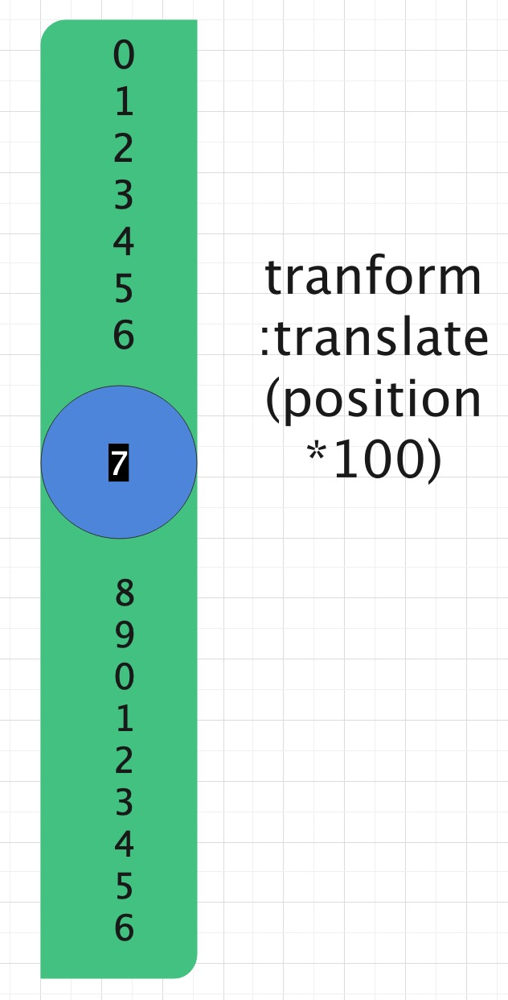

<blockquote style='padding: 10px; font-size: 1em; margin: 1em 0px; color: rgb(0, 0, 0); border-left: 5px solid rgba(0,189,170,1); background: rgb(239, 235, 233);line-height:1.5;'>
    <div>
        <div><i>It's the greatest gif we have to bear their pain without breaking.And it's born from the most human power,hope.</i></div>
        <div style="text-align:right;"><b>——Marvel·Professor X</b></div>
    <div> 
    
</blockquote>
 
# 一、Badge组件介绍

## 1.组件概述

<blockquote style='padding: 10px; font-size: 1em; margin: 1em 0px; color: rgb(0, 0, 0); border-left: 5px solid rgba(0,189,170,1); background: rgb(239, 235, 233);line-height:1;'>
    图标右上角的圆形徽标数字。
</blockquote>

## 2.为什么需要这个组件

<blockquote style='padding: 10px; font-size: 1em; margin: 1em 0px; color: rgb(0, 0, 0); border-left: 5px solid rgba(0,189,170,1); background: rgb(239, 235, 233);line-height:1。5;'>
    一般出现在通知图标或头像的右上角，用于显示需要处理的消息条数，通过醒目视觉形式吸引用户处理。
</blockquote>

# 二、Badge组件设计
  

## 原理解析



<blockquote style='padding: 10px; font-size: 1em; margin: 1em 0px; color: rgb(0, 0, 0); border-left: 5px solid rgba(0,189,170,1); background: rgb(239, 235, 233);line-height:1。5;'>
    如上图所示，文字滚动动画我觉得还是挺值得学习的。蓝色相当于我们的小红点，通过count值的变化可以判断出position的值，然后利用transform:translate来移动绿色的框，将蓝色框设置为overflow:hidden即可。
</blockquote> 

# 三、Avatar组件实战

## 1、Badge实战

```js
//Badge.js
import React,{ cloneElement, useContext } from 'react';
import PropTypes from 'prop-types';
import {
    ConfigContext
} from '@packages/core/ConfigProvider';
import useForkRef from '@packages/hooks/useForkRef';
import classNames from '@packages/utils/classNames';
import ScrollNumber from './ScrollNumber';
import useThemeColor from '@packages/hooks/useThemeColor';
import { Grow,Zoom } from '@packages/core/Transition';
import "./index.scss";


const Badge=React.forwardRef(function(props,ref){

    const {
        prefixCls:customizePrefixCls,
        className,
        style,
        children,
        count,
        overflowCount=99,
        dot=false,
        showZero=false,
        //包含状态
        color:colorProp,
        offset,
        size,
        text
    }=props;

    const handleRef=useForkRef(ref);

    const prefixCls=useContext(ConfigContext)?.getPrefixCls("Badge",customizePrefixCls);

    const color=useThemeColor(colorProp); 

    const isZero=()=>{
        const numberedDisplayCount=displayCount();
        return numberedDisplayCount==='0'||numberedDisplayCount===0;
    }

    const isDot=()=>{
        return (dot && !isZero())||(color !== null && color !== undefined);
    }

    const displayCount=()=>{  
        return count>overflowCount?`${overflowCount}+`:count;
    }

    const isHidden=()=>{
        const displayNumber=displayCount();
        const isEmpty = displayNumber === null || displayNumber === undefined || displayNumber === '';
        return (isEmpty || (isZero() && !showZero)||count<0) && !isDot();
    }

    const renderDisplayComponent=()=>{
        if(!count || typeof count!=="object"){
            return undefined;
        }

        return cloneElement(count)
    }

    const renderBadgeNumber=()=>{

        const displayNumber=displayCount(); 

        return <ScrollNumber 
            prefixCls={`${prefixCls}`}
            count={displayNumber}
            className={classNames(
                {
                    [`${prefixCls}-Count`]:!isDot(),
                    [`${prefixCls}-Dot`]:isDot(),
                    [`${prefixCls}-Small`]:size==="small", 
                }
            )}
            displayComponent={renderDisplayComponent()}
            style={{backgroundColor:color,...style,right:offset?-offset[0]:0,marginTop:offset?.[1]}}

        />
    }

    const renderText=()=>{
        const hidden=isHidden();
        return hidden||!text?null:<span className={`${prefixCls}-Text`}>{text}</span>;
    } 

    if(!children && color){
        return <div className={classNames(prefixCls)}>
            <span className={classNames(`${prefixCls}-Color`)} style={{...style,color:color,backgroundColor:color}}></span>
            <span className={classNames(`${prefixCls}-Text`)}>{text}</span>
        </div>
    }

    return (
        <span className={
            classNames(
                prefixCls,
                className,
                {
                    [`${prefixCls}-NotWrapper`]:!children
                }
            )
        }  ref={handleRef}>
            {children}
            <Zoom visible={!isHidden()} extraStyle={children?"translate(50%,-50%)":""}> 
                {renderBadgeNumber()}
            </Zoom>
            {renderText()}
        </span>
    )


});

export default Badge;

//ScrollNumber设计
import React,{cloneElement, useEffect, useState} from 'react';
import classNames from '@packages/utils/classNames';
import usePrevState from '@packages/hooks/usePrevState';

//38->[8,3]
const getNumberArray=(num)=>{
    return num
        ?num
        .toString()
        .split("") 
        .map(i=>{
            const current=Number(i);
            return isNaN(current)?i:current;
        })
        :[]
}

const renderNumberList=(position,className)=>{
    const childrenToReturn=[];
    for(let i=0;i<20;i++){
        childrenToReturn.push(
            <p
                key={i.toString()}
                className={
                    classNames(className,{
                        current:position ===i
                    })
                }
            >
                {i % 10}
            </p>
        )
    }
    return childrenToReturn;
}

const ScrollNumber=React.forwardRef((props,ref)=>{
    const {
        prefixCls:customizePrefixCls,
        className, 
        component="sup",
        style,
        title,
        count:customizeCount,
        displayComponent,
        onAnimated,
        ...restProps
    }=props;
 
    const [count,setCount]=useState(customizeCount);  
    const lastCount=usePrevState(count); 
    const prefixCls=`${customizePrefixCls}-ScrollNumber`;
  
    const newProps={
        ...restProps,
        style,
        ref:ref,
        className:classNames(prefixCls,className),
        title:title
    }

    React.useEffect(()=>{ 

        let timeout=setTimeout(()=>{
            setCount(customizeCount);
        });

        return ()=>{
            if(timeout){
                clearTimeout(timeout);
            }
        }
    },[customizeCount]);
 

    const getPositionByNum=(num,i)=>{
        const currentCount=Math.abs(Number(count));
        const lstCount=Math.abs(Number(lastCount));
        const currentDigit=Math.abs(getNumberArray(count)[i]||0);
        const lastDigit=Math.abs(getNumberArray(lstCount)[i]||0); 

        if(currentCount>lastCount||currentDigit<=lastDigit){ 
            return 10 + num;
        }
        
        return num;
    }

    const renderCurrentNumber=(num,i)=>{
        if(typeof num==="number"){
            const position=getPositionByNum(num,i);

            return React.createElement(
                "span",
                {
                    className:`${prefixCls}-Only`,
                    style:{
                        transition: undefined,
                        msTransform: `translateY(${-position * 100}%)`,
                        WebkitTransform: `translateY(${-position * 100}%)`,
                        transform: `translateY(${-position * 100}%)`,
                    },
                    key:i
                },
                renderNumberList(position,`${prefixCls}-Only-Unit`)
            )
        }

        return (
            <span key="symbol" className={`${prefixCls}-Symbol`}>
                {num}
            </span>
        )
    }

    const renderNumberElement=()=>{
        if(count && Number(count) % 1===0){
            return getNumberArray(count)
            .map((num,i)=>renderCurrentNumber(num,i)) 
        }
        return count;
    }

    if(displayComponent){
        return cloneElement(displayComponent,{
            style:style,
            className:classNames(
                `${prefixCls}-Custom-Component`
            )
        })
    }

    return React.createElement(component,newProps,renderNumberElement());

})

export default ScrollNumber;

//Ribbon.js特殊样式编写
import React,{useContext } from 'react'; 
import {
    ConfigContext
} from '@packages/core/ConfigProvider';
import capitalize from '@packages/utils/capitalize';
import useThemeColor from '@packages/hooks/useThemeColor';
import classNames from '@packages/utils/classNames';
import Paper from '@packages/core/Paper';
import "./index.scss";

const Ribbon=React.forwardRef(function(props,ref){
    const {
        prefixCls:customizePrefixCls,
        children,
        className,
        style,
        text,
        placement='end',
        color:colorProp
    }=props;

    const prefixCls=useContext(ConfigContext)?.getPrefixCls("BadgeRibbon",customizePrefixCls);

    const color=useThemeColor(colorProp);

    return (
        <div className={classNames(`${prefixCls}-Wrapper`)}>
            {children}
            <Paper 
                style={{backgroundColor:color,...style}}
                className={classNames(
                    prefixCls,
                    `${prefixCls}-Placement-${capitalize(placement)}`,
                    className
                )}
            >
                <span className={classNames(`${prefixCls}-Text`)} >{text}</span>
                <span className={classNames(`${prefixCls}-Corner`)} style={{color:color}}></span>
            </Paper>
        </div>
    )
});

export default Ribbon;

``` 

## 3、Badge组件的目录结构

```js
|-Badge.js
|-Ribbon,js
|-ScrollNumber.js
|-index.js
|-index.scss
```

# 四、Badge组件设计核心要素

## 1.useThemeColor hooks函数的使用

```js
import React from 'react';

export default function useThemeColor(color,opacity=1){
 
    let typeArr={
        "primary":`rgba(0,189,170,${opacity})`,
        "second":`rgba(64,0,130,${opacity})`,
        "warning":`rgba(252,227,138,${opacity})`,
        "info":`rgba(7,121,228,${opacity})`,
        "danger":`rgba(255,46,99,${opacity})`,
        "success":`rgba(107,198,0,${opacity})`
    };

    return React.useMemo(()=>{
        return  typeArr[color]?`${typeArr[color]}`:color;
    },[color,opacity])

}
```

<blockquote style='padding: 10px; font-size: 1em; margin: 1em 0px; color: rgb(0, 0, 0); border-left: 5px solid rgba(0,189,170,1); background: rgb(239, 235, 233);line-height:1。5;'>
    将常见的主题色color值写出来，可以通过color值来判断是否是主题色和rgba值等。
</blockquote>


## 2.通过translate实现数字滚动特效

<blockquote style='padding: 10px; font-size: 1em; margin: 1em 0px; color: rgb(0, 0, 0); border-left: 5px solid rgba(0,189,170,1); background: rgb(239, 235, 233);line-height:1.5;'>
    基本逻辑：给translate变换的元素加上过渡效果。
</blockquote>

```css
transition: all .3s cubic-bezier(.645,.045,.355,1);
```

```js
 const getPositionByNum=(num,i)=>{
        const currentCount=Math.abs(Number(count));
        const lstCount=Math.abs(Number(lastCount));
        const currentDigit=Math.abs(getNumberArray(count)[i]||0);
        const lastDigit=Math.abs(getNumberArray(lstCount)[i]||0); 

        if(currentCount>lastCount||currentDigit<=lastDigit){ 
            return 10 + num;
        }
        
        return num;
    }

    const renderCurrentNumber=(num,i)=>{
        if(typeof num==="number"){
            const position=getPositionByNum(num,i);

            return React.createElement(
                "span",
                {
                    className:`${prefixCls}-Only`,
                    style:{
                        transition: undefined,
                        msTransform: `translateY(${-position * 100}%)`,
                        WebkitTransform: `translateY(${-position * 100}%)`,
                        transform: `translateY(${-position * 100}%)`,
                    },
                    key:i
                },
                renderNumberList(position,`${prefixCls}-Only-Unit`)
            )
        }

        return (
            <span key="symbol" className={`${prefixCls}-Symbol`}>
                {num}
            </span>
        )
    }
```

## 3.offset的实现

```js
style={{backgroundColor:color,...style,right:offset?-offset[0]:0,marginTop:offset?.[1]}}
```

<blockquote style='padding: 10px; font-size: 1em; margin: 1em 0px; color: rgb(0, 0, 0); border-left: 5px solid rgba(0,189,170,1); background: rgb(239, 235, 233);line-height:1.5;'>
    红点定位在右上角的基本逻辑是：<i>position:absolute;top:0;right:0;transform:translate(50%,-50%)。</i>offset的第一个参数和第二个参数对应的是向左和向上偏移，所以采用负的right和marginTop
</blockquote>

## 4.改造Zoom过渡组件

```js
<Zoom visible={!isHidden()} extraStyle={children?"translate(50%,-50%)":""}> 
                {renderBadgeNumber()}
</Zoom>
```

<blockquote style='padding: 10px; font-size: 1em; margin: 1em 0px; color: rgb(0, 0, 0); border-left: 5px solid rgba(0,189,170,1); background: rgb(239, 235, 233);line-height:1.5;'>
    我们使用的是我们的Zoom组件，由于Zoom组件的过渡与文中元素的transform属性起了冲突，所以我们需要将额外的属性传递合并进去。这里我们需要将<b>transform-origin:100% 0%;</b>加上，否侧会产生意想不到的效果。
</blockquote>

## 5.badge标点波纹效果

```css

  if(!children && color){
        return <div className={classNames(prefixCls)}>
            <span className={classNames(`${prefixCls}-Color`)} style={{...style,color:color,backgroundColor:color}}></span>
            <span className={classNames(`${prefixCls}-Text`)}>{text}</span>
        </div>
    }

    @keyframes ripple {
        0% {
            transform: scale(.8);
            opacity: 1;
        }
        100% {
            transform: scale(2.4);
            opacity: 0;
        }
    }
 

    &-Color{
        position: relative;
        top: -1px;
        display: inline-block;
        width: 8px;
        height: 8px;
        vertical-align: middle;
        border-radius: 50%;

        &:after{
            top: 0;
            left: 0;
            width: 100%;
            border: 1px solid currentColor;
            height: 100%;
            content: "";
            position: absolute;
            animation: ripple 1.2s infinite ease-in-out;
            border-radius: 50%;
        }
    }
```
<blockquote style='padding: 10px; font-size: 1em; margin: 1em 0px; color: rgb(0, 0, 0); border-left: 5px solid rgba(0,189,170,1); background: rgb(239, 235, 233);line-height:1.5;'>
    使用<a href="https://developer.mozilla.org/zh-CN/docs/Web/CSS/Pseudo-elements">伪元素</a>来实现波纹效果。
</blockquote>

## 6.ribbon右下角倒三角

```css
.#{$prefixClsRibbon}-Wrapper{
    position: relative; 
    display: inline-block;

    .#{$prefixClsRibbon}{
        position: absolute;
        top: 8px;
        height: 22px;
        padding: 0 8px;
        color: #fff;
        line-height: 22px;
        white-space: nowrap;
        background-color: $primary-color;
        border-radius: 2px;

        &-Corner{
            position: absolute;
            top: 100%;
            width: 8px;
            height: 8px;
            color: $primary-color;
            border: 4px solid;
            transform: scaleY(.75);
            transform-origin: top;

            &:after{
                
                position: absolute;
                top: -4px;
                left: -4px;
                width: inherit;
                height: inherit;
                color: rgba(0,0,0,.25);
                border: inherit;
                content: "";
            }
            
        }

    }
    .#{$prefixClsRibbon}-Placement-End{
        right: -8px;
        border-bottom-right-radius: 0;

        .#{$prefixClsRibbon}-Corner{
            right:0;
            border-color: currentColor transparent transparent currentColor;
            
        }

    }
    
}
```
<blockquote style='padding: 10px; font-size: 1em; margin: 1em 0px; color: rgb(0, 0, 0); border-left: 5px solid rgba(0,189,170,1); background: rgb(239, 235, 233);line-height:1.5;'>
    1.使用border-color: currentColor transparent transparent currentColor;结合 border: 4px solid;来实现三角效果<br />
    2.border: inherit;width:inherit;height:inherit;巧妙运用inherit减少代码<br />
    3.color: rgba(0,0,0,.25);通过伪元素给倒三角添加一个蒙层加深效果，使得更有层次感。
</blockquote>

## 7.usePrevState hooks函数来获取上一次的state值。

```js

import React,{useRef, useEffect} from 'react';

/**
 * 获取上一轮的state值
 * 原理：先执行return ref.current再进行赋值操作
 * @param {*} value 
 */
export default function usePrevState(value){

    const ref=useRef(value);

    useEffect(()=>{
        ref.current=value

        return ()=>{
            ref.current=null;
        }
    },[value]) 

    return ref.current;
}
```

<blockquote style='padding: 10px; font-size: 1em; margin: 1em 0px; color: rgb(0, 0, 0); border-left: 5px solid rgba(0,189,170,1); background: rgb(239, 235, 233);line-height:1.5;'>
    在文字滚动时需要判断值的变化，所以需要借助此函数来获取上一次state的值。
</blockquote>
