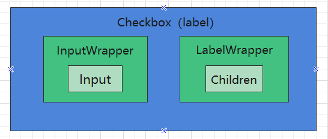

<blockquote style='padding: 10px; font-size: 1em; margin: 1em 0px; color: rgb(0, 0, 0); border-left: 5px solid rgba(0,189,170,1); background: rgb(239, 235, 233);line-height:1.5;'>
    <div>
        <div><i>All that you know, is at an end.</i></div>
        <div style="text-align:right;"><b>——Marvel·Silver Surfer</b></div>
    <div> 
    
</blockquote>
 
# 一、Checkbox组件介绍

## 1.组件概述

<blockquote style='padding: 10px; font-size: 1em; margin: 1em 0px; color: rgb(0, 0, 0); border-left: 5px solid rgba(0,189,170,1); background: rgb(239, 235, 233);line-height:1;'>
    多选框。
</blockquote>

## 2.为什么需要这个组件

<blockquote style='padding: 10px; font-size: 1em; margin: 1em 0px; color: rgb(0, 0, 0); border-left: 5px solid rgba(0,189,170,1); background: rgb(239, 235, 233);line-height:1。5;'>
    1.在一组可选项中进行多项选择时；<br />
    2.单独使用可以表示两种状态之间的切换，和 switch 类似。区别在于切换 switch 会直接触发状态改变，而 checkbox 一般用于状态标记，需要和提交操作配合。
</blockquote>

# 二、Checkbox组件设计
  

## 原理解析



<blockquote style='padding: 10px; font-size: 1em; margin: 1em 0px; color: rgb(0, 0, 0); border-left: 5px solid rgba(0,189,170,1); background: rgb(239, 235, 233);line-height:1。5;'>
    一个最常用的表单元素组件之一，checkbox组件分为2个部分。一个是左边的真正checkbox部分，右边部分是子元素。
</blockquote> 

# 三、Checkbox组件实战

## 1、代码实战

```js
import React, { useContext } from 'react';
import classNames from '@packages/utils/classNames';
import {
    ConfigContext
} from '@packages/core/ConfigProvider';
import ButtonBase from '@packages/core/ButtonBase';
import { CheckboxSelected, CheckboxUnSelected } from '@packages/core/Icon';
import useControlled from '@packages/hooks/useControlled';
import capitalize from '@packages/utils/capitalize'; 
import CheckGroupContext from './CheckboxGroupContext';
import createChainedFunction from '@packages/utils/createChainedFunction';
import "./index.scss";

const Checkbox = React.forwardRef((props, ref) => {
    const {
        prefixCls: customizePrefixCls,
        component: Component = "span",
        className,
        checked: checkedProp,
        defaultChecked,
        onChange:onChangeProp,
        color = "primary",
        selectIcon = <CheckboxSelected />,
        unselectIcon = <CheckboxUnSelected />,
        indeterminate,
        children,
        value
    } = props;

    const prefixCls = useContext(ConfigContext)?.getPrefixCls("Checkbox", customizePrefixCls);

    const checkboxGroup=useContext(CheckGroupContext);

    let ischecked=checkedProp;

    if(checkboxGroup){
        if(typeof ischecked==='undefined'){
            ischecked=checkboxGroup.value?checkboxGroup.value.indexOf(value)>-1?true:false:false;
        }
    }

    const [checked, setChecked] = useControlled({
        controlled: ischecked,
        default: Boolean(defaultChecked)
    });

    const onChange=createChainedFunction(onChangeProp,checkboxGroup && checkboxGroup.onChange);

    const handleChange = (e) => {
        setChecked(e.target.checked);
        onChange?.(e.target.checked, e,value); 
    } 

    return (
        <label
            className={
                classNames(
                    prefixCls,
                    className, 
                )
            }
        >
            <ButtonBase
                component="span"
                className={
                    classNames(
                        `${prefixCls}-CheckboxBaseRipple`,
                        {
                            [`${prefixCls}-Checked`]: checked,
                            [`${prefixCls}-${capitalize(color)}`]: color
                        }
                    )
                }
                centerRipple
                square
            >
                <Component
                    className={
                        classNames(
                            `${prefixCls}-InputWrapper`,

                        )
                    }
                >
                    <input
                        type="checkbox"
                        className={
                            classNames(
                                `${prefixCls}-Input`
                            )
                        }
                        onChange={(e) => handleChange(e)}
                        checked={checked}
                        ref={ref}
                        value={value}
                    />

                    {checked ? selectIcon : unselectIcon}

                    {indeterminate && !checked && <span className={classNames(`${prefixCls}-Indeterminate`)}></span>}

                </Component>

            </ButtonBase>
            {children && <Component
                className={
                    classNames(
                        `${prefixCls}-labelWrapper`
                    )
                }
            >
                {children}
            </Component>}
        </label>
    )
});

export default Checkbox;
``` 

## 2、Checkbox组件的目录结构

```js
|-Checkbox.js
|-CheckGroup.js
|-CheckGroupContext.js
|-index.js
|-index.scss
```

# 四、Checkbox组件设计核心要素

## 1.input[type="checkbox"]

```js
<input
    type="checkbox"
    className={
        classNames(
        `${prefixCls}-Input`
        )
    }
    onChange={(e) => handleChange(e)}
    checked={checked}
    ref={ref}
    value={value}
/>

```

<blockquote style='padding: 10px; font-size: 1em; margin: 1em 0px; color: rgb(0, 0, 0); border-left: 5px solid rgba(0,189,170,1); background: rgb(239, 235, 233);line-height:1。5;'>
当使用type="checkbox"时，value表示checkbox的value值，checked表示是否选中。</br >
</blockquote>


## 2.label的作用

<blockquote style='padding: 10px; font-size: 1em; margin: 1em 0px; color: rgb(0, 0, 0); border-left: 5px solid rgba(0,189,170,1); background: rgb(239, 235, 233);line-height:1.5;'>
    我们一般是点击Checkbox来点击切换checkbox的状态，但是我们这里不是用我们的click事件，而是使用input框的change事件，当label标签内部有表单元素时，当点击label标签内的元素时，表单元素会触发点击事件，其中的event.target.checked可以获取此时表单元素的选中状态。
</blockquote>

```js
<label
    className={
        classNames(
            prefixCls,
            className, 
        )
    }
>
            ......
    {children && <Component
                className={
                    classNames(
                        `${prefixCls}-labelWrapper`
                    )
                }
    >
            {children}
    </Component>}
</label>
```

## 3.使用createChainedFunction是的函数可以按顺序执行

```js 

//可以让函数依次执行

export default function createChainedFunction(...params){

    const args=Array.prototype.slice.call(arguments,0);

    if(args.length===1){
        return args[0];
    }

    return function chainedFunction(){
        for(let i=0;i<args.length;i++){
            if(args[i] && args[i].apply){
                args[i].apply(this,arguments);
            }
        }
    }
}

const onChange=createChainedFunction(onChangeProp,checkboxGroup && checkboxGroup.onChange);
```

<blockquote style='padding: 10px; font-size: 1em; margin: 1em 0px; color: rgb(0, 0, 0); border-left: 5px solid rgba(0,189,170,1); background: rgb(239, 235, 233);line-height:1.5;'>
    这个函数中使用了call来将传入的参数变成一个数组，然后使用apply将传入的函数一一执行，这样子就能够实现一个函数接受多个函数，然后按照顺序执行。（个人感觉就是代码比较优雅没什么卵用）
</blockquote>

 ## 4.使用context进行判断是否是在group中
 
```js
//Group
import React from 'react';
import classNames from '@packages/utils/classNames';
import {
    ConfigContext
} from '@packages/core/ConfigProvider';
import CheckboxGroupContext from './CheckboxGroupContext';
import useControlled from '@packages/hooks/useControlled';
import "./index.scss";

const CheckGroup=React.forwardRef((props,ref)=>{

    const {
        Component="div",
        className,
        value:valueProp,
        defaultValue,
        name="check-group",
        prefixCls:customizePrefixCls,
        children,
        onChange
    }=props;

    const prefixCls = React.useContext(ConfigContext)?.getPrefixCls("CheckboxGroup", customizePrefixCls);

    const [value,setValue]=useControlled({
        controlled:valueProp,
        default:defaultValue
    }); 

    const handleChangeCheckbox=(checked,event,name)=>{
        let index=value.indexOf(name); 
        if(index>-1){//当存在时
            if(checked===false){//移除存在的
                value.splice(index,1);
            }
        }else{
            if(checked===true){//添加没有的
                value.push(name);
            }
        } 
        setValue([...value]);
        onChange?.(value,e);
    }
    
    return (
        <CheckboxGroupContext.Provider value={{name,onChange:handleChangeCheckbox,value}}>
            <Component
                className={
                    classNames(
                        prefixCls,
                        className
                    )
                }
                ref={ref}
            >
                {children}
            </Component>
        </CheckboxGroupContext.Provider>
    )
});

export default CheckGroup;


    let ischecked=checkedProp;

    if(checkboxGroup){
        if(typeof ischecked==='undefined'){
            ischecked=checkboxGroup.value?checkboxGroup.value.indexOf(value)>-1?true:false:false;
        }
    }

    const [checked, setChecked] = useControlled({
        controlled: ischecked,
        default: Boolean(defaultChecked)
    });
```