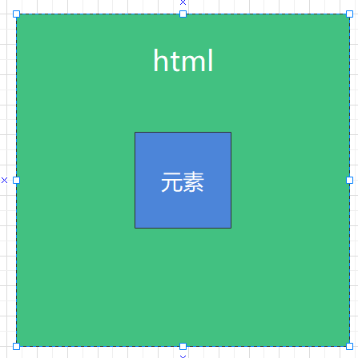
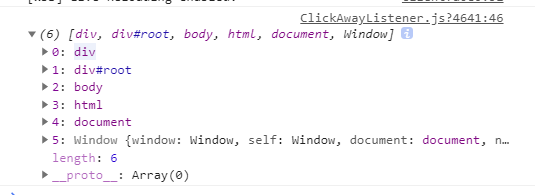

<blockquote style='padding: 10px; font-size: 1em; margin: 1em 0px; color: rgb(0, 0, 0); border-left: 5px solid rgba(0,189,170,1); background: rgb(239, 235, 233);line-height:1.5;'>
    <div>
        <div><i>I’m Venom and you are mine.</i></div>
        <div style="text-align:right;"><b>——Marvel·Venom</b></div>
    <div> 
    
</blockquote>
 
# 一、ClickAwayListener组件介绍

## 1.组件概述

<blockquote style='padding: 10px; font-size: 1em; margin: 1em 0px; color: rgb(0, 0, 0); border-left: 5px solid rgba(0,189,170,1); background: rgb(239, 235, 233);line-height:1;'>
    用于检测点击事件是否发生在元素之外。 它可以监听文档中某处发生的点击事件。
</blockquote>

## 2.为什么需要这个组件

<blockquote style='padding: 10px; font-size: 1em; margin: 1em 0px; color: rgb(0, 0, 0); border-left: 5px solid rgba(0,189,170,1); background: rgb(239, 235, 233);line-height:1。5;'>
   例如，在tooltip组件内部，当用户在点击页面除提示框外的任何一处，产生响应事件。
</blockquote>

# 二、ClickAwayListener组件设计
  

## 原理解析



<blockquote style='padding: 10px; font-size: 1em; margin: 1em 0px; color: rgb(0, 0, 0); border-left: 5px solid rgba(0,189,170,1); background: rgb(239, 235, 233);line-height:1。5;'>
    页面监听点击事件，判断点击事件是否在元素内部，如果在元素外部则触发回调事件。
</blockquote> 

# 三、ClickAwayListener组件实战

## 1、代码实战

```js
import React ,{useRef} from 'react';
import PropTypes from 'prop-types';
import useForkRef from '@packages/hooks/useForkRef';
import ownerDocument from '@packages/utils/ownerDocument';

function mapEventPropToEvent(eventProp){
    return eventProp.substring(2).toLowerCase();
}
 

const ClickAwayListener = React.forwardRef((props, ref) => {
    const {
        children,
        mouseEvent = "onClick",
        onClickAway
    } = props;

    const nodeRef=useRef(null);

    const handleRef=useForkRef(children.ref,ref,nodeRef);

    const childrenProps={ref:handleRef}

    const createHandleSynthetic=(handlerName)=>(event)=>{
        const childrenPropsHandler=children.props[handlerName];
        if(childrenPropsHandler){
            childrenPropsHandler(event);
        }
    }

    if(mouseEvent!==false){
        childrenProps[mouseEvent]=createHandleSynthetic(mouseEvent);
    }

    const handleClickAway=(event)=>{
        if(!nodeRef.current){
            return ;
        }

        //是否点击在元素内部
        let insideDOM;

        if(event.composedPath){
            insideDOM=event.composedPath().indexOf(nodeRef.current)>-1;
        }else{
            const doc=ownerDocument(nodeRef.current);

            insideDOM=nodeRef.current.contains(event.target);
        }

        if(!insideDOM){

            onClickAway(event)
        } 
    }

    React.useEffect(()=>{
        if(mouseEvent!==false){
            const mappedMouseEvent=mapEventPropToEvent(mouseEvent);

            const doc=ownerDocument(nodeRef.current);

            doc.addEventListener(mappedMouseEvent,handleClickAway);

            return ()=>{
                doc.removeEventListener(mappedMouseEvent,handleClickAway);
            }

        }
    },[handleClickAway,mouseEvent])

    return <React.Fragment>
        {React.cloneElement(children, childrenProps)}
    </React.Fragment>

}); 

export default ClickAwayListener;

```
 

<blockquote style='padding: 10px; font-size: 1em; margin: 1em 0px; color: rgb(0, 0, 0); border-left: 5px solid rgba(0,189,170,1); background: rgb(239, 235, 233);line-height:1。5;'>
    代码非常简单，相信直接看也是可以看懂的。
</blockquote> 

## 2、ClickAwayListener组件的目录结构

```js
|-ClickAwayListener.js
|-index.js 
```

# 四、ClickAwayListener组件设计核心要素

## 1.react 事件转化

```js
function mapEventPropToEvent(eventProp){
    return eventProp.substring(2).toLowerCase();
}
```

<blockquote style='padding: 10px; font-size: 1em; margin: 1em 0px; color: rgb(0, 0, 0); border-left: 5px solid rgba(0,189,170,1); background: rgb(239, 235, 233);line-height:1。5;'>
    在React中事件采用驼峰命名法，而我们这里采用了addEventListener也就是DOM2级事件监听函数写法，所以需要转化onClick->click。
</blockquote>


## 2.ownerDocument获取元素唯一的document文档

<blockquote style='padding: 10px; font-size: 1em; margin: 1em 0px; color: rgb(0, 0, 0); border-left: 5px solid rgba(0,189,170,1); background: rgb(239, 235, 233);line-height:1。5;'>
    <a href="https://developer.mozilla.org/zh-CN/docs/Web/API/Node/ownerDocument">Node.ownerDocument</a> 只读属性会返回当前节点的顶层的 document 对象。<br />

</blockquote>

```js
export default function ownerDocument(node){
    return (node && node.ownerDocument)||document;
}
```

## 3.event.composedPath判断点击的是否是当前元素

```js
if(event.composedPath){ 
            insideDOM=event.composedPath().indexOf(nodeRef.current)>-1;
}else{ 
            insideDOM=nodeRef.current.contains(event.target);
}
```
<blockquote style='padding: 10px; font-size: 1em; margin: 1em 0px; color: rgb(0, 0, 0); border-left: 5px solid rgba(0,189,170,1); background: rgb(239, 235, 233);line-height:1。5;'>
1.<a href="https://developer.mozilla.org/zh-CN/docs/Web/API/Event/composedPath">event.composedPath</a>返回一个数组，冒泡的路径经过的节点，如下图所示。<br />
2.如果有些浏览器不支持composedPath则使用Node.contains()，<a href="https://developer.mozilla.org/zh-CN/docs/Web/API/Node/contains">Node.contains()</a>返回的是一个布尔值，来表示传入的节点是否为该节点的后代节点,此方法可以判断点击是否发生在元素内部。
</blockquote>

