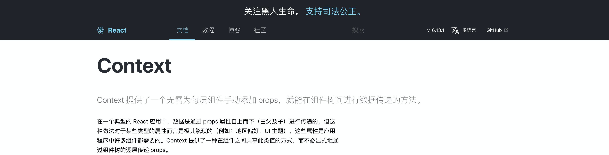
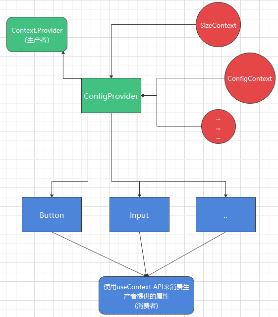

<blockquote style='padding: 10px; font-size: 1em; margin: 1em 0px; color: rgb(0, 0, 0); border-left: 5px solid rgba(0,189,170,1); background: rgb(239, 235, 233);line-height:1;'>
    <div>
        <div><i>I am Iron Man.</i></div>
        <div style="text-align:right;"><b>——Marvel·Iron Man</b></div>
    <div> 
    
</blockquote>
 
# 一、ConfigProvider组件介绍

## 1.组件概述

<blockquote style='padding: 10px; font-size: 1em; margin: 1em 0px; color: rgb(0, 0, 0); border-left: 5px solid rgba(0,189,170,1); background: rgb(239, 235, 233);line-height:1;'>
    为组件提供统一的全局化配置。
</blockquote>

## 2.为什么需要这个组件

<blockquote style='padding: 10px; font-size: 1em; margin: 1em 0px; color: rgb(0, 0, 0); border-left: 5px solid rgba(0,189,170,1); background: rgb(239, 235, 233);line-height:1。5;'>
    在我们日常开发中，往往需要一个很简单的操作，就可以完成全局的配置。比如下拉框选择中文和英文需要全文切换语言，选择大、中、小尺寸使得全文中的输入框等实现大小尺寸的切换。所以我们希望可以通过一个通用组件传递一些参数就可以实现这些功能。
</blockquote>

# 二、ConfigProvider组件设计
 
## 1.重点特性

<blockquote style='padding: 10px; font-size: 1em; margin: 1em 0px; color: rgb(0, 0, 0); border-left: 5px solid rgba(0,189,170,1); background: rgb(239, 235, 233);line-height:1。5;'>
    全局化配置很容易让人想到<a href="https://zh-hans.reactjs.org/docs/context.html#gatsby-focus-wrapper">React Context API</a> 打开文档可以明晃晃的看见一句：Context 提供了一个无需为每层组件手动添加 props，就能在组件树间进行数据传递的方法。
</blockquote>




## 2.原理解析

<blockquote style='padding: 10px; font-size: 1em; margin: 1em 0px; color: rgb(0, 0, 0); border-left: 5px solid rgba(0,189,170,1); background: rgb(239, 235, 233);line-height:1。5;'>
    就是在ConfigProvider这个组件中提供Provider生产者将全局属性传递给消费组件。在每个需要全局配置的组件也就是消费组件通过是否有通过ConfigProvider中传递的context属性值和自身组件的props属性值来得出合并的值（ConfigProvider优先级高）即如果Context对象中存在size属性值，组件本身也有size属性值，则取Context中的属性值，再继续进行后续操作。
</blockquote>



# 三、ConfigProvider组件实战

<blockquote style='padding: 10px; font-size: 1em; margin: 1em 0px; color: rgb(0, 0, 0); border-left: 5px solid rgba(0,189,170,1); background: rgb(239, 235, 233);line-height:1。5;'>
    这里我们只设计 componentSize、prefixCls这2个后续会使用到的API。
</blockquote> 

## 1、SizeContext设计


<blockquote style='padding: 10px; font-size: 1em; margin: 1em 0px; color: rgb(0, 0, 0); border-left: 5px solid rgba(0,189,170,1); background: rgb(239, 235, 233);line-height:1。5;'>
    SizeContext这个Context专门用来传递size。
</blockquote> 

```js
import React from 'react';

const SizeContext=React.createContext(undefined);

export default SizeContext;
```
 
## 2、ConfigContext设计

<blockquote style='padding: 10px; font-size: 1em; margin: 1em 0px; color: rgb(0, 0, 0); border-left: 5px solid rgba(0,189,170,1); background: rgb(239, 235, 233);line-height:1。5;'>
    ConfigContext这个Context用来传递一些全局配置如全局类名前缀prefixCls。
</blockquote> 

```js
import React from 'react';

let globalPrefix="parrot-pc";

const ConfigContext=React.createContext({
    getPrefixCls:(suffixCls,customizePrefixCls)=>{
        if(customizePrefixCls) return customizePrefixCls;

        return suffixCls?`${globalPrefix}-${suffixCls}`:globalPrefix;
    }
})

export default ConfigContext;
```

<blockquote style='padding: 10px; font-size: 1em; margin: 1em 0px; color: rgb(0, 0, 0); border-left: 5px solid rgba(0,189,170,1); background: rgb(239, 235, 233);line-height:1。5;'>
    这个Context提供了一个默认的获取类名前缀的方法，因为后面每个组件都需要使用这个方法来获取类名。
</blockquote> 

## 3、ConfigContext组件的设计

```js


import React,{useContext} from 'react';
import SizeContext from './SizeContext';
import ConfigContext from './ConfigContext';

 
const ConfigProvider=props=>{

    const {
        children,
        componentSize,
        prefixCls
    }=props;

    const configContext=useContext(ConfigContext);

    const getPrefixClsWrapper=(context)=>{
        return (suffixCls,customizePrefixCls)=>{ 

            if(customizePrefixCls) return customizePrefixCls;

            const mergePrefixCls=prefixCls||context.getPrefixCls('');

            return suffixCls?`${mergePrefixCls}-${suffixCls}`:mergePrefixCls;
        }
    }

    const config={
        ...configContext,
        getPrefixCls:getPrefixClsWrapper(configContext),
    }

    return (
        <SizeContext.Provider value={componentSize}>
            <ConfigContext.Provider value={config}>
                {children}
            </ConfigContext.Provider>
        </SizeContext.Provider>
    ) 
}

export default ConfigProvider;
```

<blockquote style='padding: 10px; font-size: 1em; margin: 1em 0px; color: rgb(0, 0, 0); border-left: 5px solid rgba(0,189,170,1); background: rgb(239, 235, 233);line-height:1。5;'>
    这个组件就是全文的核心文件，通过引入SizeContext和ConfigContext对象使用Context.Provider属性包裹children。这个组件运用在顶层容器上，所有被包裹的所有组件都可以使用useContext(Context)获取出对应的Provider中传入的值。如果顶层没有ConfigContext包裹的话会默认使用初始化时传入的getPrefixCls，即前缀为parrot-pc。如果有被包裹，将会通过ConfigProvider传入的属性prefixCls来得到类名。
</blockquote> 

## 4、ConfigProvider组件的目录结构

|-ConfigContext
|-ConfigProvider
|-index.js
|-SizeContext.js

# 四、ConfigProvider组件设计核心要素

## 1.React.Context API 使用

<blockquote style='padding: 10px; font-size: 1em; margin: 1em 0px; color: rgb(0, 0, 0); border-left: 5px solid rgba(0,189,170,1); background: rgb(239, 235, 233);line-height:1。5;'>
    <div>1.createContext可以创建Context对象，并且可以设置初始化的值</div>
    <div>2.Context.Provider是生产者，可以提供需要传递的属性名</div>
    <div>3.useContext(Context)可以获取传递的属性值，仅可在HOOKS中使用</div>
    <div>4.在class组件中可以使用Context.Consumer来或者传递的属性值</div>
</blockquote>


## 2.在组件中也要相对应的设计

<blockquote style='padding: 10px; font-size: 1em; margin: 1em 0px; color: rgb(0, 0, 0); border-left: 5px solid rgba(0,189,170,1); background: rgb(239, 235, 233);line-height:1。5;'>
    这个组件仅仅是单纯的传递一个context属性值而已，当然仅仅是一个值不能够这么神奇的改变全文类名前缀、组件大小等，还是需要自己在组件库的其他组件中对应写出相关的代码的：
</blockquote>

```js
//Button组件
...

import SizeContext from '...';
import ConfigContext from '...';

...

const Button=(props)=>{

    ......

    const contextSize=React.useContext(SizeContext);
    const contextConfig=React.useContext(ConfigContext);

    const mergeSize=context||props.size;
    const {getPrefixCls}=contextConfig

    ......
}

```
