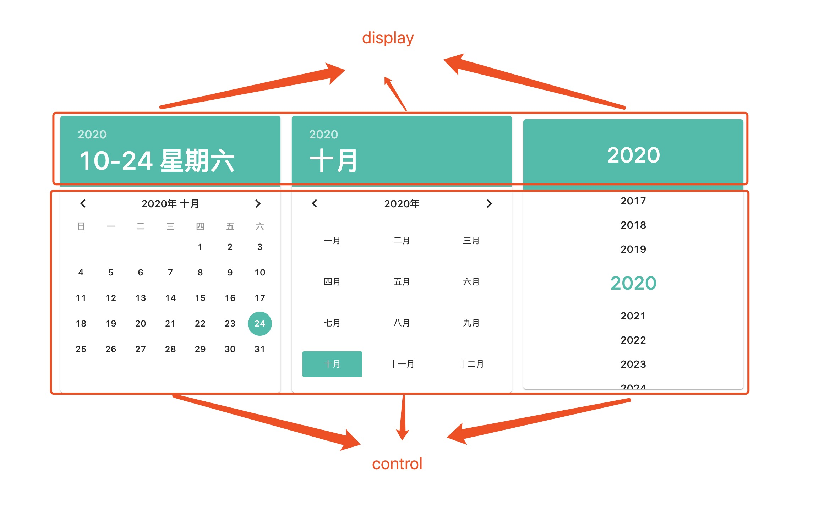

<blockquote style='padding: 10px; font-size: 1em; margin: 1em 0px; color: rgb(0, 0, 0); border-left: 5px solid rgba(0,189,170,1); background: rgb(239, 235, 233);line-height:1.5;'>
    <div>
        <div><i>You obviously，do not know whom you are fucking with！.</i></div>
        <div style="text-align:right;"><b>——Marvel·Blade</b></div>
    <div> 
    
</blockquote>
 
# 一、DatePicker组件介绍

## 1.组件概述

<blockquote style='padding: 10px; font-size: 1em; margin: 1em 0px; color: rgb(0, 0, 0); border-left: 5px solid rgba(0,189,170,1); background: rgb(239, 235, 233);line-height:1;'>
    输入或选择日期的控件。
</blockquote>

## 2.为什么需要这个组件

<blockquote style='padding: 10px; font-size: 1em; margin: 1em 0px; color: rgb(0, 0, 0); border-left: 5px solid rgba(0,189,170,1); background: rgb(239, 235, 233);line-height:1。5;'>
    当用户需要输入一个日期，可以点击标准输入框，弹出日期面板进行选择。
</blockquote>

# 二、DatePicker组件设计
  

## 原理解析



<blockquote style='padding: 10px; font-size: 1em; margin: 1em 0px; color: rgb(0, 0, 0); border-left: 5px solid rgba(0,189,170,1); background: rgb(239, 235, 233);line-height:1。5;'>
    确实这个组件个人感觉挺难的，细节部分很多。如上图，这里我们有三种模式年、月、日。对应的样式、逻辑也是不一样的。我们的组件展示部分为2个一个是展示部分，一个是可选部分。上面的日期是选择完的状态，我们给一个value,下面的选择中的状态，我们给予一个displayValue,当在选择中时我们可以更改displayValue来改变渲染的页面，当真正的选择一个日期时，更改value来改变展示部分的页面。并且定义个displayType来改变可选部分的渲染界面。
</blockquote> 

# 三、DatePicker组件实战

## 1、代码实战

```js

import React, { useContext, Fragment, useState, useRef, useEffect } from 'react';
import {
    ConfigContext
} from '@packages/core/ConfigProvider';
import PickerContainer from '@packages/core/PickerContainer';
import useControlled from '@packages/hooks/useControlled';
import useDate, {
    weekEnum,
    chunk,
    getNextMonth,
    getPrevMonth,
    complete,
    chunkInput,
    getPrevYear,
    getNextYear,
    transformMonth,
    generateYear
} from '@packages/utils/useDate';
import Button from '@packages/core/Button';
import useInit from '@packages/hooks/useInit';
import {
    KeyboardArrowLeft,
    KeyboardArrowRight
} from '@packages/core/Icon';
import classNames from '@packages/utils/classNames';
import usePrevState from '@packages/hooks/usePrevState';
import Slider from './Slider';
import "./index.scss";

const DatePicker = React.forwardRef((props, ref) => {
    const {
        prefixCls: customizePrefixCls,
        className,
        value: valueProp,
        defaultValue,
        type: typeProp = "day",//year/month/day
        onChange,
        landspace=false
    } = props;

    const [value, setValue] = useControlled({
        controlled: valueProp,
        default: defaultValue
    });

    const prefixCls = useContext(ConfigContext)?.getPrefixCls("DatePicker", customizePrefixCls);

    //只做展示的value
    const [displayValue, setDisplayValue] = useState(value);

    //展示的类型
    const [displayType, setDisplayType] = useState(typeProp);

    //当前年份
    const currentYearRef = useRef(null);

    //年份
    const yearListRef = useRef(null);

    const isInit=useInit();

    const prevValue = usePrevState(value);
    //一个展示的date 界面渲染跟着他来 
    const prevDisplayValue = usePrevState(displayValue);

    const getStatus = (mode) => {
        //获取动画方向
        if (mode === "value") {
            //如果是value的变化
            if (prevValue) {
                if (useDate(prevValue).time > useDate(value).time) {
                    return "prev";
                }
                return "next";
            }
        } else if (mode === "display") {

            if (prevDisplayValue) {
                if (useDate(prevDisplayValue).time > useDate(displayValue).time) {
                    return "prev";
                }
                return "next";
            }
        }

        return "next";
    }

    const handleSwitchTitle = (status) => {//点击左右侧按钮

        //切换月份
        if (displayType === "day") {

            if (status === "next") {
                setDisplayValue(useDate(getNextMonth(displayValue)).fullDate)
            } else {
                setDisplayValue(useDate(getPrevMonth(displayValue)).fullDate)
            }

        } else if (displayType === "month") {
            if (status === "next") {
                setDisplayValue(useDate(getNextYear(displayValue)).fullDate)
            } else {
                setDisplayValue(useDate(getPrevYear(displayValue)).fullDate)
            }
        }
    }

    const handleClickButton = (num) => {//点击日历上的日期
        if (displayType === "day") {
            setValue(`${useDate(displayValue).year}-${useDate(displayValue).month}-${complete(num)}`);
            setDisplayValue(`${useDate(displayValue).year}-${useDate(displayValue).month}-${complete(num)}`);
        } else if (displayType === "month") {
            setValue(`${useDate(displayValue).year}-${complete(num)}-${useDate(value).day}`);
            setDisplayValue(`${useDate(displayValue).year}-${complete(num)}-${useDate(value).day}`)
            handleSwicthType("day");
        } else if (displayType === "year") {
            setValue(`${num}-${useDate(value).month}-${useDate(value).day}`);
            setDisplayValue(`${num}-${useDate(value).month}-${useDate(value).day}`);
            handleSwicthType("month");
        }

    }

    // const handleSwicthToolbarText=(type)=>{//点击toolbar的title
        
    // }

    const handleSwicthType=(toMode)=>{//toMode表示切换到哪种模式
        if(typeProp==="day"){//typeProp为day时可以切换到任意模式
            setDisplayType(toMode);
        }else if(typeProp==="month"){//typeProp为month时无法切换到day模式下
            if(toMode==="day"){
                return ;
            }
            setDisplayType(toMode);
        }else if(typeProp==="year"){
            if(toMode==="day"||toMode==="month"){
                return ;
            }
            setDisplayType(toMode);
        }
    }


    //渲染头部内容
    const renderDisplay = () => {

        let displayNode;

        let yearNode = <div className={`${prefixCls}-Display-Year`} onClick={()=>handleSwicthType("year")}>
            <Slider status={getStatus("value")} date={useDate(value).year}>
                <div className={`${prefixCls}-Display-Year-Text`}>
                    {useDate(value).year}
                </div>
            </Slider>
        </div>

        let monthNode = <div className={`${prefixCls}-Display-Month`}>
            <Slider status={getStatus("value")} date={useDate(value).month}>
                <div className={`${prefixCls}-Display-Month-Text`}>
                    {useDate(value).monthTransform}
                </div>
            </Slider>
        </div>


        let monthdayNode = <div className={`${prefixCls}-Display-Monthday`} onClick={()=>handleSwicthType("day")}>
            <Slider status={getStatus("value")} date={useDate(value).fullDate}>
                <div className={`${prefixCls}-Display-Monthday-Text`}>
                    {useDate(value).monthday} {useDate(value).weekTransform}
                </div>
            </Slider>

        </div>

        if (typeProp === "day") {
            displayNode = <Fragment>
                {yearNode}
                {monthdayNode}
            </Fragment>
        } else if (typeProp === "month") {
            displayNode = <Fragment>
                {yearNode}
                {monthNode}
            </Fragment>
        } else if(typeProp==="year"){
            displayNode = <Fragment>
                {yearNode} 
            </Fragment>
        }
        
        

        return displayNode;
    }

    //渲染内容区域
    const renderContainer = () => {
        let containerNode;
        let toolbarNode;
        let toolbarTitle;
        let weekNode;
        let contentNode;

        if (displayType === "day") {

            toolbarTitle = <Slider status={getStatus("display")} date={useDate(displayValue).month} direction="leftRight">
                <div className={`${prefixCls}-Toolbar-Title-Text`} onClick={()=>handleSwicthType("month")}>
                    {useDate(displayValue).yearTransform} {useDate(displayValue).monthTransform}
                </div>
            </Slider>

            weekNode = <div className={`${prefixCls}-Container-Monthday-Week`}>
                {
                    weekEnum.map((week) => <div key={week} className={`${prefixCls}-Container-Monthday-Week-Day`}>{week}</div>)
                }
            </div>

            contentNode = <div className={`${prefixCls}-Container-Monthday-Day`}>
                <Slider status={getStatus("display")} date={useDate(displayValue).month} direction="leftRight" renderChildren>
                    <div className={`${prefixCls}-Container-Monthday-Day-Wrapper`}>
                        {chunk(useDate(displayValue).date, 7).map((item, idx) => {
                            return <div key={idx} className={`${prefixCls}-Container-Monthday-Day-Row`} >
                                {item.map((i, index) => {
                                    if (!i) {
                                        return <div key={index} className={`${prefixCls}-Container-Monthday-Day-Row-Empty`}></div>
                                    }
                                    return <div key={index} className={classNames(
                                        `${prefixCls}-Container-Monthday-Day-Row-Button`,
                                        {
                                            ['now']: useDate(displayValue).year === useDate().year &&
                                                useDate(displayValue).month === useDate().month &&
                                                Number(i) === Number(useDate().day),
                                            ['selected']: useDate(value).year === useDate(displayValue).year &&
                                                useDate(value).month === useDate(displayValue).month &&
                                                Number(i) === Number(useDate(value).day)
                                        }
                                    )} onClick={() => handleClickButton(i)}>
                                        <div className={`${prefixCls}-Container-Monthday-Day-Row-Button-Bg`}></div>
                                        <div className={`${prefixCls}-Container-Monthday-Day-Row-Button-Text`}>{i}</div>
                                    </div>
                                })}
                            </div>
                        })}
                    </div>
                </Slider>
            </div>
        } else if (displayType === "month") {

            toolbarTitle = <Slider status={getStatus("display")} date={useDate(displayValue).year} direction="leftRight">
                <div className={`${prefixCls}-Toolbar-Title-Text`} onClick={()=>handleSwicthType("year")}>
                    {useDate(displayValue).yearTransform}
                </div>
            </Slider>

            weekNode = null;

            contentNode = <div className={`${prefixCls}-Container-Month-Content`}>
                <Slider status={getStatus("display")} date={useDate(displayValue).fullDate} direction="leftRight" renderChildren>
                    <div className={`${prefixCls}-Container-Month-Button-Wrapper`}>
                        {chunkInput(Array.from({ length: 12 }, (v, k) => k + 1), 3).map((item, idx) => {
                            return <div key={idx} className={`${prefixCls}-Container-Month-Button-Wrapper-Row`} >
                                {item.map((i, index) => {
                                    return <div key={index} className={classNames(
                                        `${prefixCls}-Container-Month-Button`,
                                        {
                                            ['now']: useDate(displayValue).year === useDate().year &&
                                                useDate(displayValue).month == complete(i),
                                            ['selected']: useDate(value).year === useDate(displayValue).year &&
                                                useDate(value).month ==complete(i)
                                        }
                                    )} onClick={() => handleClickButton(i)}>
                                        <div className={`${prefixCls}-Container-Month-Button-Bg`}></div>
                                        <div className={`${prefixCls}-Container-Month-Button-Text`}>{transformMonth(i)}</div>
                                    </div>
                                })}
                            </div>
                        })}
                    </div>
                </Slider>
            </div>

        }


        toolbarNode = <div className={`${prefixCls}-Toolbar`}>
            <Button centerRipple type="text" shape="circle" className={`${prefixCls}-Container-Monthday-Button`} onClick={() => handleSwitchTitle("prev")}>
                <KeyboardArrowLeft />
            </Button>

            <div className={`${prefixCls}-Toolbar-Title`}>
                {toolbarTitle}
            </div>

            <Button centerRipple type="text" shape="circle" className={`${prefixCls}-Container-Monthday-Button`} onClick={() => handleSwitchTitle("next")}>
                <KeyboardArrowRight />
            </Button>
        </div>

        if (displayType === "year") {
            toolbarNode = null;
            weekNode = null;
            contentNode = <div className={`${prefixCls}-Container-Year`} ref={yearListRef}>
                <div className={`${prefixCls}-Container-Year-List`} >
                    {
                        generateYear(value).map((item) => {

                            const isCurrent = useDate(value).year === item;

                            return <div ref={isCurrent ? currentYearRef : null}
                                className={classNames(
                                    `${prefixCls}-Container-Year-List-Item`,
                                    {
                                        ['selected']: isCurrent
                                    }
                                )}
                                key={item}
                                onClick={() => handleClickButton(item)}
                            >
                                {item}
                            </div>
                        })
                    }
                </div>
            </div>
        }


        containerNode = <div className={classNames(
            {
                [`${prefixCls}-Container-Monthday`]: displayType === "day",
                [`${prefixCls}-Container-Month`]: displayType === "month",
                [`${prefixCls}-Container-Year`]: displayType === "year",
            }
        )}>
            {toolbarNode}
            {weekNode}
            {contentNode}
        </div>

        return containerNode;
    }

    useEffect(() => {
        if (displayType === "year") {
            let distance = currentYearRef.current.offsetTop;

            yearListRef.current.scrollTop = distance - 110;

        }
    }, [displayType, value]);

    useEffect(()=>{
        if(isInit){
            onChange?.(value);
        }
    },[value]);

    return (
        <PickerContainer
            className={
                prefixCls,
                className
            }
            display={
                renderDisplay()
            }
            displayName={classNames(
                `${prefixCls}-Display`,
                {
                    [`${prefixCls}-DisplayMonth`]: displayType === "year",
                    [`${prefixCls}-Display-TypeMonth`]:typeProp==="year"
                }
            )}
            container={
                renderContainer()
            }
            containerName={classNames(
                `${prefixCls}-Container`,
                {
                    [`${prefixCls}-ContainerYear`]: displayType === "year"
                }
            )}
            landspace={landspace}
        />
    )
});

export default DatePicker;
```
 

<blockquote style='padding: 10px; font-size: 1em; margin: 1em 0px; color: rgb(0, 0, 0); border-left: 5px solid rgba(0,189,170,1); background: rgb(239, 235, 233);line-height:1。5;'>
    value维护的是真正的选择日期，displayValue维护的是展示的日期，displayType维护的是展示的类型。
</blockquote> 

 

## 2、DatePicker组件的目录结构

```js
|-DatePicker.js
|-Slider.js
|-SliderTranslation.js
|-index.js
|-index.scss
```

# 四、DatePicker组件设计核心要素

## 1.维护的一个真正的date对象

```js
/**
 * 传进来一个date对象或者一个时间字符串
 * @param {}} date 
 */
export default function useDate(date) {
    //如果date是字符串 如果date是日期对象
    const newDate = date && typeof date==="string" 
        ? new Date(date) 
        : date && date instanceof Date
        ? date
        : new Date();

    let year = newDate.getFullYear();
    let month = complete(newDate.getMonth()+1);
    let day = complete(newDate.getDate());
    let week = newDate.getDay();
    let monthday = `${month}-${day}`;
    let startOfMonth=`${year}-${month}-01`;
    let endOfMonth=`${year}-${month}-${new Date(year,month,0).getDate()}`;
    let daysOfMonth=`${new Date(year,month,0).getDate()}`;
    let time=newDate.getTime();

 
    return {
        date:newDate,
        fullDate:`${year}-${month}-${day}`,
        time:time,
        year: year,
        month: month,
        day: day,
        week: week,
        monthday: monthday,
        weekTransform: transformWeek(week),
        monthTransform:transformMonth(month),
        yearTransform:transformYear(year),
        //每月的第一天
        startOfMonth:startOfMonth,
        //每月的最后一天
        endOfMonth:endOfMonth,
        //每个月的天数
        daysOfMonth:daysOfMonth,
    }
}
```

<blockquote style='padding: 10px; font-size: 1em; margin: 1em 0px; color: rgb(0, 0, 0); border-left: 5px solid rgba(0,189,170,1); background: rgb(239, 235, 233);line-height:1。5;'>
内部维护一个date变量：<br />
    1.当传进来的参数是string时，date赋值一个以string为参数的date对象。</br >
    2.当没有东西传进来时，date赋值一个一个空参数的date对象，也就是现在。</br >
    3.当传进来的是一个date对象时,date赋值传进来的date对象。<br />
最后使用内部的这个date对象来进行一系列后续的操作，如算出年月日等。这样做有一个好处就是无论你是使用date还是string都可以轻易转换，我更提倡自已写，而不使用day.js和moment.js库。
</blockquote>


## 2.使用PickerContainer作为一个容器

<blockquote style='padding: 10px; font-size: 1em; margin: 1em 0px; color: rgb(0, 0, 0); border-left: 5px solid rgba(0,189,170,1); background: rgb(239, 235, 233);line-height:1.5;'>
    因为后续我们需要写的组件TimePicker也需要使用相同的容器样式所以我们来写一个组件来包裹，使得Datepicker减少样式方面的负担。
</blockquote>

```js
import React,{useContext} from 'react';
import {
    ConfigContext
} from '@packages/core/ConfigProvider';
import classNames from '@packages/utils/classNames';
import Paper from '@packages/core/Paper';
import "./index.scss";

const PickerContainer=React.forwardRef((props,ref)=>{
    const {
        prefixCls:customizePrefixCls,
        className,
        display,
        container,
        displayName,
        containerName,
        landspace
    }=props;

    const prefixCls=useContext(ConfigContext)?.getPrefixCls("PickerContainer",customizePrefixCls);

    return (
        <Paper
            className={
                classNames(
                    prefixCls,
                    className,
                    {
                        [`${prefixCls}-Landspace`]:landspace
                    }
                )
            }
            ref={ref}
        >
            <div className={classNames(
                    `${prefixCls}-Display`, 
                    displayName
            )}>{display}</div>
            <div className={classNames(
                    `${prefixCls}-Container`, 
                    containerName
            )}>{container}</div>
        </Paper>
    );
});

export default PickerContainer;
```

## 3.使用translation实现切换时日期动画效果

```js
import React,{cloneElement} from 'react';
import classNames  from '@packages/utils/classNames';
import { 
    ConfigContext
} from '@packages/core/ConfigProvider'; 
import capitalize from '@packages/utils/capitalize'
import { CSSTransition } from 'react-transition-group';
import "./index.scss";

const SliderTranslation = React.forwardRef((props, ref) => {

    const {
        prefixCls: customizePrefixCls,
        children,
        in: inProps,
        onEnter,
        onExited,
        onExit,
        status,
        //leftRight
        direction="upDown",
        ...restProps
    } = props;

    const prefixCls = React.useContext(ConfigContext)?.getPrefixCls("DatePicker-Slider-Translation", customizePrefixCls); 

    const handleEnter = (node, isAppearing) => { 
 
        if (onEnter) {
          onEnter(node, isAppearing);
        }
    };

    const handleExit=(node,isAppearing)=>{
        if(onExit){
            onExit(node, isAppearing);
        }
    }

    const handleExited=(node,isAppearing)=>{
 
        if(onExited){
            onExited(node, isAppearing);
        }
    }


    return (
       
        <CSSTransition
            in={inProps}
            timeout={450}
            appear
            classNames={classNames(
                prefixCls,
                { 
                    [`${prefixCls}-${capitalize(direction,false)}`]:direction,
                    [`${prefixCls}-${capitalize(status,false)}`]:status,
                }
            )}
            onEnter={handleEnter}
            onExit={handleExit}
            onExited={handleExited}
            {...restProps}
        >
            {
            (state, childProps) => {
                return cloneElement(children, {
                    style: {
                        visibility: state === 'exited' && !inProps ? "hidden" : undefined,
                        ...children.props.style,
                    },
                    ref:ref,
                    ...childProps
                })
            }
        }
        </CSSTransition>
    

    )
});
export default SliderTranslation;

import React, { useEffect } from 'react';
import SliderTranslation from './SliderTranslation';
import childrenToArray from '@packages/utils/childrenToArray'; 
import useInit from '@packages/hooks/useInit';
import usePrevState from '@packages/hooks/usePrevState';

const Slider=(props)=>{

    const {
        children:childrenProps,
        date, 
        status="next",//默认是下一个向上
        direction="upDown",
        renderChildren
    }=props;
 
    const [children,setChildren]=React.useState([]);

    const prevDate=usePrevState(date);

    const index=React.useRef(0);

    const isInit=useInit();

    const prevRef=React.useRef(null);

    const handleRef=(ref)=>{
        if(!ref){
            return ;
        }
        prevRef.current=ref;
        setTransition();
    }

    const setTransition=()=>{
       
        function transitionend(){ 
            
            if(children.length>1){
                setChildren((oldChildrens)=>{
                    if(oldChildrens.length>1){
                        return oldChildrens.splice(1);
                    }
                    return oldChildrens;
                });
            }
            prevRef.current.removeEventListener('transitionend', transitionend, false);
        }
        prevRef.current.addEventListener('transitionend', transitionend, false);
        
    }

    useEffect(()=>{ 
        setChildren([<SliderTranslation in={true} key={index.current} direction={direction}>{childrenProps}</SliderTranslation>]);
     
        index.current++;
    },[]);

    useEffect(()=>{
        if(isInit){
            let clearIndex=React.Children.count(children)===1?0:1;//遇到过渡清除不掉的情况下

            setChildren([React.cloneElement(children[clearIndex],{
                status:status==="next"?"prev":"next",
                in:false
            }),<SliderTranslation in={true} key={index.current} status={status} direction={direction} >{childrenProps}</SliderTranslation>]) 
        }
        index.current++;
    },[date]);
    
    useEffect(()=>{
        if(isInit){
            let clearIndex=React.Children.count(children)===1?0:1;//遇到过渡清除不掉的情况下

            setChildren([React.cloneElement(children[clearIndex],{
                status:status==="next"?"prev":"next",
                in:false
            }),<SliderTranslation in={true} key={index.current} status={status} direction={direction} >{childrenProps}</SliderTranslation>]) 
        }
    },[]);

    
    useEffect(()=>{//当日期不变时 无法重新渲染 
        if(isInit && renderChildren && prevDate===date){ 
            setChildren([<SliderTranslation in={true} key={index.current} >{childrenProps}</SliderTranslation>])
            index.current++;
        }
    },[childrenProps]);
   
    return <React.Fragment>
        {
            childrenToArray(children).map((item,index)=>{
          
                return React.cloneElement(item,{
                    ref:index===0?handleRef:undefined
                })
            })
        } 
    </React.Fragment>
};

export default Slider;

<Slider status={getStatus("value")} date={useDate(value).year}>
                <div className={`${prefixCls}-Display-Year-Text`}>
                    {useDate(value).year}
                </div>
</Slider>
```

<blockquote style='padding: 10px; font-size: 1em; margin: 1em 0px; color: rgb(0, 0, 0); border-left: 5px solid rgba(0,189,170,1); background: rgb(239, 235, 233);line-height:1.5;'>
    1.SliderTranslation组件实现纯动画效果。<br />
    2.Slider.js实现的难点是如何缓存组件：当组件初始化加载时->缓存一个初始化的组件->当date变化时将新的children动画效果为true，旧的children动画效果为false->清楚第一个子节点<br />
    3.通过时间的变化来判断Slider的status也就是动画的切换方向。<br />
    4.监听transitionend⌚️用来过渡结束后清除第一个子元素。<br />
    5.renderChildren作用：有时候当日期不变化时，我们也希望children变化，加上这个参数，就会重新渲染元素。
</blockquote>

 