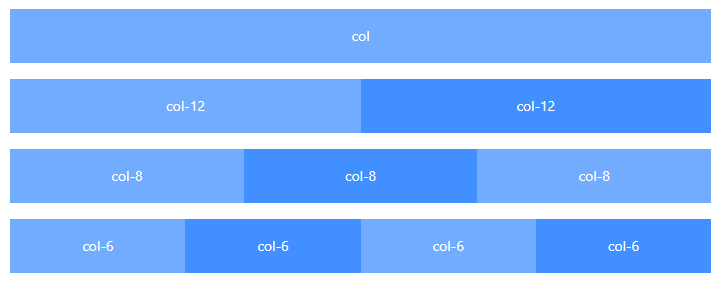

<blockquote style='padding: 10px; font-size: 1em; margin: 1em 0px; color: rgb(0, 0, 0); border-left: 5px solid rgba(0,189,170,1); background: rgb(239, 235, 233);line-height:1.5;'>
    <div>
        <div><i>Every breath you take is mercy from me.</i></div>
        <div style="text-align:right;"><b>——Marvel·Black Panther</b></div>
    <div> 
    
</blockquote>
 
# 一、Grid珊格组件介绍

## 1.组件概述

<blockquote style='padding: 10px; font-size: 1em; margin: 1em 0px; color: rgb(0, 0, 0); border-left: 5px solid rgba(0,189,170,1); background: rgb(239, 235, 233);line-height:1.5;'> 
布局的栅格化系统，我们是基于行（row）和列（col）来定义信息区块的外部框架，以保证页面的每个区域能够稳健地排布起来。
</blockquote>

## 2.为什么需要这个组件

<blockquote style='padding: 10px; font-size: 1em; margin: 1em 0px; color: rgb(0, 0, 0); border-left: 5px solid rgba(0,189,170,1); background: rgb(239, 235, 233);line-height:1.5;'> 
在我们的组件库中，很多组件都用到了这个基础组件，比如我们的Form组件,这个组件的主要目的是保证页面的每个区域能够稳健地排布起来。考虑实际的场景：在一个表单中，如果是在大屏中，需要一行至少有4个input元素输入框，但是如果是在小屏中，只需要2个input输入框即可。
</blockquote> 

如下图：



<blockquote style='padding: 10px; font-size: 1em; margin: 1em 0px; color: rgb(0, 0, 0); border-left: 5px solid rgba(0,189,170,1); background: rgb(239, 235, 233);line-height:1.5;'> 

可以参考antd的grid组件，通过row行和col列可以将一行分成对应的不同大小、宽度的列。
</blockquote>

```js
//参考代码
    <Row>
      <Col span={24}>col</Col>
    </Row>
    <Row>
      <Col span={12}>col-12</Col>
      <Col span={12}>col-12</Col>
    </Row>
    <Row>
      <Col span={8}>col-8</Col>
      <Col span={8}>col-8</Col>
      <Col span={8}>col-8</Col>
    </Row>
    <Row>
      <Col span={6}>col-6</Col>
      <Col span={6}>col-6</Col>
      <Col span={6}>col-6</Col>
      <Col span={6}>col-6</Col>
    </Row>
```

# 二、Grid组件设计

## 原理解析

<blockquote style='padding: 10px; font-size: 1em; margin: 1em 0px; color: rgb(0, 0, 0); border-left: 5px solid rgba(0,189,170,1); background: rgb(239, 235, 233);line-height:1.5;'> 

其实也是非常简单，此组件本身是基于弹性盒子布局来写的，响应式属性则是通过<a href="https://developer.mozilla.org/zh-CN/docs/Web/API/Window/matchMedia">window对象的matchMedia APi</a>来扩展。

</blockquote>

# 三、Grid组件实战

## 1、RowContext的创建


<blockquote style='padding: 10px; font-size: 1em; margin: 1em 0px; color: rgb(0, 0, 0); border-left: 5px solid rgba(0,189,170,1); background: rgb(239, 235, 233);line-height:1.5;'> 

<a href="https://zh-hans.reactjs.org/docs/context.html#gatsby-focus-wrapper">context</a>这里使用context是为了避免Col列组件并不是Row行组件的直接子元素,属性可以多层传递。

</blockquote> 

```js
import { createContext } from 'react';

const RowContext=createContext({});

export default RowContext;
```

## 2、Row组件的编写

<blockquote style='padding: 10px; font-size: 1em; margin: 1em 0px; color: rgb(0, 0, 0); border-left: 5px solid rgba(0,189,170,1); background: rgb(239, 235, 233);line-height:1.5;'>  
Row组件是基于弹性布局属性编写的，相当于flex布局的容器，学习弹性盒子个人比较推荐 <a href="http://www.ruanyifeng.com/blog/2015/07/flex-grammar.html">阮一峰的Flex教程</a>  
</blockquote> 
 

### 1.属性align 

<blockquote style='padding: 10px; font-size: 1em; margin: 1em 0px; color: rgb(0, 0, 0); border-left: 5px solid rgba(0,189,170,1); background: rgb(239, 235, 233);line-height:1.5;'> 

align就是相当于align-items的角色，只是省略了baseline、stretch属性。垂直对齐方式默认值是top。 

</blockquote>  

### 2.属性justify 

<blockquote style='padding: 10px; font-size: 1em; margin: 1em 0px; color: rgb(0, 0, 0); border-left: 5px solid rgba(0,189,170,1); background: rgb(239, 235, 233);line-height:1.5;'> 
justify就是相当于justify-content的角色,水平对齐方式默认值是start。

</blockquote> 
 

### 3.属性gutter 珊格之间的距离

<blockquote style='padding: 10px; font-size: 1em; margin: 1em 0px; color: rgb(0, 0, 0); border-left: 5px solid rgba(0,189,170,1); background: rgb(239, 235, 233);line-height:1.5;'> 
1.首先根据屏幕大小判断出对应的尺码，再根据对应尺寸的大小来设置行的样式<b>marginLeft:$size/-2;marginRight:$size/-2</b>;<br />
2.再设置列的样式<b>paddingLeft: ${size} / 2;paddingRight: ${size} / 2</b>

</blockquote> 


## 3、Col组件的编写 

<blockquote style='padding: 10px; font-size: 1em; margin: 1em 0px; color: rgb(0, 0, 0); border-left: 5px solid rgba(0,189,170,1); background: rgb(239, 235, 233);line-height:1.5;'> 
Col相当于弹性盒子的项目。
</blockquote>  

### 1.属性flex flex布局属性 


<blockquote style='padding: 10px; font-size: 1em; margin: 1em 0px; color: rgb(0, 0, 0); border-left: 5px solid rgba(0,189,170,1); background: rgb(239, 235, 233);line-height:1.5;'> 

这里的flex相当于弹性盒子项目的flex属性
</blockquote>  

## 2.属性span 栅格占位格数，为 0 时相当于 display: none

<blockquote style='padding: 10px; font-size: 1em; margin: 1em 0px; color: rgb(0, 0, 0); border-left: 5px solid rgba(0,189,170,1); background: rgb(239, 235, 233);line-height:1.5;'> 
1.通过弹性盒子元素属性:<b>flex:0 0 100%/(24/$span)`</b>(每一行有24格栏栅)即可设置 <br />
2.flex属性有三个参数：第一个参数flex-grow定义项目的放大比例,第二个参数flex-shrink定义项目的缩小比例，第三个参数flex-basis属性定义了在分配多余空间之前，项目占据的主轴空间。
</blockquote>  
 
## 3.属性order 栅格顺序

<blockquote style='padding: 10px; font-size: 1em; margin: 1em 0px; color: rgb(0, 0, 0); border-left: 5px solid rgba(0,189,170,1); background: rgb(239, 235, 233);line-height:1.5;'> 
1.通过弹性盒子元素属性:<b>order:$order`</b>
2.order属性定义项目的排列顺序。数值越小，排列越靠前。
</blockquote>  
 

## 4.属性pull和属性push 栅格向左/右移动格数


<blockquote style='padding: 10px; font-size: 1em; margin: 1em 0px; color: rgb(0, 0, 0); border-left: 5px solid rgba(0,189,170,1); background: rgb(239, 235, 233);line-height:1.5;'> 
看起来很高大上的属性，其实只是利用了<b>left</b>和<b>right</b>,前提是元素设置了<b>position:relative</b>。<b>left: (100%/24) * $push;right: (100%/24) * $pull</b>;
</blockquote>  


## 5.属性offset 栅格左侧的间隔格数，间隔内不可以有栅格


<blockquote style='padding: 10px; font-size: 1em; margin: 1em 0px; color: rgb(0, 0, 0); border-left: 5px solid rgba(0,189,170,1); background: rgb(239, 235, 233);line-height:1.5;'> 
同样是看起来很高大上的属性，其实只是用了一个margin-left：<b>margin-left: (100%/24) * $offset</b>
</blockquote>  


## 6.xs/sm/md/lg/xl/xxl属性 响应式栅格

<blockquote style='padding: 10px; font-size: 1em; margin: 1em 0px; color: rgb(0, 0, 0); border-left: 5px solid rgba(0,189,170,1); background: rgb(239, 235, 233);line-height:1.5;'> 
其实是通过传递的属性来给节点添加对应的class，再给class通过媒体查询设置相对应的样式
</blockquote>    

## 4、Grid组件的目录结构

```js
|-Row.js
|-Col.js
|-RowContext.js
|-index.js
|-index.scss
```

# 四、Grid组件设计核心要素

## 1、重点Hook:useBreakpoint介绍

<blockquote style='padding: 10px; font-size: 1em; margin: 1em 0px; color: rgb(0, 0, 0); border-left: 5px solid rgba(0,189,170,1); background: rgb(239, 235, 233);line-height:1.5;'> 
该Hooks功能：能够根据屏幕大小进行自适应栅格。那么Grid是怎么做的呢？antd内部有一个hooks函数:useBreakpoint。这个hooks函数引用了一个工具类函数：
</blockquote>    


```js

//ResponsiveObserve 工具类函数
export const responsiveArray = ['xxl', 'xl', 'lg', 'md', 'sm', 'xs'];

export const responsiveMap = {
    xs: '(max-width: 575px)',
    sm: '(min-width: 576px)',
    md: '(min-width: 768px)',
    lg: '(min-width: 992px)',
    xl: '(min-width: 1200px)',
    xxl: '(min-width: 1600px)',
};

const subscribers = new Map();
let subUid = -1;
let screens = {};

const responsiveObserve={
    matchHandlers:{},
    dispatch(pointMap){
        screens=pointMap;
        subscribers.forEach(func=>func(screens));
        return subscribers.size>=1;
    },
    subscribe(func){
        if(!subscribers.size) this.register();
        subUid+=1;
        subscribers.set(subUid,func);
        func(screens);
        return subUid;
    },
    unsubscribe(token){
        subscribers.delete(token);
        if(!subscribers.size) this.unregister();
    },
    register(){
        Object.keys(responsiveMap).forEach((screen)=>{
            const matchMediaQuery = responsiveMap[screen];
            const listener=({matches})=>{
                this.dispatch({
                    ...screens,
                    [screen]:matches
                });
            };
            const mql = window.matchMedia(matchMediaQuery);
            mql.addListener(listener);
            this.matchHandlers[matchMediaQuery] = {
                mql, 
                listener,
            };
            listener(mql);
        })
    },
    unregister(){
        Object.keys(responsiveMap).forEach((screen)=>{
            const matchMediaQuery=responsiveMap[screen];
            const handler=this.matchHandlers[matchMediaQuery];
            handler?.mql.removeListener(handler?.listener);
        });
        subscribers.clear();
    }
}

export default responsiveObserve;

//useBreakPoint hook的使用
export default function useBreakpoint(){

    const [screens,setScreens]=useState({});

    useEffect(()=>{
        const token=ResponsiveObserve.subscribe(supportScreens=>{
            setScreens(supportScreens)
        });

        return ()=>ResponsiveObserve.unsubscribe(token);
    },[]);

    return screens;
}
```


<blockquote style='padding: 10px; font-size: 1em; margin: 1em 0px; color: rgb(0, 0, 0); border-left: 5px solid rgba(0,189,170,1); background: rgb(239, 235, 233);line-height:1.5;'> 
1.<a href="https://developer.mozilla.org/zh-CN/docs/Web/API/Window/matchMedia">Window.matchMedia()</a>Api可以监听媒体查询条件的变化，通过屏幕的变化来。其中mql对象中的监听函数有一个方法matches，表示当前是否匹配这个媒体查询。<br />
2.useBreakpoint在每次媒体查询条件匹配变化的时候，会重新触发setScreens设置屏幕。<br />
3.执行流程分析：useEffect(()=>{},[])相当于class组件中的componentDidMount，全文中只执行一次->调用subscribe方法，传递一个改变screens的方法->进入subscribe方法，此时subscribers是一个空Map,从而调用register方法->循环屏幕媒体查询调用dispatch方法->将对应的媒体查询结果赋值给内部变量screens->将func存到subscribers变量里面，执行func来改变屏幕->之后每一次屏幕的修改都会被matchMedia监听到，然后触发dispatch方法->subscribers.forEach(func=>func(screens))执行存在subscribers里面的函数func->即修改了state,state变化，页面会重新渲染。

</blockquote>    
  
## 2、结合useBreakpoint来计算出正确的gutter并赋值


<blockquote style='padding: 10px; font-size: 1em; margin: 1em 0px; color: rgb(0, 0, 0); border-left: 5px solid rgba(0,189,170,1); background: rgb(239, 235, 233);line-height:1.5;'> 
 
如果传入的gutter属性是数值，则默认传入的为垂直方向的gutter值。<br />
传入数组的话，第一个值为水平方向的gutter值，第二个为垂直方向的值。

</blockquote>   

```js
const getGutter = () => {
        const results = [0, 0];
        const normalizedGutter = Array.isArray(gutterProp) ? gutterProp : [gutterProp, 0];
        normalizedGutter.forEach((g, index) => {
            if (typeof g === 'object') {
                for (let i = 0; i < responsiveArray.length; i++) {
                    const breakpoint = responsiveArray[i]; 
                    if (screens[breakpoint] && g[breakpoint] !== undefined) {
                        results[index] = g[breakpoint];
                        break;
                    }
                }
            } else {
                results[index] = g || 0;
            }
        });
        return results;
    };

    const gutter = getGutter(); 

    const rowStyle={
        ...(gutter[0]>0?{
            marginLeft:gutter[0]?gutter[0]/-2:undefined,
            marginRight:gutter[0]?gutter[0]/-2:undefined
        }:{}),
        ...(gutter[1]>0?{
            marginTop: gutter[1]?gutter[1]/ -2:undefined,
            marginBottom: gutter[1]?gutter[1]/ 2:undefined,
        }:{}),
        ...style
    } 
```

## 3、margin+padding实现gutter

<blockquote style='padding: 10px; font-size: 1em; margin: 1em 0px; color: rgb(0, 0, 0); border-left: 5px solid rgba(0,189,170,1); background: rgb(239, 235, 233);line-height:1.5;'> 
这里行设置负值的margin可以增加行的宽度，然后设置元素的padding为margin负值一样的宽度可以使第一个子元素和最后一个子元素视觉上与原来保持一致。
</blockquote>   

```js

//Row组件
const rowStyle={
        ...(gutter[0]>0?{
            marginLeft:gutter[0]?gutter[0]/-2:undefined,
            marginRight:gutter[0]?gutter[0]/-2:undefined
        }:{}),
        ...(gutter[1]>0?{
            marginTop: gutter[1]?gutter[1]/ -2:undefined,
            marginBottom: gutter[1]?gutter[1]/ 2:undefined,
        }:{}),
        ...style
}
//Col组件
if (gutter) {
                    mergedStyle = {
                        ...(gutter[0] > 0
                            ? {
                                paddingLeft: gutter[0]?gutter[0] / 2:undefined,
                                paddingRight: gutter[0]?gutter[0] / 2:undefined,
                            }
                            : {}),
                        ...(gutter[1] > 0
                            ? {
                                paddingTop: gutter[1]?gutter[1] / 2:undefined,
                                paddingBottom: gutter[1]?gutter[1] / 2:undefined,
                            }
                            : {}),
                        ...mergedStyle
                    }
} 
```


