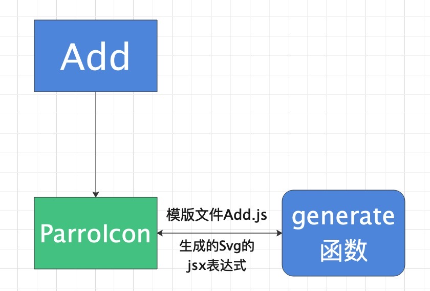

<blockquote style='padding: 10px; font-size: 1em; margin: 1em 0px; color: rgb(0, 0, 0); border-left: 5px solid rgba(0,189,170,1); background: rgb(239, 235, 233);line-height:1.5;'>
    <div>
        <div><i>I just feel you.</i></div>
        <div style="text-align:right;"><b>——Marvel·Scarlet Witch</b></div>
    <div> 
    
</blockquote>

# 一、Icon组件介绍

## 1.组件概述
<blockquote style='padding: 10px; font-size: 1em; margin: 1em 0px; color: rgb(0, 0, 0); border-left: 5px solid rgba(0,189,170,1); background: rgb(239, 235, 233);line-height:1;'>
    语义化的矢量图形。
</blockquote>

## 2.为什么需要这个组件
<blockquote style='padding: 10px; font-size: 1em; margin: 1em 0px; color: rgb(0, 0, 0); border-left: 5px solid rgba(0,189,170,1); background: rgb(239, 235, 233);line-height:1.5;'>
    <div>1. 全球通用:Windows,iOS, etc., 中文版和英文版甚至各种语言版本，在不打开菜单之前，基本上都长一样。</div>
    <div>2. 节约空间:如果在一个图标能够表述清楚含义的时候，比如用一个叉就可以不用写「关闭」。</div>
    <div>3. 快速定位:图标可以用它独特的形状或者颜色让人快速定位到一个功能，豌豆荚2.0左侧的导航在「音乐/应用/视频」分类加了简单的小图标之后，用户的对应用管理功能的访问量增加了约30%</div>
    <div>4. 最重要的原因是因为我们今后的组件设计都会用到图标，也就是需要这个组件作为基础丰富其他组件的设计</div>
</blockquote>


# 二、Icon组件设计

<blockquote style='padding: 10px; font-size: 1em; margin: 1em 0px; color: rgb(0, 0, 0); border-left: 5px solid rgba(0,189,170,1); background: rgb(239, 235, 233);line-height:1.5;'>
看似普通的Icon图标其实隐藏着巨大的玄机，在如何缩减Icon体积大小，各种组件库也是煞费小脑袋瓜子。
</blockquote>

## 1.为何使用svg?

<blockquote style='padding: 10px; font-size: 1em; margin: 1em 0px; color: rgb(0, 0, 0); border-left: 5px solid rgba(0,189,170,1); background: rgb(239, 235, 233);line-height:1.5;'>
市面上各种组件库都是使用svg来作为Icon图标的基础，那么究竟是为什么呢？这让我陷入了沉思。
</blockquote>
 
### 1.Svg
<blockquote style='padding: 10px; font-size: 1em; margin: 1em 0px; color: rgb(0, 0, 0); border-left: 5px solid rgba(0,189,170,1); background: rgb(239, 235, 233);line-height:1.5;'>
<div>SVG是一种可缩放矢量图形（英语：Scalable Vector Graphics，SVG）是基于可扩展标记语言（XML），用于描述二维矢量图形的图形格式。简单的理解，它是图形的另一种格式例如它和常见的图片格式.png、.jpg、.gif等是一类。</div>
</blockquote>

### 2.Iconfont
<blockquote style='padding: 10px; font-size: 1em; margin: 1em 0px; color: rgb(0, 0, 0); border-left: 5px solid rgba(0,189,170,1); background: rgb(239, 235, 233);line-height:1.5;'>
<div>iconfont 是指用字体文件取代图片文件，来展示图标、特殊字体等元素的一种方法。很多网站都会用它，比如手淘、新浪微博等。</div>
</blockquote>

### 3.Img

<blockquote style='padding: 10px; font-size: 1em; margin: 1em 0px; color: rgb(0, 0, 0); border-left: 5px solid rgba(0,189,170,1); background: rgb(239, 235, 233);line-height:1.5;'>
<div>标签定义 HTML 页面中的图像。</div>
</blockquote>

### 4.Svg Vs Iconfont Vs Img 多方位对比
<blockquote style='padding: 10px; font-size: 1em; margin: 1em 0px; color: rgb(0, 0, 0); border-left: 5px solid rgba(0,189,170,1); background: rgb(239, 235, 233);line-height:1.5;'>
<div>我们在阿里iconfont上选了一个多色摄像头的图标，下载png、svg、ttf文件，并作出以下对比</div>
</blockquote>

|  对比维度     | Svg  | iconfont  | img  |
|  ----  | ----  | ----  | ----  |
| 体积  | 2kb | 2kb  | 7kb |
| 浏览器可读性  | xml格式，文本可被直接浏览，有利于SEO | Unicode符号调用对应的图标，可读性较差  | 无可读性 |
| 浏览器兼容性  | ie9+、大部分浏览器| 大部分浏览器  | 大部分浏览器 |
| 渲染方式  | 图形渲染显示效果较好 | 字体渲染显示效果并不好  | 显示效果最差 |
| 渲染性能  |  好 | 较好  | 较差 |
| 是否支持多色  | 支持 | 不支持  | 支持 |
| 动画实现  | 原生支持 | 不支持  | 不支持 |
| 开发成本  | 需要使用loader进行转化 | 需要引入对应的字体文件+Css  | src一键搞定 |


<blockquote style='padding: 10px; font-size: 1em; margin: 1em 0px; color: rgb(0, 0, 0); border-left: 5px solid rgba(0,189,170,1); background: rgb(239, 235, 233);line-height:1.5;'>
总结：都0202年了，还有人考虑兼容性不用svg?
</blockquote>


## 2.Antd Icon

<blockquote style='padding: 10px; font-size: 1em; margin: 1em 0px; color: rgb(0, 0, 0); border-left: 5px solid rgba(0,189,170,1); background: rgb(239, 235, 233);line-height:1.5;'>
<a href="https://ant.design/docs/spec/introduce-cn">Antd</a>是阿里推出的一个React组件库，不出意外也是大家常用的组件库之一。打开icons/index.js入口文件时，可以看见:
</blockquote>

```js
export * from './icons';
export * from './components/twoTonePrimaryColor';
export { default as createFromIconfontCN } from './components/IconFont';
export { default } from './components/Icon';
```
<blockquote style='padding: 10px; font-size: 1em; margin: 1em 0px; color: rgb(0, 0, 0); border-left: 5px solid rgba(0,189,170,1); background: rgb(239, 235, 233);line-height:1.5;'>
参考资料：<a href="https://es6.ruanyifeng.com/#docs/module#export-%E4%B8%8E-import-%E7%9A%84%E5%A4%8D%E5%90%88%E5%86%99%E6%B3%95">export 与 import 的复合写法</a>
</blockquote>
 
<blockquote style='padding: 10px; font-size: 1em; margin: 1em 0px; color: rgb(0, 0, 0); border-left: 5px solid rgba(0,189,170,1); background: rgb(239, 235, 233);line-height:1.5;'>
<h5>详解：</h5>
<div>1.icons目录下存放的是图标。</div> 
<div>2.当引入icons下的一个图标时，会将一个存放了生成对应svg的属性的对象传入一个自定义组件。通过一个方法生成一个对应的组件。</div> 
<div>3.没有引入svg，只是记录了svg对应的的属性值如path标签的ds属性来绘制图标的路径。采用js直接生成svg。</div>
</blockquote>

## 3.Material Icon


<blockquote style='padding: 10px; font-size: 1em; margin: 1em 0px; color: rgb(0, 0, 0); border-left: 5px solid rgba(0,189,170,1); background: rgb(239, 235, 233);line-height:1.5;'>
<a href="https://ant.design/docs/spec/introduce-cn">Material</a>是世界上最受欢迎的 React UI 框架。(他自己说的，我可没说)
</blockquote>

```js
//某个图标.js文件
import * as React from 'react';
import createSvgIcon from './utils/createSvgIcon';

export default createSvgIcon(
  <path d="M22 11h-4.17l3.24-3.24-1.41-1.42L15 11h-2V9l4.66-4.66-1.42-1.41L13 6.17V2h-2v4.17L7.76 2.93 6.34 4.34 11 9v2H9L4.34 6.34 2.93 7.76 6.17 11H2v2h4.17l-3.24 3.24 1.41 1.42L9 13h2v2l-4.66 4.66 1.42 1.41L11 17.83V22h2v-4.17l3.24 3.24 1.42-1.41L13 15v-2h2l4.66 4.66 1.41-1.42L17.83 13H22z" />
, 'AcUnit');
```
 

 <blockquote style='padding: 10px; font-size: 1em; margin: 1em 0px; color: rgb(0, 0, 0); border-left: 5px solid rgba(0,189,170,1); background: rgb(239, 235, 233);line-height:1.5;'>
<h5>详解：</h5>
<div>1.Material UI和Ant UI大致相同，都是使用哪个js引入哪个Js。</div> 
<div>2.没有引入svg，采用js直接生成svg。</div>
 
</blockquote>


## 4.Rsuite Icon


<blockquote style='padding: 10px; font-size: 1em; margin: 1em 0px; color: rgb(0, 0, 0); border-left: 5px solid rgba(0,189,170,1); background: rgb(239, 235, 233);line-height:1.5;'>
<a href="https://rsuitejs.com/zh/guide/introduction">React Suite</a>是比较小众的一个UI框架，他的Icon组件写法和以上2种有些许不同。
</blockquote>

```js
const Icon: RsRefForwardingComponent<'i', IconProps> = React.forwardRef((props: IconProps, ref) => {
  const {
    ...,
    ...rest
  } = props;

  ... 

  if (isSvgIcon) {
    const svgIcon = icon as SVGIcon;
    return (
      <Component {...rest} ref={ref} className={classes} style={styles}>
        <svg style={svgStyle} viewBox={svgIcon.viewBox}>
          <use xlinkHref={`#${svgIcon.id}`} />
        </svg>
      </Component>
    );
  }

  return <Component {...rest} ref={ref} className={classes} style={styles} />;
});
```

```css
.@{ns}icon {
  //* use !important to prevent issues with browser extensions that change fonts */
  font-family: @font-family-icon !important;
  speak: none;
  font-style: normal;
  font-weight: normal;
  font-variant: normal;
  display: inline-block;
  text-transform: none;
  font-size: 14px;
  line-height: 1;
  //* Better Font Rendering =========== */
  -webkit-font-smoothing: antialiased;
  -moz-osx-font-smoothing: grayscale;
}
```

<blockquote style='padding: 10px; font-size: 1em; margin: 1em 0px; color: rgb(0, 0, 0); border-left: 5px solid rgba(0,189,170,1); background: rgb(239, 235, 233);line-height:1.5;'>
<h5>详解</h5>
看JS部分可能看的不是很清楚，我们看CSS部分，@font-family-icon实际上是引用的他自定义的一个字体文件，其实这里使用的就是我们前文提到的Iconfont写法。通过类名就可以轻松的定义图标。我们可以下载引入的<a href="https://cdn.jsdelivr.net/npm/rsuite/dist/styles/fonts/rsuite-icon-font.ttf">字体文件</a>发现有210kb的大小，也就是说不管你是引入一个组件或者是多个组件，都需要引入这个ttf文件字体，会造成资源的一个浪费。
</blockquote>

## 五、原理解析



<blockquote style='padding: 10px; font-size: 1em; margin: 1em 0px; color: rgb(0, 0, 0); border-left: 5px solid rgba(0,189,170,1); background: rgb(239, 235, 233);line-height:1.5;'>
根据上图，我们以Add组件为例：
<div>1.当引入Add图标时，首先调用的是icons目录下的Add.js文件</div>
<div>2.当Add.js文件被调用时，引入svg/Add.js模版文件，当作icon属性传递给ParrotIcon</div>
<div>3.在ParrotIcon组件内部调用generate函数生成svg节点，最后即展示ParrotIcon组件</div>
</blockquote>


# 三、Icon组件实战

<blockquote style='padding: 10px; font-size: 1em; margin: 1em 0px; color: rgb(0, 0, 0); border-left: 5px solid rgba(0,189,170,1); background: rgb(239, 235, 233);line-height:1.5;'>
在前文中，我们也大概了解了常用组件库（Antd）和小众组件库（Rsuite）Icon组件的写法。这里我们介绍2种常用的组件库的写法。
</blockquote>

## 1.普通Icon组件写法（简单、方便、比较耗费资源）

```js
import ${name} from './${name}.svg';
......
......

<svg width={"1em"} height={"1em"} fill={"currentcolor"} >
      <use xlinkHref={`#${name}`}></use>
</svg>
```

<blockquote style='padding: 10px; font-size: 1em; margin: 1em 0px; color: rgb(0, 0, 0); border-left: 5px solid rgba(0,189,170,1); background: rgb(239, 235, 233);line-height:1.5;'>
这种写法有种缺点:需要把所有的svg文件都导入进来，然后通过传入的name来判断该加载哪一个SVG。
</blockquote>

<blockquote style='padding: 10px; font-size: 1em; margin: 1em 0px; color: rgb(0, 0, 0); border-left: 5px solid rgba(247, 31, 85,1); background: rgb(239, 235, 233);line-height:1.5;'>
警告：<a href="https://developer.mozilla.org/zh-CN/docs/Web/SVG/Attribute/xlink:href">MDN</a>从SVG 2开始不推荐使用xlinkHref属性。不再建议使用此功能。尽管某些浏览器可能仍支持它，但是它可能已经从相关的Web标准中删除，正在被删除或仅出于兼容性目的而保留。
</blockquote>

## 2.Antd Icon组件写法（写法繁琐、但是体积大大缩小优化）

### 1.定义入口页面

```js
//index.js入口文件
//export * from 表示整体输出
export * from './icons';

//export { default } 相当于import xxx; export default xxx
export { default } from './components/Icon';

//icons/index.js
//export { default as Add } 相当于import xxx; export {Add:xxx}
export { default as Add} from './Add';

//icons/Add.js
import React from 'react';
import AddSvg from '../svg/Add';

import ParrotIcon from '../components/ParrotIcon';

const Add=(props,ref)=><ParrotIcon {...props} ref={ref} icon={AddSvg} />;

export default React.forwardRef(Add)
```

### 2.定义ParrotIcon组件
```js
import React ,{useContext} from 'react'; 
import { ConfigContext,SizeContext } from '@packages/core/ConfigProvider';
import classNames from '@packages/utils/classNames';
import capitalize from '@packages/utils/capitalize';
import { generate } from '../utils';

const ParrotIcon=React.forwardRef((props,ref)=>{

    const {
        onClick,
        className,
        icon:target,
        rotate,
        prefixCls:customizePrefixCls,
        size:sizeProp="default",
        spin,
        style
    }=props;


    const prefixCls=useContext(ConfigContext)?.getPrefixCls("Icon",customizePrefixCls); 

    const svgStyle=rotate?{msTransform:`rotate(${rotate}deg)`,transform:`rotate(${rotate}deg)`}:undefined;

    const size=useContext(SizeContext)||sizeProp; 

    const renderIcon=()=>{
        return generate(target.icon,`svg-${target.name}m`,{ 
            onClick,
            style:svgStyle,
            width:'1em',
            height:'1em',
            className:classNames(
                {
                    [`${prefixCls}-Spin`]:!!spin
                }
            ),
            fill:"currentColor",
        })
    }
 
    return (
        <span
            ref={ref}
            onClick={onClick}
            style={style}
            className={classNames(
                prefixCls,
                className,
                {
                    [`${prefixCls}-${capitalize(size)}`]:size
                }
            )}
        >
            {
                renderIcon() 
            }
        </span>
    )
});


export default ParrotIcon;

```

### 3.generate函数生成svg

```js
export function generate(node,key,rootProps){
    if(!rootProps){ 

        return React.createElement(
            node.tag,
            {
                key,
                ...node.attrs,
            },
            (node.children||[]).map((child,index)=>generate(child,`${key}-${node.tag}-${index}`))
        );
    }

    return React.createElement(
        node.tag,
        {
            key,
            ...node.attrs,
            ...rootProps
        },
        (node.children || []).map((child, index) => generate(child, `${key}-${node.tag}-${index}`)),
    )
} 
```

### 4.svg图标模版
```js


const Add = {
    "icon": {
        "tag": "svg",
        "attrs": {
            "viewBox": "0 0 1024 1024", "focusable": "false"
        },
        "children":[
            {
                "tag":"path",
                "attrs":{
                    "d":"M810.666667 554.666667h-256v256h-85.333334v-256H213.333333v-85.333334h256V213.333333h85.333334v256h256v85.333334z"
                },
                "name":"Add"
            }
            
        ]
    }
}
 
export default Add;

```

### 5.ConfigProvider组件的目录结构

```js
|-components
|-------icons
|-------ParrotIcons
|-icons
|-------Add.js
|-------index.js
|-svg
|-------Add.js
|-------Add.svg(后续会移除)
|-index.js
|-index.scss
|-utils.js
```


# 四、Icon组件设计核心要素

## 1.普通Icon组件批量引入多个Svg

<blockquote style='padding: 10px; font-size: 1em; margin: 1em 0px; color: rgb(0, 0, 0); border-left: 5px solid rgba(0,189,170,1); background: rgb(239, 235, 233);line-height:1.5;'>
在上面我们说道，需要在Icon页面引入多个svg，那么每次新增一个新的Svg，岂不是就要多写一个import?作为0202年的前端工程师，这么写想必脸也会红吧。webpack中有个<a href="https://webpack.js.org/guides/dependency-management/#require-context">require.context()</a>,可以很好的帮助我们实现这个需求，
</blockquote>

```js
//1.directory ：需要引入文件的目录
//2.useSubdirectories ：是否查找该目录下的子级目录
//3.regExp ：匹配引入文件的正则表达式
require.context(directory,useSubdirectories,regExp)

//以下函数可以将svg目录下的所有.svg文件全部导入
let importAll=(requireContext)=>requireContext.keys().forEach(requireContext);

try{
    importAll(require['context']("./svg/",true,/\.svg$/))
}catch(error){
}
```


## 2.React.forwardRef介绍

<blockquote style='padding: 10px; font-size: 1em; margin: 1em 0px; color: rgb(0, 0, 0); border-left: 5px solid rgba(0,189,170,1); background: rgb(239, 235, 233);line-height:1.5;'>
组件中多处使用到了forwardRef,那么forwardRef是什么呢？<a href="https://zh-hans.reactjs.org/docs/react-api.html#reactforwardref">forwardRef</a>是一种转发ref到子组件的方法，我们这里的作用是在外层组件中使用到内部节点的ref。
</blockquote>

## 3.svg属性的viewBox和path

<blockquote style='padding: 10px; font-size: 1em; margin: 1em 0px; color: rgb(0, 0, 0); border-left: 5px solid rgba(0,189,170,1); background: rgb(239, 235, 233);line-height:1.5;'>
<div>viewBox:这里我给大家推荐2篇文章<a href="https://www.jianshu.com/p/4422c05ff0f2">秒懂<SVG\/>里的viewbox</a>、<a href="https://segmentfault.com/a/1190000009226427?utm_source=tag-newest">SVG之ViewBox</a></div>
<div>path:用来定义路径，我们的图标主要就是靠这个来制作的<a href="https://www.w3school.com.cn/svg/svg_path.asp">W3c svg path</a></div>
</blockquote>


