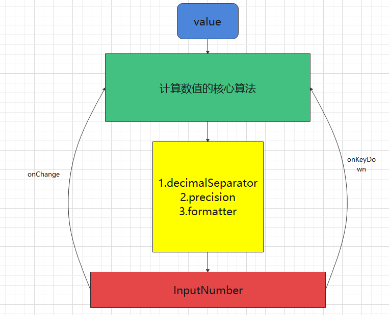

<blockquote style='padding: 10px; font-size: 1em; margin: 1em 0px; color: rgb(0, 0, 0); border-left: 5px solid rgba(0,189,170,1); background: rgb(239, 235, 233);line-height:1;'>
    <div>
        <div><i>Don’t let your past determine the future.</i></div>
        <div style="text-align:right;"><b>——Marvel·Ant Man</b></div>
    <div> 
    
</blockquote>

# 一、InputNumber组件介绍

## 1.组件概述
<blockquote style='padding: 10px; font-size: 1em; margin: 1em 0px; color: rgb(0, 0, 0); border-left: 5px solid rgba(0,189,170,1); background: rgb(239, 235, 233);line-height:1;'>
    通过鼠标或键盘，输入范围内的数值。
</blockquote>

## 2.为什么需要这个组件
<blockquote style='padding: 10px; font-size: 1em; margin: 1em 0px; color: rgb(0, 0, 0); border-left: 5px solid rgba(0,189,170,1); background: rgb(239, 235, 233);line-height:1.5;'>
    <div>在一些场景如填写数量、单价等，这些场景只需要输入数值，而不允许输入汉字或者其他字符，这个时候就需要这样的一个组件，只可以输入数字，不允许输入中文。</div>
</blockquote>


# 二、InputNumber组件设计

<blockquote style='padding: 10px; font-size: 1em; margin: 1em 0px; color: rgb(0, 0, 0); border-left: 5px solid rgba(0,189,170,1); background: rgb(239, 235, 233);line-height:1。5;'>
    其实原生input框本就有一个number类型的输入框，只需要将type设置为number即可。但是number框有一些局限性，value的值是仅可以为数字，如果是需要对值进行美化，例如1.000转化为1,000如果是number框就做不到这个功能。<a href="https://ant.design/components/input-number-cn/">Antd</a>采用的input text框对值进行控制，而<a href="https://material-ui.com/zh/components/text-fields/">Material</a>和<a href="https://rsuitejs.com/components/input-number">Rsuite</a>均是直接将type设置成了number，省心又省力。
</blockquote>

## 1、浅析antd的代码
 
<blockquote style='padding: 10px; font-size: 1em; margin: 1em 0px; color: rgb(0, 0, 0); border-left: 5px solid rgba(0,189,170,1); background: rgb(239, 235, 233);line-height:1。5;'>
    经过我通读了antd inputnumber的代码,足足有1000多行，去掉ts等不重要的代码也有八百多行，其中将真实的value值和美化的value值分为2个state值，不得不说可能严谨但是代码会变得又臭又长，而且代码估计后期也不好维护。当然代码多的原因当然是因为antd考虑到了各种浏览器兼容性和万恶的class组件。对于光标的处理也花费了一番不小的心思。所以还是自己跟着antd的API来按照自己的逻辑来写吧。
</blockquote>

## 2.原理解析



<blockquote style='padding: 10px; font-size: 1em; margin: 1em 0px; color: rgb(0, 0, 0); border-left: 5px solid rgba(0,189,170,1); background: rgb(239, 235, 233);line-height:1。5;'>
    1.组件基于InputText，将value值传给InputValue，首先确定这里的InputText是受控组件。<br />
    2.第一步计算出组件的核心算法，这一步中是直接修改value<br />
    3.第二步黄色框属于展示层面的修改，诸如formatter、precision、decimalSeparator等API的修改。<br />
    4.当按上下键时，触发onKeyDown方法判断上下键进行value值的计算，按其他键时，触发onChange事件进行value值的计算。 
</blockquote>


# 三、InputNumber组件实战

## 1.renderNumber渲染上下键

```js
//InputNumber.js
const renderNumber = (<div className={classNames(`${prefixCls}-HandlerWrap`)} >
        <ButtonBase className={classNames(`${prefixCls}-Handler`)} TouchRippleProps={{style:{color:themeColor.PRIMARY}}} onClick={()=>setValue(computedLastValueOutOfRange("up"))}> <KeyboardArrowUp style={{ fontSize: sizeObj[size] }} /></ButtonBase>
        <ButtonBase className={classNames(`${prefixCls}-Handler`)} TouchRippleProps={{style:{color:themeColor.PRIMARY}}} onClick={()=>setValue(computedLastValueOutOfRange("down"))}> <KeyboardArrowDown style={{ fontSize: sizeObj[size] }} /></ButtonBase>
    </div>);

//InputNumber.js
renderNumber={renderNumber}

//InputText.js
  <div style={style} className={classNames(
            `${prefixCls}`,
            className,
            {
                [`${prefixCls}-${capitalize(size)}`]:size,
                [`${prefixCls}-Focus`]:active
            } 
        )}>
            ....
            {renderNumber}
</div>
```

<blockquote style='padding: 10px; font-size: 1em; margin: 1em 0px; color: rgb(0, 0, 0); border-left: 5px solid rgba(0,189,170,1); background: rgb(239, 235, 233);line-height:1.5;'>
    1.组件基于InputText，所以为了展示输入框的上下键，将renderNumber传入inputText组件进行渲染。<br />
    2.迎合波纹主题，使用前文提到的BaseRipple组件，将PRIMARY主题色传入组件，并且使用提供的Icon组件。
</blockquote>

## 2.max、min实现

```js
const computedLastValueOutOfRange=(type,e,value)=>{
        //根据边界判断最终的值
        let val=getCanCalcValue();
         
        if(type==="up"){
            const step=getStep(e);
            let cVal=val+step;

            if(cVal>=maxProp){
                return maxProp;
            }

            return String(cVal);

        }else if(type==="down"){
            const step=getStep(e);
            let cVal=val-step; 
            if(cVal<=minProp){
                return minProp;
            }

            return String(cVal);
        }else if(type==="change" && e===null){//change变化的值
            if(Number(value)>=maxProp){//如果超出max值
                return String(maxProp);
            }

            if(Number(value)<=minProp){//如果低于min值
                return String(minProp);
            }

            return String(value);
        }
}
```

<blockquote style='padding: 10px; font-size: 1em; margin: 1em 0px; color: rgb(0, 0, 0); border-left: 5px solid rgba(0,189,170,1); background: rgb(239, 235, 233);line-height:1.5;'>
    根据change事件或者onKeyDown和step的值来判断下一个value值和max、min值进行对比，如果超过min~max的范围，设置对应的value值。
</blockquote>

## 3.step实现

```js
const getStep = (e) => {
        
        if(!e){
            return stepProp||1;
        }
        //获取步数
        if (e.metaKey || e.ctrlKey) {
            return 0.1;
        } else if (e.shiftKey) {
            return 10;
        }
        return stepProp || 1;
}
```


<blockquote style='padding: 10px; font-size: 1em; margin: 1em 0px; color: rgb(0, 0, 0); border-left: 5px solid rgba(247, 31, 85,1); background: rgb(239, 235, 233);line-height:1.5;'>
    参考：<a href="https://developer.mozilla.org/zh-CN/docs/Web/API/KeyboardEvent/metaKey">metaKey</a>、<a href="https://developer.mozilla.org/zh-CN/docs/Web/API/KeyboardEvent/shiftKey">shiftKey</a>、<a href=" https://developer.mozilla.org/zh-CN/docs/Web/API/KeyboardEvent/ctrlKey">ctrlKey</a>
</blockquote>

<blockquote style='padding: 10px; font-size: 1em; margin: 1em 0px; color: rgb(0, 0, 0); border-left: 5px solid rgba(0,189,170,1); background: rgb(239, 235, 233);line-height:1.5;'>
    1.onKeyDown事件的事件对象event中可以获取到 metaKey、shiftKey、ctrlKey属性来判断对应按钮是否按下来获取step。<br />
    2.onChange事件中event对象没有metaKey这些属性，直接返回设置的step。
</blockquote>

## 4.formatter、decimalSeparator、precision实现

```js

const getTransformValue = (value) => {
        //转化formatter、decimalSeparator的函数
 
        let val = value;

        if (!isValidProps(value)) {
            //不存在value值
            val = "";
        } else if (isNaN(parseFloat(value))) {
            //汉字等
            val = value;
        } else {
            //普通数值
            val = String(val);
        }
        
        if(precision && isNumber(val)){//判断是数字
            val=Number(val).toFixed(precision);
        }

        if (formatter) {
            val = formatter(val);
        } 

        if (decimalSeparator) { 
            val = val.replace(".", decimalSeparator)
        }

        return val;
} 
```
<blockquote style='padding: 10px; font-size: 1em; margin: 1em 0px; color: rgb(0, 0, 0); border-left: 5px solid rgba(0,189,170,1); background: rgb(239, 235, 233);line-height:1.5;'>
    三者都属于美化渲染value的值。
</blockquote>

# 四、InputNumber组件设计核心要素

## 1.全文仅需要一个value值

<blockquote style='padding: 10px; font-size: 1em; margin: 1em 0px; color: rgb(0, 0, 0); border-left: 5px solid rgba(0,189,170,1); background: rgb(239, 235, 233);line-height:1.5;'>
    1.为了统一数据格式，防止后期数据混乱。我们规定在组件内部函数输出的值都为字符串类型，外部进行回调或者内部进行计算时使用数值类型。<br />
    2.getCanCalcValue函数用于获取最新的value，且已经被转为number类型。<br />
</blockquote>

```js

  const getCanCalcValue = () => {
        //这里返回的值永远是number类型
        //获取可以计算的值

        let val=value;

        if (!value) {
            val=0;
        }

        if (isChinese(value)) {
            //是汉字
            val=0;
        }
        if(precision && isNumber(value)){
            val=Number(val).toFixed(precision);
        }

        return Number(val);
    }

```

## 2.formatter不需要对应的parser

<blockquote style='padding: 10px; font-size: 1em; margin: 1em 0px; color: rgb(0, 0, 0); border-left: 5px solid rgba(0,189,170,1); background: rgb(239, 235, 233);line-height:1.5;'>
    由于我们这里的fomatter只是起到了美化了value值的作用，所以并没有对传出的值产生影响，也就不需要parser进行转化,跟人感觉更简洁。
</blockquote>


## 3.keydown事件按上键时光标会移动到前面

<blockquote style='padding: 10px; font-size: 1em; margin: 1em 0px; color: rgb(0, 0, 0); border-left: 5px solid rgba(247, 31, 85,1); background: rgb(239, 235, 233);line-height:1.5;'>
   只需要阻止默认事件就可以，有一点需要注意的是如果写在上面，那么onChange事件是不会出发的，这点也是坑了我很久的。
</blockquote>

```js
const handleKeyDown = (keyCode, e) => {       

        //阻止默认事件会不触发onchange 
        // if (e) {
        //     //阻止每次按下按键光标跳到前面
        //     e.persist();
        //     e.preventDefault();
        // } 

        //按键向上
        if (keyCode === KeyCode.UP) {
            if(e){
                e.preventDefault();
            }
            let val=computedLastValueOutOfRange("up",e);
            setValue(val);
        } else if (keyCode === KeyCode.DOWN) {
            let val=computedLastValueOutOfRange("down",e);
            setValue(val);
        }  
}  
```