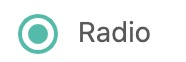

<blockquote style='padding: 10px; font-size: 1em; margin: 1em 0px; color: rgb(0, 0, 0); border-left: 5px solid rgba(0,189,170,1); background: rgb(239, 235, 233);line-height:1.5;'>
    <div>
        <div><i>No matter how it changes, it won't change the ending.</i></div>
        <div style="text-align:right;"><b>——Marvel·Beast</b></div>
    <div> 
    
</blockquote>
 
# 一、Radio组件介绍

## 1.组件概述

<blockquote style='padding: 10px; font-size: 1em; margin: 1em 0px; color: rgb(0, 0, 0); border-left: 5px solid rgba(0,189,170,1); background: rgb(239, 235, 233);line-height:1;'>
    单选框。
</blockquote>

## 2.为什么需要这个组件

<blockquote style='padding: 10px; font-size: 1em; margin: 1em 0px; color: rgb(0, 0, 0); border-left: 5px solid rgba(0,189,170,1); background: rgb(239, 235, 233);line-height:1。5;'>
    1.用于在多个备选项中选中单个状态。<br />
    2.和 Select 的区别是，Radio 所有选项默认可见，方便用户在比较中选择，因此选项不宜过多。
</blockquote>

# 二、Radio组件设计
  

## 原理解析



<blockquote style='padding: 10px; font-size: 1em; margin: 1em 0px; color: rgb(0, 0, 0); border-left: 5px solid rgba(0,189,170,1); background: rgb(239, 235, 233);line-height:1。5;'>
    一个最常用的表单元素组件之一，radio组件分为2个部分。一个是左边的真正radio部分，右边部分是子元素。
</blockquote> 

# 三、Radio组件实战

## 1、代码实战

```js


import React, { useContext } from 'react';
import {
    ConfigContext
} from '@packages/core/ConfigProvider';
import classNames from '@packages/utils/classNames';
import ButtonBase from '@packages/core/ButtonBase';
import {
    RadioChecked,
    RadioUncheck
} from '@packages/core/Icon';
import useControlled from '@packages/hooks/useControlled';
import capitalize from '@packages/utils/capitalize';
import RadioGroupContext from './RadioGroupContext';
import createChainedFunction from '@packages/utils/createChainedFunction';
import {
    Zoom
} from '@packages/core/Transition';
import "./index.scss";

const Radio = React.forwardRef((props, ref) => {

    const {
        prefixCls: customizePrefixCls,
        component: Component = "span",
        className,
        checked:checkedProp,
        defaultChecked,
        color="primary",
        value,
        children,
        onChange:onChangeProp
    } = props;

    const prefixCls = useContext(ConfigContext)?.getPrefixCls("Radio", customizePrefixCls);

    const radioGroup=useContext(RadioGroupContext);

    let isChecked=checkedProp; 

    if(radioGroup){
        if(typeof isChecked==='undefined'){
            isChecked=radioGroup.value?radioGroup.value===value?true:false:false;
        }
    }

    const [checked,setChecked]=useControlled({
        controlled:isChecked,
        default:Boolean(defaultChecked)
    });

    const onChange=createChainedFunction(onChangeProp,radioGroup && radioGroup.onChange);
    
    const handleChange = (e) => { 
        setChecked(e.target.checked);
        onChange?.(e.target.checked, e,value); 
    } 

    return <label
        className={
            classNames(
                prefixCls,
                className,
            )
        }
    >
        <ButtonBase
            component="span"
            className={
                classNames(
                    `${prefixCls}-RadioBaseRipple`,
                    {
                        [`${prefixCls}-Checked`]: checked,
                        [`${prefixCls}-${capitalize(color)}`]: color
                    }
                )
            }
            centerRipple
            square
        >
            <Component
                className={
                    classNames(
                        `${prefixCls}-InputWrapper`,

                    )
                }
            >
                <input
                    type="radio"
                    className={
                        classNames(
                            `${prefixCls}-Input`
                        )
                    }
                    onChange={(e) => handleChange(e)}
                    checked={checked}
                    ref={ref}
                    value={value}
                />

                {checked ? <Zoom in={checked}><RadioChecked /></Zoom> : <RadioUncheck />}

            </Component>

        </ButtonBase>
        {children && <Component
            className={
                classNames(
                    `${prefixCls}-labelWrapper`
                )
            }
        >
            {children}
        </Component>}
    </label>
});

export default Radio;

``` 

## 2、Radio组件的目录结构

```js
|-Radio.js
|-RadioGroup.js
|-RadioGroupContext.js
|-index.js
|-index.scss
```

# 四、Radio组件设计核心要素


<blockquote style='padding: 10px; font-size: 1em; margin: 1em 0px; color: rgb(0, 0, 0); border-left: 5px solid rgba(0,189,170,1); background: rgb(239, 235, 233);line-height:1。5;'>
    大体上和checkbox保持一致，就是把input框改成了type为radio 与checkbox不同的是这样change事件只能改成true。
</blockquote> 

## RadioGroup和CheckboxGroup逻辑稍有不同

```js
//RadioGroup
  const handleChangeCheckbox=(checked,event,name)=>{
        if(name&&checked===true){
            setValue(name);
            onChange?.(value,e);
        }
    }
//CheckboxGroup
    const handleChangeCheckbox=(checked,event,name)=>{
        let index=value.indexOf(name); 
        if(index>-1){//当存在时
            if(checked===false){//移除存在的
                value.splice(index,1);
            }
        }else{
            if(checked===true){//添加没有的
                value.push(name);
            }
        } 
        setValue([...value]);
        onChange?.(value,e);
    }
```
<blockquote style='padding: 10px; font-size: 1em; margin: 1em 0px; color: rgb(0, 0, 0); border-left: 5px solid rgba(0,189,170,1); background: rgb(239, 235, 233);line-height:1。5;'>
   因为一个是数组一个是单元素所以稍有不同。
</blockquote> 