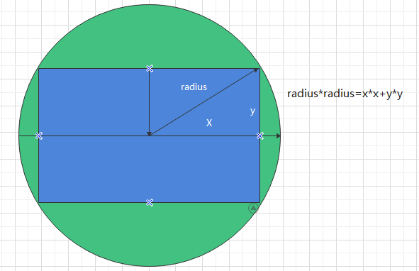

<blockquote style='padding: 10px; font-size: 1em; margin: 1em 0px; color: rgb(0, 0, 0); border-left: 5px solid rgba(0,189,170,1); background: rgb(239, 235, 233);line-height:1.5;'>
    <div>
        <div><i>I'm difficult to get along with.</i></div>
        <div style="text-align:right;"><b>——Marvel·Ultron</b></div>
    <div> 
    
</blockquote>

# 一、RippleBase组件介绍

## 1.组件概述

<blockquote style='padding: 10px; font-size: 1em; margin: 1em 0px; color: rgb(0, 0, 0); border-left: 5px solid rgba(0,189,170,1); background: rgb(239, 235, 233);line-height:1.5;'>
    全局的元素点击波纹效果组件。
</blockquote>

## 2.为什么需要这个组件

<blockquote style='padding: 10px; font-size: 1em; margin: 1em 0px; color: rgb(0, 0, 0); border-left: 5px solid rgba(0,189,170,1); background: rgb(239, 235, 233);line-height:1.5;'>
    我们这次要设计的这个组件库中大部分都是需要点击波纹的涟漪效果的，所以我们将他抽离出来，方便我们调用。
</blockquote>

# 二、RippleBase组件设计


<blockquote style='padding: 10px; font-size: 1em; margin: 1em 0px; color: rgb(0, 0, 0); border-left: 5px solid rgba(0,189,170,1); background: rgb(239, 235, 233);line-height:1.5;'>
先给大家放一张效果图，大家揣摩揣摩。
</blockquote>

## 1、思考


<blockquote style='padding: 10px; font-size: 1em; margin: 1em 0px; color: rgb(0, 0, 0); border-left: 5px solid rgba(0,189,170,1); background: rgb(239, 235, 233);line-height:1.5;'>
先别往下看，自己先思考如何实现这样的一个功能？想一分钟试试？<br />
反正我当时是想了很久的然后结合别人的源码才能写出来这样的一个功能。
</blockquote>

## 2、原理分析

```js
<RippleBase>
        <div style={{width:500,height:500,border:"1px solid blue"}}></div>
</RippleBase>
```


<blockquote style='padding: 10px; font-size: 1em; margin: 1em 0px; color: rgb(0, 0, 0); border-left: 5px solid rgba(0,189,170,1); background: rgb(239, 235, 233);line-height:1.5;'>
上面的代码是动态图的代码。这是一个很简单的代码，要实现涟漪的效果需要想写办法：<br />
1.在被包裹的组件外层包一层span/div/...标签。<br />
2.涟漪/波纹组单独成一个组件，使其成为包裹组件的同级元素<br />
3.鼠标按键被按下时的时候，被包裹组件触发onMouseDown事件，冒泡到最外层组件，触发onMouseDown事件，通过内部函数的一些处理，使涟漪组添加一个涟漪，在涟漪上添加一个动画效果。onMouseUp鼠标按键被松开的时候，移除一个涟漪,如上图。
</blockquote>

# 三、RippleBase组件实战

## 1.入口文件编写

```js
import React ,{useContext} from 'react';
import classNames from '@packages/utils/classNames'; 
import PropTypes from 'prop-types'; 
import TouchRipple from './TouchRipple';
import {ConfigContext} from '@packages/core/ConfigProvider';
import "./index.scss";

const ButtonBase=React.forwardRef((props,ref)=>{
    const {
        component:Component='button',
        type="default",
        className,
        disabled=false,
        disableRipple = false,
        disableTouchRipple=false,
        tabIndex = 0,
        children,
        prefixCls:customizePrefixCls,
        onClick,
        onMouseDown,
        onMouseUp,
        onMouseLeave,
        onFocus,
        onBlur,
        onKeyDown,
        onKeyUp,
        onTouchStart,
        onTouchEnd,
        onTouchMove,
        centerRipple=false,
        TouchRippleProps,
        ...restProps
    }=props;
 
    const prefixCls=useContext(ConfigContext)?.getPrefixCls("ButtonBase",customizePrefixCls); 

    let ComponentProp=Component;

    const rippleRef = React.useRef(null);

    function useRippleHandler(rippleAction,eventCallback,skipRippleAction=disableTouchRipple){
        return event=>{
            if(eventCallback){
                eventCallback(event)
            }
            const ignore = skipRippleAction;
            if (!ignore && rippleRef.current) {
                rippleRef.current[rippleAction](event);
            }
            return true;
        }
    }

    const handleFocus = event => {
        if (disabled) {
          return;
        }  

        if (onFocus) {
          onFocus(event);
        }
    };

    const handleBlur = useRippleHandler(
        'stop',
        event => {
          if (onBlur) {
            onBlur(event);
          }
        },
        false
    );

    const handleKeyDown = event => {
        if (onKeyDown) {
          onKeyDown(event);
        }
    };

    const handleKeyUp = event => {
        if (onKeyUp) {
          onKeyUp(event);
        }
    };

    const handleMouseDown = useRippleHandler('start', onMouseDown);
    const handleMouseUp = useRippleHandler('stop', onMouseUp);
    const handleMouseLeave = useRippleHandler('stop', onMouseLeave);

    const handleTouchStart = useRippleHandler('start', onTouchStart);
    const handleTouchEnd = useRippleHandler('stop', onTouchEnd);
    const handleTouchMove = useRippleHandler('stop', onTouchMove);
 

    return (
        <ComponentProp
            tabIndex={disabled?-1:tabIndex}
            className={classNames(
                prefixCls,className,
                {
                    [`${prefixCls}-disabled`]:disabled
                }
            )}
            onClick={onClick} 
            onFocus={handleFocus}
            onMouseDown={handleMouseDown}
            onBlur={handleBlur}
            onMouseUp={handleMouseUp}
            onMouseLeave={handleMouseLeave}
            onKeyDown={handleKeyDown}
            onKeyUp={handleKeyUp}
            onTouchStart={handleTouchStart}
            onTouchEnd={handleTouchEnd}
            onTouchMove={handleTouchMove}
            ref={ref}
            {...restProps}
        >
            {children}
            {!disableRipple && !disabled && <TouchRipple  center={centerRipple} prefixCls={prefixCls} ref={rippleRef} {...TouchRippleProps} /> }
        </ComponentProp>
    )

});
 
export default ButtonBase;
```

## 2.TouchRipple涟漪组设计

```js
import React from 'react';
import classNames from '@packages/utils/classNames';
import { TransitionGroup } from 'react-transition-group';
import Ripple from './Ripple';
import PropTypes from 'prop-types';

const DURATION = 500;

const TouchRipple=React.forwardRef((props,ref)=>{

    const {
        prefixCls:customizePrefixCls,
        center: centerProp = false, 
        ...restProps
    }=props;

    const prefixCls=`${customizePrefixCls}-TouchRipple`;

    const [ripples, setRipples] = React.useState([]);

    const nextKey = React.useRef(0);

    const container = React.useRef(null);

    const rippleCallback = React.useRef(null);

    const startCommit = React.useCallback(
      params => {
        const { pulsate, rippleX, rippleY, rippleSize, cb } = params;
  
        setRipples(oldRipples => [
          ...oldRipples,
          <Ripple
            key={nextKey.current} 
            prefixCls={prefixCls}
            timeout={DURATION}
            pulsate={pulsate}
            rippleX={rippleX}
            rippleY={rippleY}
            rippleSize={rippleSize}
          />,
        ]);
        nextKey.current += 1;
        rippleCallback.current = cb;
      },
      [],
  );

    const start=React.useCallback((event={},options = {}, cb)=>{
        const {
            pulsate = false,
            center = centerProp || options.pulsate,
            fakeElement = false, // For test purposes
        } = options;

        if (event.type === 'mousedown' && ignoringMouseDown.current) {
            ignoringMouseDown.current = false;
            return;
        }

        if (event.type === 'touchstart') {
            ignoringMouseDown.current = true;
        }

        const element = fakeElement ? null : container.current;

        const rect = element
        ? element.getBoundingClientRect()
        : {
            width: 0,
            height: 0,
            left: 0,
            top: 0,
          };

           // Get the size of the ripple
        let rippleX;
        let rippleY;
        let rippleSize;

        if (center || (event.clientX === 0 && event.clientY === 0) || (!event.clientX && !event.touches)) {
            rippleX = Math.round(rect.width / 2);
            rippleY = Math.round(rect.height / 2);
        } else {
            const clientX = event.clientX ? event.clientX : event.touches[0].clientX;
            const clientY = event.clientY ? event.clientY : event.touches[0].clientY;
            rippleX = Math.round(clientX - rect.left);
            rippleY = Math.round(clientY - rect.top);
        }
        if (center) {
            rippleSize = Math.sqrt((2 * rect.width ** 2 + rect.height ** 2) / 3);
    
            // For some reason the animation is broken on Mobile Chrome if the size if even.
            if (rippleSize % 2 === 0) {
              rippleSize += 1;
            }
        }else {
            const sizeX =
              Math.max(Math.abs((element ? element.clientWidth : 0) - rippleX), rippleX) * 2 + 2;
            const sizeY =
              Math.max(Math.abs((element ? element.clientHeight : 0) - rippleY), rippleY) * 2 + 2;
            rippleSize = Math.sqrt(sizeX ** 2 + sizeY ** 2);
        }

        startCommit({ pulsate, rippleX, rippleY, rippleSize, cb });
    },[startCommit,centerProp]);

    React.useEffect(() => {
        if (rippleCallback.current) {
          rippleCallback.current();
          rippleCallback.current = null;
        }
    }, [ripples]);

    const pulsate = React.useCallback(() => {
        start({}, { pulsate: true });
    }, [start]);

    const stop = React.useCallback((event, cb) => {
      
        setRipples(oldRipples => {
          if (oldRipples.length > 0) {
            return oldRipples.slice(1);
          }
          return oldRipples;
        });
        rippleCallback.current = cb;
    }, []);

    const ignoringMouseDown = React.useRef(false);

    React.useImperativeHandle(
        ref,
        () => ({
          pulsate,
          start,
          stop,
        }),
        [pulsate, start, stop],
    );     
  
    
    return (
        <span className={classNames(prefixCls)} ref={container}>
            <TransitionGroup component={null} exit {...restProps}>
                {ripples}
            </TransitionGroup>
        </span>
    )

});

export default React.memo(TouchRipple);
```

## 3.Ripple涟漪设计
```js

import React from 'react';
import classNames from '@packages/utils/classNames';
import PropTypes from 'prop-types';
import useEventCallback from '@packages/hooks/useEventCallback';

const Ripple=(props)=>{

    const {
        prefixCls:customizePrefixCls,
        pulsate = false,
        rippleSize,
        rippleX,
        rippleY,
        onExited,
        in:inProp,
        timeout
    }=props;
   

    const prefixCls=`${customizePrefixCls}-Ripple`

    const [leaving, setLeaving] = React.useState(false);

    const rippleClassName=classNames(
        prefixCls,
        `${prefixCls}-Visible`,
        {
            [`${prefixCls}-Pulsate`]:pulsate
        }
    )

    const childClassName=classNames(
        `${prefixCls}-Child`,
        {
            [`${prefixCls}-ChildLeaving`]:leaving,
            [`${prefixCls}-ChildPulsate`]:pulsate
        }
    )

    const rippleStyles = {
        width: rippleSize,
        height: rippleSize,
        top: -(rippleSize / 2) + rippleY,
        left: -(rippleSize / 2) + rippleX,
    };

    const handleExited=useEventCallback(onExited);

    React.useEffect(()=>{ 
        if (!inProp) {
             
            setLeaving(true);

            const timeoutId = setTimeout(handleExited, timeout);
            return () => {
                clearTimeout(timeoutId);
            };
        }
        return undefined;
    },[handleExited,inProp,timeout])

    return (
        <span className={rippleClassName} style={rippleStyles}>
            <span className={childClassName} />
        </span>
    )

}

export default Ripple;

```

## 4.样式文件设计

```css


@import "../styles/variable";


$prefixCls:"#{$global-prefix}-ButtonBase";

$ripple-animation-duration:500ms;

.#{$prefixCls}{
    cursor: pointer;
    border:0;
    display: inline-flex;
    outline: 0;
    padding:0;
    margin:0;
    position:relative;
    align-items: center;
    user-select: none;
    vertical-align: middle;
    justify-content: center;
    background-color: transparent;

    &-TouchRipple{
        top:0;
        left:0;
        right:0;
        bottom:0;
        z-index:0;
        overflow: hidden;
        position:absolute;
        border-radius: inherit;
        pointer-events: none;

        &-Ripple{
            opacity: 0;
            position: absolute;

            &-Visible{
                opacity: 0.3;
                transform: scale(1);
                animation: ripple-enter $ripple-animation-duration cubic-bezier(0.4, 0, 0.2, 1);;
            }

            &-Child{
                opacity: 1;
                display: block;
                width: 100%;
                height: 100%;
                border-radius: 50%;
                background-color: currentColor;
            }

            &-ChildLeaving{
                opacity: 0;
                animation: ripple-exit $ripple-animation-duration cubic-bezier(0.4, 0, 0.2, 1);
            }

            &-ChildPulsate{
                opacity: 1;
                display: block;
                width: 100%;
                height: 100%;
                border-radius: 50%;
                background-color: currentColor;
            }

            @keyframes ripple-enter {
                0% {
                    transform: scale(0);
                    opacity: 0.1;
                }
                100% {
                    transform: scale(1);
                    opacity: 0.3;
                }
            }

            @keyframes ripple-exit {
                0% {
                    opacity: 1;
                }
                100% {
                    opacity: 0;
                }
            }
        }

    }

}
```

## 5.RippleBase组件的目录结构

|-RippleBase.js
|-index.js
|-index.scss
|-Ripple.js
|-TouchRipple.js

# 四、RippleBase组件设计核心要素

## 1.最外层组件样式设计

<blockquote style='padding: 10px; font-size: 1em; margin: 1em 0px; color: rgb(0, 0, 0); border-left: 5px solid rgba(0,189,170,1); background: rgb(239, 235, 233);line-height:1.5;'>
    1.border:none;outline:none; 去除不需要的边框和轮廓。<br />
    2.display:inline-flex;为了使被包裹元素不独占一行，使用inline-flex。<br />
    3.background-color:transparent;使得不会影响内部元素的样式。
</blockquote>

```css
    cursor: pointer;
    border:none;
    display: inline-flex;
    outline: none;
    padding:0;
    margin:0;
    position:relative;
    align-items: center;
    user-select: none;
    vertical-align: middle;
    justify-content: center;
    background-color: transparent;
```

## 2.抽离useRippleHandler函数配合useImperativeHandle函数

<blockquote style='padding: 10px; font-size: 1em; margin: 1em 0px; color: rgb(0, 0, 0); border-left: 5px solid rgba(0,189,170,1); background: rgb(239, 235, 233);line-height:1.5;'>
    全文需要处理的函数较多，可以抽离出这样一个函数出来。<a href="https://zh-hans.reactjs.org/docs/hooks-reference.html#useimperativehandle">useImperativehandle</a>可以让你在使用 ref 时自定义暴露给父组件的实例值。在大多数情况下，应当避免使用 ref 这样的命令式代码。在class组件中，可以通过this和ref轻松调用class中的实例方法等，useImperativeHandle就是为了实现和class相同的功能而产生的。
</blockquote>

```js

const handleMouseDown = useRippleHandler('start', onMouseDown);

function useRippleHandler(rippleAction,eventCallback,skipRippleAction=disableTouchRipple){
        return event=>{
            if(eventCallback){
                eventCallback(event)
            }
            const ignore = skipRippleAction;
            if (!ignore && rippleRef.current) {
                rippleRef.current[rippleAction](event);
            }
            return true;
        }
}

React.useImperativeHandle(
        ref,
        () => ({
          pulsate,
          start,
          stop,
        }),
        [pulsate, start, stop],
);     
 
```


## 3.计算ripple波纹的大小


<blockquote style='padding: 10px; font-size: 1em; margin: 1em 0px; color: rgb(0, 0, 0); border-left: 5px solid rgba(0,189,170,1); background: rgb(239, 235, 233);line-height:1.5;'>
    因为波纹是相对于波纹组的div进行绝对定位的，所以计算出波纹组（一个圆）的直径、top、left值尤为关键。
</blockquote>

```css
        //波纹组的样式
        top:0;
        left:0;
        right:0;
        bottom:0;
        z-index:0;
        overflow: hidden;
        position:absolute;
        border-radius: inherit;
        pointer-events: none;
```

<blockquote style='padding: 10px; font-size: 1em; margin: 1em 0px; color: rgb(0, 0, 0); border-left: 5px solid rgba(0,189,170,1); background: rgb(239, 235, 233);line-height:1.5;'>
当centerRipple时，Ripple的原点在包裹组件的中心。所以只需要求出圆的直径就可以得出top、left等值。由下图得知，圆的半径是包裹组件的长和宽的平方和的开平方。
</blockquote>

<blockquote style='padding: 10px; font-size: 1em; margin: 1em 0px; color: rgb(0, 0, 0); border-left: 5px solid rgba(7,121,228,1); background: rgb(239, 235, 233);line-height:1.5;'>
1.勾股定理：a²+b²=c²;<br />
2.<a href="https://developer.mozilla.org/zh-CN/docs/Web/API/Range/getBoundingClientRect">getBoundingClientRight</a>可以得出元素相对于视窗的top、left、right、以及元素的宽高。<br />
3.Math.sqrt相当于数学中的开根号 <br />
4.Math.pow相当于数学中的平方 <br />
5.* 相当于数学中的乘，**相当于数学中的平方，Math.pow(a,2)===a ** 2 <br />
</blockquote>



```js
//一个存在width\height\top\left的对象
const rect = element
        ? element.getBoundingClientRect()
        : {
            width: 0,
            height: 0,
            left: 0,
            top: 0,
          };
//即上图中的x,y
rippleX = Math.round(rect.width / 2);
rippleY = Math.round(rect.height / 2);


//由勾股定理得出radius半径，乘2得出直径
let radius=Math.sqrt(Math.pow(rippleX,2)+Math.pow(rippleY,2));
rippleSize = radius*2; 

//可以得出top和left的值
const rippleStyles = {
        width: rippleSize,
        height: rippleSize,
        top: -(rippleSize / 2) + rippleY,
        left: -(rippleSize / 2) + rippleX,
};
```


<blockquote style='padding: 10px; font-size: 1em; margin: 1em 0px; color: rgb(0, 0, 0); border-left: 5px solid rgba(0,189,170,1); background: rgb(239, 235, 233);line-height:1.5;'>
由上图得知当centerRipple为false时，点击在元素的中心点左上角时，以最长斜边画圆。同时可以根据勾股定理算出波纹的长宽、top、left。
</blockquote>

```js

const clientX = event.clientX ? event.clientX : event.touches[0].clientX;
const clientY = event.clientY ? event.clientY : event.touches[0].clientY;
//得出相对于元素的x、y
rippleX = Math.round(clientX - rect.left);
rippleY = Math.round(clientY - rect.top);

//勾股定理得出rippleSize
const sizeX =Math.max(Math.abs((element ? element.clientWidth : 0) - rippleX), rippleX);
const sizeY =Math.max(Math.abs((element ? element.clientHeight : 0) - rippleY), rippleY);
rippleSize = Math.sqrt(sizeX ** 2 + sizeY ** 2)*2;
```

## 4.波纹的动画样式设计

<blockquote style='padding: 10px; font-size: 1em; margin: 1em 0px; color: rgb(0, 0, 0); border-left: 5px solid rgba(0,189,170,1); background: rgb(239, 235, 233);line-height:1.5;'>
其实动画还是比较简单的，当ripple被装载时，给予一个动画，当ripple被卸载时，给与一个动画。
</blockquote>

```css
    //组件加载
    &-Visible{
                opacity: 0.3;
                transform: scale(1);
                animation: ripple-enter $ripple-animation-duration cubic-bezier(0.4, 0, 0.2, 1);;
    }
    
    @keyframes ripple-enter {
                0% {
                    transform: scale(0);
                    opacity: 0.1;
                }
                100% {
                    transform: scale(1);
                    opacity: 0.3;
                }
    }
    &-ChildLeaving{
                opacity: 0;
                animation: ripple-exit $ripple-animation-duration cubic-bezier(0.4, 0, 0.2, 1);
    }
    //组件卸载
    @keyframes ripple-exit {
                0% {
                    opacity: 1;
                }
                100% {
                    opacity: 0;
                }
    }

```

## 5.TransitionGroup组件

<blockquote style='padding: 10px; font-size: 1em; margin: 1em 0px; color: rgb(0, 0, 0); border-left: 5px solid rgba(0,189,170,1); background: rgb(239, 235, 233);line-height:1.5;'>
1.当项目被删除或添加时，in道具将自由切换<br />
2.当项目从节点上被卸载时，leaving状态为true，加载卸载动画，给个定时器当timeout时间后，也就是动画执行结束，将onExited传出，transitiongroup会自动判断出动画结束，进而移除节点。
</blockquote>

```js
React.useEffect(()=>{ 
        //transitiongroup通过onExited回调来判断移除节点的时机
        if (!inProp) { 
            setLeaving(true);

            const timeoutId = setTimeout(onExited, timeout);
            return () => {
                clearTimeout(timeoutId);
            };
        }
        return undefined;
},[onExited,inProp,timeout])
```