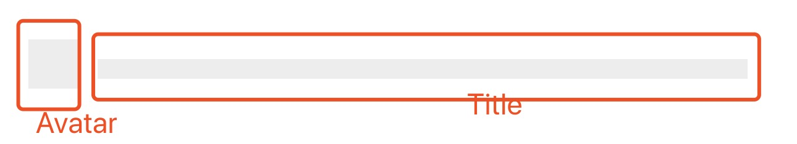

<blockquote style='padding: 10px; font-size: 1em; margin: 1em 0px; color: rgb(0, 0, 0); border-left: 5px solid rgba(0,189,170,1); background: rgb(239, 235, 233);line-height:1.5;'>
    <div>
        <div><i>They wish to cure us. But I say, we are the cure.</i></div>
        <div style="text-align:right;"><b>——Marvel·Magneto</b></div>
    <div> 
    
</blockquote>
 
# 一、Skeleton组件介绍

## 1.组件概述

<blockquote style='padding: 10px; font-size: 1em; margin: 1em 0px; color: rgb(0, 0, 0); border-left: 5px solid rgba(0,189,170,1); background: rgb(239, 235, 233);line-height:1;'>
    在需要等待加载内容的位置提供一个占位图形组合,可以减少由加载时间造成的困扰。
</blockquote>

## 2.为什么需要这个组件

<blockquote style='padding: 10px; font-size: 1em; margin: 1em 0px; color: rgb(0, 0, 0); border-left: 5px solid rgba(0,189,170,1); background: rgb(239, 235, 233);line-height:1。5;'>
    1.网络较慢，需要长时间等待加载处理<br />
    2.图文信息内容较多的列表/卡片中。<br />
    3.只在第一次加载数据的时候使用。<br />
    4.可以被 Spin 完全代替，但是在可用的场景下可以比 Spin 提供更好的视觉效果和用户体验。
</blockquote>

# 二、Skeleton组件设计
  

## 原理解析

<blockquote style='padding: 10px; font-size: 1em; margin: 1em 0px; color: rgb(0, 0, 0); border-left: 5px solid rgba(0,189,170,1); background: rgb(239, 235, 233);line-height:1。5;'>
    这个组件可以分成单独的组件Button、Avatar、Input、Image实现占位符的效果。<br />
    默认是文章的占位符，即有文章三大元素组件、Avatar、Title、Paragraph。
</blockquote> 


<blockquote style='padding: 10px; font-size: 1em; margin: 1em 0px; color: rgb(0, 0, 0); border-left: 5px solid rgba(0,189,170,1); background: rgb(239, 235, 233);line-height:1。5;'>
    avatar={false}  title={true}  paragraph={true}<br />
    1.从上图我们可以看出来，默认占位符展示的是文章的占位符，默认是有Title、Paragraph元素的，其中paragraph是有三行元素的，这里使用的是ul+li元素，可以看出来此时属于上下结构。
</blockquote> 


<blockquote style='padding: 10px; font-size: 1em; margin: 1em 0px; color: rgb(0, 0, 0); border-left: 5px solid rgba(0,189,170,1); background: rgb(239, 235, 233);line-height:1。5;'>
    avatar={true}  title={true}  paragraph={true}<br />
    2.从上图我们可以看出来，如果设置avatar属性，默认为上（Avatar）、右（Title）、下（Paragraph）组件结构、
</blockquote> 



<blockquote style='padding: 10px; font-size: 1em; margin: 1em 0px; color: rgb(0, 0, 0); border-left: 5px solid rgba(0,189,170,1); background: rgb(239, 235, 233);line-height:1。5;'>
    avatar={true}  title={true}  paragraph={false}<br />
    3.从上图我们可以看出来，如果设置avatar属性，默认为座（Avatar）、右（Title） 组件结构,而且如果没有paragraph时Avatar是正方形的。
</blockquote> 

# 三、Skeleton组件实战

## 1、代码实战

```js

import React ,{useContext} from 'react';
import {
    ConfigContext
} from '@packages/core/ConfigProvider';
import Element from './Element';
import Title from './Title';
import Paragraph from './Paragraphy';
import classNames from '@packages/utils/classNames';
import capitalize from '@packages/utils/capitalize';
import "./index.scss";

function getAvatarBasicProps(hasTitle,hasParagraph){

    if(hasTitle && !hasParagraph){
        return {size:"large",shape:"square"}
    }
    return {size:"large",shape:"circle"}
}

function getTitleBasicProps(hasAvatar,hasParagraph){

    if(!hasAvatar && hasParagraph){
        return {width:"38%"}
    }

    if(hasAvatar && hasParagraph){
        return {width:"50%"}
    }

    return {};
}

function getParagraphBasicProps(hasAvatar,hasTitle){
    const basicProps={};

    if(!hasAvatar || !hasTitle){
        basicProps.width="60%";
    }

    if(!hasAvatar && hasTitle){
        basicProps.rows=3;
    }else{
        basicProps.rows=2;
    }

    return basicProps;
}

function getComponentProps(props){
    if(props && typeof props==="object"){
        return props;
    }
    return {};
}


const Skeleton=(props)=>{
    const {
        prefixCls:customizePrefixCls,
        className,
        children,
        loading,
        avatar,
        title=true,
        paragraph=true,
        animation="pluse"
    }=props;

    const prefixCls=useContext(ConfigContext)?.getPrefixCls("Skeleton",customizePrefixCls);

    if(loading||!('loading' in props)){
        //如果loading为true或者不存在loading属性时
        const hasAvatar=!!avatar;
        const hasTitle=!!title;
        const hasParagraphy=!!paragraph;

        let avatarNode;
        if(hasAvatar){
            const avatarProps={
                prefixCls:`${prefixCls}-Avatar`,
                ...getAvatarBasicProps(hasTitle,hasParagraphy),
                ...getComponentProps(avatar)
            }
            avatarNode=(
                <div className={classNames(`${prefixCls}-Header`)}>
                    <Element {...avatarProps} />
                </div>
            )
        }

        let contentNode;
        if(hasTitle || hasParagraphy){
            let titleNode;
            if(hasTitle){
                const titleProps={
                    prefixCls:`${prefixCls}-Title`,
                    ...getTitleBasicProps(hasAvatar,hasParagraphy),
                    ...getComponentProps(title)
                }

                titleNode=<Title {...titleProps}/>
            }
            let paragraphNode;
            if(hasParagraphy){
                const paragraphProps={
                    prefixCls:`${prefixCls}-Paragraph`,
                    ...getParagraphBasicProps(hasAvatar,hasTitle),
                    ...getComponentProps(paragraph)
                }

                paragraphNode=<Paragraph {...paragraphProps}/>
            }

            contentNode=(
                <div className={`${prefixCls}-Content`}>
                    {titleNode}
                    {paragraphNode}
                </div>
            )
        }

        return (
            <div className={classNames(prefixCls,className,{
                [`${prefixCls}-HasAvatar`]:hasAvatar,
                [`${prefixCls}-Animation-${capitalize(animation)}`]:animation

            })}>
                {avatarNode}
                {contentNode}
            </div>
        )
    }

    return children;
 
}

export default Skeleton; 
```
 

## 2、Skeleton组件的目录结构

```js
|-Skeleton.js
|-Avatar.js
|-Button.js
|-Element.js
|-Image.js
|-Input.js
|-Paragraph.js
|-Title.js
|-index.js
|-index.scss
```

# 四、Skeleton组件设计核心要素

## 1.使用display:table格式来布局

```css
//父组件
display:table;

//子组件
display:table-cell;
vertical-align: top;
```

<blockquote style='padding: 10px; font-size: 1em; margin: 1em 0px; color: rgb(0, 0, 0); border-left: 5px solid rgba(0,189,170,1); background: rgb(239, 235, 233);line-height:1。5;'>
    1.如果是单个展位组件，使用display:inline-block为了不占据一行。<br />
    2.如果是默认文章占位符使用table布局更好实现元素向上移动等效果。

</blockquote>


## 2.拆分Element元素来复用代码

<blockquote style='padding: 10px; font-size: 1em; margin: 1em 0px; color: rgb(0, 0, 0); border-left: 5px solid rgba(0,189,170,1); background: rgb(239, 235, 233);line-height:1.5;'>
    因为大小如size、形状如shape都是公用的于是可以拆成一个公共组件方便复用。
</blockquote>

```js

import React from 'react';
import classNames from '@packages/utils/classNames';
import "./index.scss";


const Element=(props)=>{

    const {prefixCls,className,style,size,shape}=props;

    const sizeStyle=typeof size==="number"
        ?{
            width:size,
            height:size,
            lineHeight:`${size}px`
        }:{};

    return <span className={classNames(
        prefixCls,
        className,
        {
            [`${prefixCls}-Large`]:size==="large",
            [`${prefixCls}-Small`]:size==="small"
        },
        {
            [`${prefixCls}-Circle`]:shape==="circle",
            [`${prefixCls}-Square`]:shape==="square",
            [`${prefixCls}-Round`]:shape==="round"
        }
    )} style={{...sizeStyle,...style}}/>
}

export default Element;
```

## 3.使用scss @minxin @include复用css代码

```css
&-Wave{
            .#{$prefixClsContent}{
                .#{$prefixClsTitle},.#{$prefixClsParagraph} >li{
                    @include skeleton-wave-minxin;
                }
            }
            .#{$prefixClsAvatar}{ 
                @include skeleton-wave-minxin;
            }
            .#{$prefixClsButton}{ 
                @include skeleton-wave-minxin;
            }
            .#{$prefixClsInput}{ 
                @include skeleton-wave-minxin;
            }
            .#{$prefixClsImage}{ 
                @include skeleton-wave-minxin;
            }
}

@mixin skeleton-wave-minxin {
        position:relative;
        overflow: hidden;
                    
        &:after{

                        top: 0;
                        left: 0;
                        right: 0;
                        bottom: 0;
                        content: "";
                        position: absolute;
                        animation: skeleton-wave  1.6s linear .5s infinite;
                        transform: translateX(-100%);
                        background: linear-gradient(90deg,transparent,rgba(0,0,0,.04),transparent);

        }
}
```

<blockquote style='padding: 10px; font-size: 1em; margin: 1em 0px; color: rgb(0, 0, 0); border-left: 5px solid rgba(0,189,170,1); background: rgb(239, 235, 233);line-height:1.5;'>
    使用@mixin、@include可以大量减少代码量。    
</blockquote>

## 4.实现占位符的2个动画

```css
/*pluse动画*/
@keyframes skeleton-pluse {
        0%{
            opacity:1;
        }
        50%{
            opacity:.4;
        }
        100%{
            opacity:1;
        }
}
animation:skeleton-pluse 1.5s ease-in-out .5s infinite;

/*wave动画*/
@keyframes skeleton-wave {
        0%{
            transform:translateX(-100%);
        }
        80%{
            transform:translateX(100%);
        }
        100%{
            transform:translateX(100%);
        }
}
@mixin skeleton-wave-minxin {
        position:relative;
        overflow: hidden;
                    
        &:after{

                        top: 0;
                        left: 0;
                        right: 0;
                        bottom: 0;
                        content: "";
                        position: absolute;
                        animation: skeleton-wave  1.6s linear .5s infinite;
                        transform: translateX(-100%);
                        background: linear-gradient(90deg,transparent,rgba(0,0,0,.04),transparent);

        }
}
```

<blockquote style='padding: 10px; font-size: 1em; margin: 1em 0px; color: rgb(0, 0, 0); border-left: 5px solid rgba(0,189,170,1); background: rgb(239, 235, 233);line-height:1.5;'>
    文中的占位符默认使用的是pluse即脉冲动画，其实现原理就是改变透明度。还可以调节动画效果为wave即波纹效果，即使用伪元素生成一个新的元素然后改变其translateX即可，这里需注意的时需要给元素添加overflow:hidden样式避免元素溢出。
</blockquote>

 