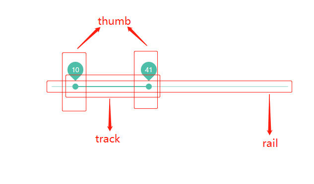

<blockquote style='padding: 10px; font-size: 1em; margin: 1em 0px; color: rgb(0, 0, 0); border-left: 5px solid rgba(0,189,170,1); background: rgb(239, 235, 233);line-height:1.5;'>
    <div>
        <div><i>Not for them,it's for you.</i></div>
        <div style="text-align:right;"><b>——Marvel·Nightcrawler</b></div>
    <div> 
    
</blockquote>

# 一、Slider组件介绍
 
## 1.组件概述

<blockquote style='padding: 10px; font-size: 1em; margin: 1em 0px; color: rgb(0, 0, 0); border-left: 5px solid rgba(0,189,170,1); background: rgb(239, 235, 233);line-height:1.5;'>
    滑动型输入器，展示当前值和可选范围。
</blockquote>


## 2.为什么需要这个组件
<blockquote style='padding: 10px; font-size: 1em; margin: 1em 0px; color: rgb(0, 0, 0); border-left: 5px solid rgba(0,189,170,1); background: rgb(239, 235, 233);line-height:1.5;'>
    <div>当用户需要在数值区间/自定义区间内进行选择时，可为连续或离散值。</div>
</blockquote>

# 二、Slider组件设计

 

<blockquote style='padding: 10px; font-size: 1em; margin: 1em 0px; color: rgb(0, 0, 0); border-left: 5px solid rgba(0,189,170,1); background: rgb(239, 235, 233);line-height:1.5;'>
    <h2>元素概括：</h2> 
    如上图所示，一个完整的slider组件一定包括这三个元素：<br />
    1.Rail：译为铁轨。如果把上面移动的“滑块”当作一个小火车，那么rail就相当于一个铁轨，是不是很形象哈哈哈。<br />
    2.Track：译为轨道、足迹。相当于小火车走过的路途、足迹。<br />
    3.Thumb：译为拇指。相当于一个小火车,他的行驶路径的变化取决于我们拇指/鼠标的移动等。<br />

</blockquote>

<blockquote style='padding: 10px; font-size: 1em; margin: 1em 0px; color: rgb(0, 0, 0); border-left: 5px solid rgba(247, 31, 85,1); background: rgb(239, 235, 233);line-height:1.5;'>
    <h2>问题1：元素的样式是如何搭建的？</h2>
    1.首先最外层父元素是一个inline-block的行内块级元素，设置宽度100%、height为2px，设置定位为relative;<br />
    2.rail元素是长铁轨故宽度占100%，高度于父元素保持一致，背景色要稍微浅一点方便看到铁轨的运行轨迹故设置background-color:currentColor;opacity:.38;<br />
    3.track元素是运行轨道，故设置高度一致颜色一致，定位为absolute;宽度/向左偏移量都是在js中控制的。<br />
    4.小圆球border-radius：50%;其向左偏移量也是由js控制的。
</blockquote>

<blockquote style='padding: 10px; font-size: 1em; margin: 1em 0px; color: rgb(0, 0, 0); border-left: 5px solid rgba(247, 31, 85,1); background: rgb(239, 235, 233);line-height:1.5;'>
    <h2>问题2：小球是如何通过鼠标的变化而跟随移动的？</h2>
    1.首先这个小球的移动其实是通过自身的一个value值的变化，然后再通过内部的一些转化而得来的新值，最后算出百分比，再修改对应的样式：如果是horizontal水平方向则修改left值，如果是vertical垂直方向则修改bottom值<br />
    2.具体操作(PC)：首先鼠标按下，触发mousedown事件，改变value值，然后监听整个页面的mousemove、mouseup事件，在鼠标移动时改变value值，鼠标松开即mouseup时移除监听事件。<br />
</blockquote>

<blockquote style='padding: 10px; font-size: 1em; margin: 1em 0px; color: rgb(0, 0, 0); border-left: 5px solid rgba(247, 31, 85,1); background: rgb(239, 235, 233);line-height:1.5;'>
    <h2>问题3：双球模式如何写的？</h2>
    其实就是value值是一个数组，对应着2个球的位置，然后更改球(thumb)的位置，更改铁轨(track)的的位置和大小。
</blockquote>

# 三、Slider组件实战

```js
import React, { useState, useContext, useRef, useEffect } from 'react';
import classNames from '@packages/utils/classNames';
import {
    ConfigContext
} from '@packages/core/ConfigProvider';
import capitalize from '@packages/utils/capitalize';
import useControlled from '@packages/hooks/useControlled';
import toArray from '@packages/utils/toArray';
import useForkRef from '@packages/hooks/useForkRef';
import ownerDocument from '@packages/utils/ownerDocument';
import ValueLabel from './ValueLabel';
import "./index.scss";

function computed(value, min, max) {
    //根据max和min得出正确的值
    return Math.min(Math.max(min, value), max);
}

function valueToPercent(value, min, max) {
    //根据max和min得出正确的百分比
    return ((value - min) / (max - min)) * 100;
}

function percentToValue(percent, min, max) {
    return (max - min) * percent + min;
}

const axisProps = {
    horizontal: {
        offset: (percent) => ({ left: `${percent}%` }),
        leap: (percent) => ({ width: `${percent}%` }),
    },
    vertical: {
        offset: (percent) => ({ bottom: `${percent}%` }),
        leap: (percent) => ({ height: `${percent}%` }),
    },
};

function getDecimalPrecision(num) {
    const decimalPart = num.toString().split(".")[1];
    return decimalPart ? decimalPart.length : 0;
}

function roundValueToStep(value, step, min) {
    const nearest = Math.round((value - min) / step) * step + min;
    return Number(nearest.toFixed(getDecimalPrecision(step)));
}

function trackFinger(event, touchId) {
    if (touchId.current !== undefined && event.changedTouches) {
        for (let i = 0; i < event.changedTouches.length; i += 1) {
            const touch = event.changedTouches[i];
            if (touch.identifier === touchId.current) {
                return {
                    x: touch.clientX,
                    y: touch.clientY,
                };
            }
        }
        return false;
    }
    return {
        x: event.clientX,
        y: event.clientY,
    };
}


function findClosest(values, currentValue) {
    //通过距离判断出index
    const { index: closestIndex } = values.reduce((acc, value, index) => {
      const distance = Math.abs(currentValue - value); 
  
      if (acc === null || distance < acc.distance || distance === acc.distance) {
        return {
          distance,
          index,
        };
      }
  
      return acc;
    }, null);
    return closestIndex;
}

function setValueIndex({ values, source, newValue, index }) {
    // Performance shortcut
    if (source[index] === newValue) {
      return source;
    }
  
    const output = values.slice();
    output[index] = newValue;
    return output;
}

function focusThumb({ sliderRef, activeIndex, setActive }) {
    const doc = ownerDocument(sliderRef.current);
    if (
        !sliderRef.current.contains(doc.activeElement) ||
        Number(doc.activeElement.getAttribute('data-index')) !== activeIndex
    ) {
        sliderRef.current.querySelector(`[role="slider"][data-index="${activeIndex}"]`).focus();
    }

    if (setActive) {
        setActive(activeIndex);
    }
}

const Slider = React.forwardRef((props, ref) => {

    const {
        prefixCls: customizePrefixCls,
        className,
        color = "primary",
        direction = "horizontal",
        value: valueProp,
        defaultValue = 0,
        max = 100,
        min = 0,
        ThumbComponent = "span",
        onMouseDown,
        onChange,
        style,
        valueLabelDisplay = "off",
        ValueLabelComponent: ValueLabelComponentProp = ValueLabel,
        valueLabelFormat,
        step = 1, 
        
    } = props;

    const prefixCls = useContext(ConfigContext)?.getPrefixCls("Slider", customizePrefixCls);

    const [valueDerived, setValue] = useControlled({
        controlled: valueProp,
        default: defaultValue
    });

    const previousIndex = React.useRef();

    const [active, setActive] = useState(-1);

    const getFingerNewValue = ({ finger,move=false, values: values2, source }) => { 
        const { current: slider } = sliderRef;
        const { width, height, bottom, left } = slider.getBoundingClientRect();
        let percent;

        if (direction.indexOf("vertical") === 0) {
            percent = (bottom - finger.y) / height;
        } else {
            percent = (finger.x - left) / width;
        }

        let newValue;
        newValue = percentToValue(percent, min, max);

        if (step) {
            newValue = roundValueToStep(newValue, step, min);
        }

        newValue = computed(newValue, min, max);

        let activeIndex = 0; 

        if (range) {
            if(!move){
                activeIndex = findClosest(values2, newValue);
            }else{
                activeIndex = previousIndex.current;
            } 
            const previousValue = newValue;
            newValue = setValueIndex({
                values: values2,
                source,
                newValue,
                index: activeIndex,
            }).sort((a,b)=>a-b);
            activeIndex = newValue.indexOf(previousValue);
            previousIndex.current = activeIndex;
        }
        

        return {
            newValue, activeIndex
        }
    }

    const sliderRef = useRef();

    const touchId = useRef(null);

    const handleRef = useForkRef(ref, sliderRef);

    const [open, setOpen] = React.useState(-1);

    //slice可以将类数组转化为数组
    const range = Array.isArray(valueDerived);//判断是否是范围

    let values = range ? valueDerived.slice().sort((a,b)=>a-b) : toArray(valueDerived);

    values.map((value) => computed(value, min, max));

    const handleFocus = (event) => {
        const index = Number(event.currentTarget.getAttribute('data-index'));
        setOpen(index);
    };

    const handleMouseOver = (event) => {
        const index = Number(event.currentTarget.getAttribute('data-index'));
        setOpen(index);
    };

    const handleMouseLeave = () => {
        setOpen(-1);
    };

    const handleTouchMove = (nativeEvent) => {
        console.log("handleTouchMove")
        const finger = trackFinger(nativeEvent, touchId);
        if (!finger) {
            return;
        }

        if (nativeEvent.type === 'mousemove' && nativeEvent.buttons === 0) {
            // eslint-disable-next-line @typescript-eslint/no-use-before-define
            handleTouchEnd(nativeEvent);
            return;
        }

        const { newValue, activeIndex } = getFingerNewValue({
            finger,
            move: true,
            values,
            source: valueDerived,
        });
        focusThumb({ sliderRef, activeIndex, setActive });
        setValue(newValue);
    }

    const handleKeyDown = (event) => { 
        const index = Number(event.currentTarget.getAttribute('data-index'));
        const value = values[index];
        const tenPercents = (max - min) / 10;
        let newValue;
        const increaseKey = 'ArrowRight';
        const decreaseKey = 'ArrowLeft'; 
        switch (event.key) {
            case 'Home':
                newValue = min;
                break;
            case 'End':
                newValue = max;
                break;
            case 'PageUp':
                if (step) {
                    newValue = value + tenPercents;
                }
                break;
            case 'PageDown':
                if (step) {
                    newValue = value - tenPercents;
                }
                break;
            case increaseKey:
            case 'ArrowUp':
                if (step) {
                    newValue = value + step;
                }
                break;
            case decreaseKey:
            case 'ArrowDown':
                if (step) {
                    newValue = value - step;
                }
                break;
            default:
                return;
        }
        if (step) {
            newValue = roundValueToStep(newValue, step, min);
        }
        newValue = computed(newValue, min, max);
        setValue(newValue);

    }

    const handleMouseDown = (event) => { 
        onMouseDown?.(event);

        // 单击
        if (event.button !== 0) {
            return;
        }

        const finger = trackFinger(event, touchId);

        const { newValue, activeIndex } = getFingerNewValue({ finger ,values,source:valueDerived});

        focusThumb({ sliderRef, activeIndex, setActive });

        setValue(newValue);

        const doc = ownerDocument(sliderRef.current);
        doc.addEventListener("mousemove", handleTouchMove);
        doc.addEventListener('mouseup', handleTouchEnd);
    }

    const stopListening = () => {
        const doc = ownerDocument(sliderRef.current);
        doc.removeEventListener("mousemove", handleTouchMove);
        doc.removeEventListener("mouseup", handleTouchEnd);
        doc.removeEventListener("touchmove", handleTouchMove);
        doc.removeEventListener("touchend", handleTouchEnd);
    };

    const handleTouchEnd = (nativeEvent) => {
        console.log("handleTouchEnd")
        const finger = trackFinger(nativeEvent, touchId);

        if (!finger) {
            return;
        }
        const { newValue } = getFingerNewValue({ finger, values, source: valueDerived });

        setActive(-1);

        touchId.current = undefined;

        stopListening();
    }

    const trackOffset = valueToPercent(range ? values[0] : min, min, max);
    const trackLeap = valueToPercent(values[values.length - 1], min, max) - trackOffset;

    const trackStyle = {
        ...axisProps[direction].offset(trackOffset),
        ...axisProps[direction].leap(trackLeap)
    };

    useEffect(() => {
        onChange?.(range ? values : values[0]);
    }, [values]);

    console.log(values)
    return (
        <span
            className={
                classNames(
                    prefixCls,
                    className,
                    {
                        [`${prefixCls}-${capitalize(color)}`]: color,
                        [`${prefixCls}-${capitalize(direction)}`]: direction
                    }
                )
            }
            ref={handleRef}
            style={style}
            onMouseDown={handleMouseDown}
        >
            <span className={`${prefixCls}-Rail`} />
            <span className={`${prefixCls}-Track`} style={trackStyle} />
            <input type="hidden" />
            {
                values.map((value, index) => {
                    const percent = valueToPercent(value, min, max);
                    const style = axisProps[direction].offset(percent);
                    const ValueLabelComponent = valueLabelDisplay === "off" ? ({ children }) => children : ValueLabelComponentProp

                    return (
                        <ValueLabelComponent
                            key={index}
                            className={classNames(
                                `${prefixCls}-ValueLabel`
                            )}
                            value={
                                typeof valueLabelFormat === "function"
                                    ? valueLabelFormat(value, index)
                                    : value
                            }
                            index={index}
                            open={open === index || active === index || valueLabelDisplay === 'on'}
                        >
                            <ThumbComponent
                                className={
                                    classNames(
                                        `${prefixCls}-Thumb`,
                                        {
                                            [`${prefixCls}-Thumb-Active`]: active === index
                                        }
                                    )
                                }
                                style={style}
                                role={"slider"}
                                tabIndex={0}
                                data-index={index}
                                key={index}
                                onKeyDown={handleKeyDown}
                                onFocus={handleFocus}
                                onMouseOver={handleMouseOver}
                                onMouseLeave={handleMouseLeave}
                            />
                        </ValueLabelComponent>
                    )
                })
            }

        </span>
    );
});
 
export default Slider;
```

# 四、Slider组件设计核心要素

## 1.onkeydown的触发条件

<blockquote style='padding: 10px; font-size: 1em; margin: 1em 0px; color: rgb(0, 0, 0); border-left: 5px solid rgba(0,189,170,1); background: rgb(239, 235, 233);line-height:1.5;'>
    <a href="https://developer.mozilla.org/zh-CN/docs/Web/API/Element/keydown_event">onKeyDown</a>事件是按键被按下时触发的事件，我们这里需要使用他。但是有时候会产生无法触发的情况：<br />
    1.首先得是表单等可以聚焦的元素，或者是tabindex不等于-1的元素。<a href="https://developer.mozilla.org/zh-CN/docs/Web/HTML/Global_attributes/tabindex">tabIndex</a>指示其元素是否可以聚焦，以及它是否/在何处参与顺序键盘导航。<br />
    2.如果不是自动聚焦的元素如div的话，需要手动聚焦 <b>node.focus</b>

</blockquote>


## 1.currentTarget和target的区别

<blockquote style='padding: 10px; font-size: 1em; margin: 1em 0px; color: rgb(0, 0, 0); border-left: 5px solid rgba(0,189,170,1); background: rgb(239, 235, 233);line-height:1.5;'>
    将children子元素转化成普通的数组方便遍历。
</blockquote>

```js
export default function childrenToArray(children){

    let ret=[];

    React.Children.forEach(children,(c)=>{
        ret.push(c);
    });

    return ret;

}
```

## 2.通过direction判断样式、size判断大小

```js
const spaceSize = {
    small: 8,
    default: 16,
    large: 24,
};
style={
                            i === items.length - 1
                              ? {...itemStyle}
                              : {
                                  [direction === 'vertical' ? 'marginBottom' : 'marginRight']:
                                    typeof size === 'string' ? spaceSize[size] : size,
                                    ...itemStyle
                                }
}
```

<blockquote style='padding: 10px; font-size: 1em; margin: 1em 0px; color: rgb(0, 0, 0); border-left: 5px solid rgba(0,189,170,1); background: rgb(239, 235, 233);line-height:1.5;'>
    <div>1.如果direction是vertical的话即垂直方向，使用marginBottom。如果是horizontal即水平方向时，使用marginRight。</div>
    <div>2.通过size的值获得大小值。</div>
    <div>3.space组件的最后一个元素不施加样式效果。</div>

</blockquote>