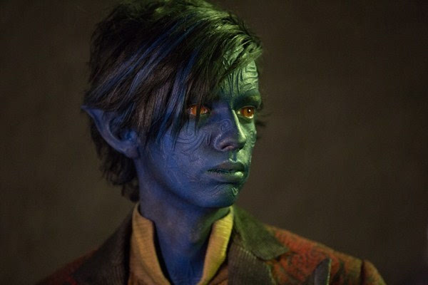

<blockquote style='padding: 10px; font-size: 1em; margin: 1em 0px; color: rgb(0, 0, 0); border-left: 5px solid rgba(0,189,170,1); background: rgb(239, 235, 233);line-height:1.5;'>
    <div>
        <div><i>Not for them,it's for you.</i></div>
        <div style="text-align:right;"><b>——Marvel·Nightcrawler</b></div>
    <div> 
    
</blockquote>

# 一、Slider组件介绍
 
## 1.组件概述

<blockquote style='padding: 10px; font-size: 1em; margin: 1em 0px; color: rgb(0, 0, 0); border-left: 5px solid rgba(0,189,170,1); background: rgb(239, 235, 233);line-height:1.5;'>
    滑动型输入器，展示当前值和可选范围。
</blockquote>


## 2.为什么需要这个组件
<blockquote style='padding: 10px; font-size: 1em; margin: 1em 0px; color: rgb(0, 0, 0); border-left: 5px solid rgba(0,189,170,1); background: rgb(239, 235, 233);line-height:1.5;'>
    <div>当用户需要在数值区间/自定义区间内进行选择时，可为连续或离散值。</div>
</blockquote>

# 二、Slider组件设计

 

<blockquote style='padding: 10px; font-size: 1em; margin: 1em 0px; color: rgb(0, 0, 0); border-left: 5px solid rgba(0,189,170,1); background: rgb(239, 235, 233);line-height:1.5;'>
    <h2>元素概括：</h2> 
    如上图所示，一个完整的slider组件一定包括这三个元素：<br />
    1.Rail：译为铁轨。如果把上面移动的“滑块”当作一个小火车，那么rail就相当于一个铁轨，是不是很形象哈哈哈。<br />
    2.Track：译为轨道、足迹。相当于小火车走过的路途、足迹。<br />
    3.Thumb：译为拇指。相当于一个小火车,他的行驶路径的变化取决于我们拇指/鼠标的移动等。<br />

</blockquote>

<blockquote style='padding: 10px; font-size: 1em; margin: 1em 0px; color: rgb(0, 0, 0); border-left: 5px solid rgba(247, 31, 85,1); background: rgb(239, 235, 233);line-height:1.5;'>
    <h2>问题1：元素的样式是如何搭建的？</h2>
    1.首先最外层父元素是一个inline-block的行内块级元素，设置宽度100%、height为2px，设置定位为relative;<br />
    2.rail元素是长铁轨故宽度占100%，高度于父元素保持一致，背景色要稍微浅一点方便看到铁轨的运行轨迹故设置background-color:currentColor;opacity:.38;<br />
    3.track元素是运行轨道，故设置高度一致颜色一致，定位为absolute;宽度/向左偏移量都是在js中控制的。<br />
    4.小圆球border-radius：50%;其向左偏移量也是由js控制的。
</blockquote>

<blockquote style='padding: 10px; font-size: 1em; margin: 1em 0px; color: rgb(0, 0, 0); border-left: 5px solid rgba(247, 31, 85,1); background: rgb(239, 235, 233);line-height:1.5;'>
    <h2>问题2：小球是如何通过鼠标的变化而跟随移动的？</h2>
    1.首先这个小球的移动其实是通过自身的一个value值的变化，然后再通过内部的一些转化而得来的新值，最后算出百分比，再修改对应的样式：如果是horizontal水平方向则修改left值，如果是vertical垂直方向则修改bottom值<br />
    2.具体操作(PC)：首先鼠标按下，触发父div的mousedown事件，改变value值，并且手动触发小球的焦点，然后监听整个页面的mousemove、mouseup事件，在鼠标移动时改变value值，鼠标松开即mouseup时移除监听事件。<br />
</blockquote>

<blockquote style='padding: 10px; font-size: 1em; margin: 1em 0px; color: rgb(0, 0, 0); border-left: 5px solid rgba(247, 31, 85,1); background: rgb(239, 235, 233);line-height:1.5;'>
    <h2>问题3：双球模式如何写的？</h2>
    其实就是value值是一个数组，对应着2个球的位置，然后更改球(thumb)的位置，更改铁轨(track)的的位置和大小。
</blockquote>

# 三、Slider组件实战

```js 
import React, { useState, useContext, useRef, useEffect } from 'react';
import classNames from '@packages/utils/classNames';
import {
    ConfigContext
} from '@packages/core/ConfigProvider';
import capitalize from '@packages/utils/capitalize';
import useControlled from '@packages/hooks/useControlled';
import toArray from '@packages/utils/toArray';
import useForkRef from '@packages/hooks/useForkRef';
import ownerDocument from '@packages/utils/ownerDocument';
import ValueLabel from './ValueLabel'; 
import useIsFocusVisible from '@packages/hooks/useIsFocusVisible';
import "./index.scss";


const Forward = ({ children }) => children;

function computed(value, min, max) {
    //根据max和min得出正确的值
    return Math.min(Math.max(min, value), max);
}

function valueToPercent(value, min, max) {
    //根据max和min得出正确的百分比
    return ((value - min) / (max - min)) * 100;
}

function percentToValue(percent, min, max) {
    return (max - min) * percent + min;
}

const axisProps = {
    horizontal: {
        offset: (percent) => ({ left: `${percent}%` }),
        leap: (percent) => ({ width: `${percent}%` }),
    },
    vertical: {
        offset: (percent) => ({ bottom: `${percent}%` }),
        leap: (percent) => ({ height: `${percent}%` }),
    },
};

function getDecimalPrecision(num) {
    const decimalPart = num.toString().split(".")[1];
    return decimalPart ? decimalPart.length : 0;
}

function roundValueToStep(value, step, min) {
    const nearest = Math.round((value - min) / step) * step + min;
    return Number(nearest.toFixed(getDecimalPrecision(step)));
}

function trackFinger(event, touchId) {
    if (touchId.current !== undefined && event.changedTouches) {
        for (let i = 0; i < event.changedTouches.length; i += 1) {
            const touch = event.changedTouches[i];
            if (touch.identifier === touchId.current) {
                return {
                    x: touch.clientX,
                    y: touch.clientY,
                };
            }
        }
        return false;
    }
    return {
        x: event.clientX,
        y: event.clientY,
    };
}


function findClosest(values, currentValue) {
    const { index: closestIndex } = values.reduce((acc, value, index) => {
      const distance = Math.abs(currentValue - value);
  
      if (acc === null || distance < acc.distance || distance === acc.distance) {
        return {
          distance,
          index,
        };
      }
  
      return acc;
    }, null);
    return closestIndex;
}

function setValueIndex({ values, source, newValue, index }) {
    // Performance shortcut
    if (source[index] === newValue) {
      return source;
    }
  
    const output = values.slice();
    output[index] = newValue;
    return output;
}

function focusThumb({ sliderRef, activeIndex, setActive }) { 
    const doc = ownerDocument(sliderRef.current); 
    if (
        !sliderRef.current.contains(doc.activeElement) ||
        Number(doc.activeElement.getAttribute('data-index')) !== activeIndex
    ) {
        sliderRef.current.querySelector(`[role="slider"][data-index="${activeIndex}"]`).focus();
    }

    if (setActive) {
        setActive(activeIndex);
    }
}

const Slider = React.forwardRef(function(props, ref){

    const {
        prefixCls: customizePrefixCls,
        className,
        color = "primary",
        direction = "horizontal",
        value: valueProp,
        defaultValue = 0,
        max = 100,
        min = 0,
        ThumbComponent = "span",
        onMouseDown,
        onChange,
        style,
        valueLabelDisplay = "off",
        ValueLabelComponent: ValueLabelComponentProp = ValueLabel,
        valueLabelFormat,
        step = 1 
    } = props;

    const prefixCls = useContext(ConfigContext)?.getPrefixCls("Slider", customizePrefixCls);

    const [valueDerived, setValue] = useControlled({
        controlled: valueProp,
        default: defaultValue
    });

    const [focusVisible,setFocusVisible]=React.useState(-1);

    //slice可以将类数组转化为数组
    const range = Array.isArray(valueDerived);//判断是否是范围

    let values = range ? valueDerived.slice().sort((a,b)=>a-b) : toArray(valueDerived);

    values=values.map((value) => computed(value, min, max));

    const sliderRef = useRef();

    const touchId = useRef(null);

    const {
        isFocusVisibleRef,
        onBlur:handleBlurVisible,
        onFocus:handleFocusVisible,
        ref:focusVisibleRef
    }=useIsFocusVisible();

    const handleRef = useForkRef(ref, sliderRef,focusVisibleRef); 

    const previousIndex = React.useRef();

    const [active, setActive] = useState(-1);

    const getFingerNewValue = ({ finger,move=false, values: values2, source }) => {
        const { current: slider } = sliderRef;
        const { width, height, bottom, left } = slider.getBoundingClientRect();
        let percent;

        if (direction.indexOf("vertical") === 0) {
            percent = (bottom - finger.y) / height;
        } else {
            percent = (finger.x - left) / width;
        }

        let newValue;
        newValue = percentToValue(percent, min, max);

        if (step) {
            newValue = roundValueToStep(newValue, step, min);
        }

        newValue = computed(newValue, min, max);

        let activeIndex = 0;

        if (range) {
            if(!move){
                activeIndex = findClosest(values2, newValue);
            }else{
                activeIndex = previousIndex.current;
            }
            const previousValue = newValue;
            newValue = setValueIndex({
                values: values2,
                source,
                newValue,
                index: activeIndex,
            }).sort((a,b)=>a-b);
            activeIndex = newValue.indexOf(previousValue);
            previousIndex.current = activeIndex;
        }
        
        return {
            newValue, activeIndex
        }
    }

    

    const handleTouchMove = (nativeEvent) => {
        const finger = trackFinger(nativeEvent, touchId);
        if (!finger) {
            return;
        } 

        const { newValue, activeIndex } = getFingerNewValue({
            finger,
            move: true,
            values,
            source: valueDerived,
        });
        focusThumb({ sliderRef, activeIndex, setActive });
        setValue(newValue);
    }

    const handleKeyDown = (event) => {  
        const index = Number(event.currentTarget.getAttribute('data-index'));
        const value = values[index];
        const tenPercents = (max - min) / 10;
        let newValue;
        const increaseKey = 'ArrowRight';
        const decreaseKey = 'ArrowLeft'; 
        switch (event.key) {
            case 'Home':
                newValue = min;
                break;
            case 'End':
                newValue = max;
                break;
            case 'PageUp':
                if (step) {
                    newValue = value + tenPercents;
                }
                break;
            case 'PageDown':
                if (step) {
                    newValue = value - tenPercents;
                }
                break;
            case increaseKey:
            case 'ArrowUp':
                if (step) {
                    newValue = value + step;
                }
                break;
            case decreaseKey:
            case 'ArrowDown':
                if (step) {
                    newValue = value - step;
                }
                break;
            default:
                return;
        }
        if (step) {
            newValue = roundValueToStep(newValue, step, min);
        }
        newValue = computed(newValue, min, max);
        setValue(newValue);

    }

    const handleMouseDown =  (event) => {  
        onMouseDown?.(event);

        // 单击
        if (event.button !== 0) {
            return;
        }

        event.preventDefault();

        const finger = trackFinger(event, touchId);
   
        const { newValue, activeIndex } = getFingerNewValue({ finger ,values,source:valueDerived});

        focusThumb({ sliderRef, activeIndex, setActive });

        setValue(newValue);

        const doc = ownerDocument(sliderRef.current);
        doc.addEventListener("mousemove", handleTouchMove);
        doc.addEventListener('mouseup', handleTouchEnd);
    }

    const handleFocus = (event) => { 
        const index = Number(event.currentTarget.getAttribute('data-index'));
        handleFocusVisible(event);
        if (isFocusVisibleRef.current === true) {
          setFocusVisible(index);
        } 
    };

    const handleBlur = (event) => { 
        handleBlurVisible(event);
        if (isFocusVisibleRef.current === false) {
          setFocusVisible(-1);
        } 
    };

    const stopListening = () => {
        const doc = ownerDocument(sliderRef.current);
        doc.removeEventListener("mousemove", handleTouchMove);
        doc.removeEventListener("mouseup", handleTouchEnd);
        doc.removeEventListener("touchmove", handleTouchMove);
        doc.removeEventListener("touchend", handleTouchEnd);
    };

    const handleTouchEnd = (nativeEvent) => { 
        const finger = trackFinger(nativeEvent, touchId);

        if (!finger) {
            return;
        }
        const { newValue } = getFingerNewValue({ finger, values, source: valueDerived });

        setActive(-1);

        touchId.current = undefined;

        stopListening();
    }

    const trackOffset = valueToPercent(range ? values[0] : min, min, max);
    const trackLeap = valueToPercent(values[values.length - 1], min, max) - trackOffset;

    const trackStyle = {
        ...axisProps[direction].offset(trackOffset),
        ...axisProps[direction].leap(trackLeap)
    };

  
    useEffect(() => {
        onChange?.(range ? values : values[0]);
    }, [values]);

    return (
        <span
            className={
                classNames(
                    prefixCls,
                    className,
                    {
                        [`${prefixCls}-${capitalize(color,false)}`]: color,
                        [`${prefixCls}-${capitalize(direction,false)}`]: direction
                    }
                )
            }
            ref={handleRef}
            style={style}
            onMouseDown={handleMouseDown}
        
        >
            <span className={`${prefixCls}-Rail`} />
            <span className={`${prefixCls}-Track`} style={trackStyle} /> 
            {
                values.map((value, index) => {
                    const percent = valueToPercent(value, min, max);
                    const style = axisProps[direction].offset(percent);
                    const ValueLabelComponent = valueLabelDisplay === "off" ? Forward: ValueLabelComponentProp
                     
                    return (
                        <ValueLabelComponent
                            key={index}
                            className={classNames(
                                `${prefixCls}-ValueLabel`
                            )}
                            value={
                                typeof valueLabelFormat === "function"
                                    ? valueLabelFormat(value, index)
                                    : value
                            }
                            index={index}
                            open={active === index || valueLabelDisplay === 'on'}
                        >
                            <ThumbComponent
                                className={
                                    classNames(
                                        `${prefixCls}-Thumb`,
                                        {
                                            [`${prefixCls}-Thumb-Active`]: active === index,
                                            [`${prefixCls}-Thumb-FocusVisible`]: focusVisible === index,
                                        }
                                    )
                                }
                                style={style}
                                role="slider"
                                tabIndex={0}
                                data-index={index}
                                key={index}
                                onKeyDown={handleKeyDown} 
                                onFocus={handleFocus}
                                onBlur={handleBlur}
                            />
                        </ValueLabelComponent>
                    )
                })
            }

        </span>
    );
});


export default Slider;
```

# 四、Slider组件设计核心要素

## 1.onKeyDown的触发条件

<blockquote style='padding: 10px; font-size: 1em; margin: 1em 0px; color: rgb(0, 0, 0); border-left: 5px solid rgba(0,189,170,1); background: rgb(239, 235, 233);line-height:1.5;'>
    <a href="https://developer.mozilla.org/zh-CN/docs/Web/API/Element/keydown_event">onKeyDown</a>事件是按键被按下时触发的事件，我们这里需要使用他。但是有时候会产生无法触发的情况,所以我们需要生效需要满足下面2个条件：<br />
    1.首先得是表单等可以聚焦的元素，或者是tabindex不等于-1的元素。<a href="https://developer.mozilla.org/zh-CN/docs/Web/HTML/Global_attributes/tabindex">tabIndex</a>指示其元素是否可以聚焦，以及它是否/在何处参与顺序键盘导航。<br />
    2.如果不是自动聚焦的元素如div的话，需要手动聚焦 <b>node.focus</b>

</blockquote>

## 2.tabIndex的作用

<blockquote style='padding: 10px; font-size: 1em; margin: 1em 0px; color: rgb(0, 0, 0); border-left: 5px solid rgba(247, 31, 85,1); background: rgb(239, 235, 233);line-height:1.5;'>
    <a href="https://developer.mozilla.org/zh-CN/docs/Web/HTML/Global_attributes/tabindex">tabIndex</a>指示其元素是否可以聚焦，以及它是否/在何处参与顺序键盘导航。文中我们的thumb小球是普通的span元素本身不是可聚焦元素，无法实现onKeyDown等操作事件所以使用tabIndex将其设置为可聚焦元素。
</blockquote>

## 3.onMouseDown与onFocus事件触发的顺序

<blockquote style='padding: 10px; font-size: 1em; margin: 1em 0px; color: rgb(0, 0, 0); border-left: 5px solid rgba(247, 31, 85,1); background: rgb(239, 235, 233);line-height:1.5;'>
    经过我们的测试触发子组件时：子组件onMouseDown->父组件onMouseDown->子onFocus->父onFocus。在我们的测试中发现当子组件中使用tabIndex将其设置为可聚焦元素时，其父组件也可以触发聚焦事件如onFocus。
</blockquote>

## 4.哪些事件是可以冒泡的？

<blockquote style='padding: 10px; font-size: 1em; margin: 1em 0px; color: rgb(0, 0, 0); border-left: 5px solid rgba(247, 31, 85,1); background: rgb(239, 235, 233);line-height:1.5;'>
    <a href="https://developer.mozilla.org/zh-CN/docs/Web/API/Event/bubbles">event.bubbles</a>返回一个布尔值,表明当前事件是否会向DOM树上层元素冒泡。<a href="https://segmentfault.com/q/1010000000687977">游览器中有哪些事件会冒泡？</a> 、<a href="https://www.w3.org/TR/DOM-Level-3-Events/#h3_interface-Event">UI Events</a>这些文中可以完整的看到。
</blockquote>

## 5.:focus-visible伪类的使用

<blockquote style='padding: 10px; font-size: 1em; margin: 1em 0px; color: rgb(0, 0, 0); border-left: 5px solid rgba(247, 31, 85,1); background: rgb(239, 235, 233);line-height:1.5;'>
    <a href="https://developer.mozilla.org/zh-CN/docs/Web/CSS/:focus-visible">focus-visible</a>算是新出的一个css属性，也就是为了区分聚焦是否是键盘聚焦（通常是按Tab键。但是在我们的测试下，不管是点击聚焦还是手动调用focus聚焦还是键盘聚焦，都会触发focus-visible这个伪类。
</blockquote>

## 6.useIsFocusVisible hooks函数的使用

```js
import React, { useCallback } from 'react';

//跟踪是否处于键盘模式
let hadKeyboardEvent=true; 

//如果最近的用户交互是通过键盘，以及按键没有包含meta键、alt/option键或control键，那么模态是键盘。
function handleKeyDown(event){
    if(event.metaKey || event.altKey ||event.ctrlKey){
        return ;
    }
    hadKeyboardEvent=true;
}
//如果用户在任何时候点击指向设备，确保我们改变成远离键盘的模态。 
function handlePointerDown(){
    hadKeyboardEvent=false;
}

 
function isFocusVisible(event) {
    const { target } = event;
    try { 
      return target.matches(':focus-visible');
    } catch (error) { 
    }
   
    return hadKeyboardEvent;
}
  

function prepare(doc) {
    doc.addEventListener('keydown', handleKeyDown, true);
    doc.addEventListener('mousedown', handlePointerDown, true);
    doc.addEventListener('pointerdown', handlePointerDown, true);
    doc.addEventListener('touchstart', handlePointerDown, true);
}

export function teardown(doc) {
    doc.removeEventListener('keydown', handleKeyDown, true);
    doc.removeEventListener('mousedown', handlePointerDown, true);
    doc.removeEventListener('pointerdown', handlePointerDown, true);
    doc.removeEventListener('touchstart', handlePointerDown, true);
}
  

export default function useIsFocusVisible(){ 

    const ref=useCallback((node)=>{
        if(node!==null){ 
            prepare(node.ownerDocument);
        }
    },[]); 
    
    const isFocusVisibleRef = React.useRef(false);

    function handleBlurVisible() { 
        if (isFocusVisibleRef.current) {
          isFocusVisibleRef.current = false; 
        } 
    }

    function handleFocusVisible(event) {
        if (isFocusVisible(event)) {
          isFocusVisibleRef.current = true; 
        }
    }

    return { isFocusVisibleRef, onFocus: handleFocusVisible, onBlur: handleBlurVisible, ref };
}
```

<blockquote style='padding: 10px; font-size: 1em; margin: 1em 0px; color: rgb(0, 0, 0); border-left: 5px solid rgba(247, 31, 85,1); background: rgb(239, 235, 233);line-height:1.5;'>
    因为css伪类focus、focus-visible等由于浏览器的不兼容性，采用js模拟focus状态来保持浏览器表现的一致性。<a href="https://developer.mozilla.org/zh-CN/docs/Web/API/Element/matches">matches()</a> 方法（在规范草案中称为matchesSelector() ）接收一个CSS选择符参数，如果元素匹配则该选择符返回 true ，否则返回 false 。
</blockquote>

## 7.全局变量与临时变量

```js
//全局变量
const Forward = ({ children }) => children;

const ValueLabelComponent = valueLabelDisplay === "off" ? Forward: ValueLabelComponentProp

//临时变量
const ValueLabelComponent = valueLabelDisplay === "off" ? ({ children }) => children: ValueLabelComponentProp

```

<blockquote style='padding: 10px; font-size: 1em; margin: 1em 0px; color: rgb(0, 0, 0); border-left: 5px solid rgba(247, 31, 85,1); background: rgb(239, 235, 233);line-height:1.5;'>
    写这个组件时，我遇到了一个极其简单但是却让我卡了整整2天的问题：因为我们需要使用onKeyDown事件来实现按下+ -键也可以移动thumb/小球，那么我们就必须要使小球聚焦。但是我们每次在父div上的mousedown的方法手动focus时，他会触发onFocus但是onKeyDown没有用，一开始就怀疑是离开了焦点，最后确实是这样，但是他一直都不触发onBlur事件，但是onKeyDown事件总是不触发，一开始总是搞不懂究竟是为什么？经过我一系列的探索，我发现了是全局变量和临时变量的区别，因为全局变量是一直存在在内存中的，但是临时变量是这个作用域内执行完毕就会被销毁，每次value变化重新map时变量会重新创建之前的会销毁即thumb会被销毁重新创建，也就会自动离开焦点。
</blockquote>

## 8.currentTarget和target的区别

```js
const index = Number(event.currentTarget.getAttribute('data-index'));
```

<blockquote style='padding: 10px; font-size: 1em; margin: 1em 0px; color: rgb(0, 0, 0); border-left: 5px solid rgba(0,189,170,1); background: rgb(239, 235, 233);line-height:1.5;'>
    <a href="https://developer.mozilla.org/zh-CN/docs/Web/API/Event/currentTarget">event.currentTarget</a>和<a href="https://developer.mozilla.org/zh-CN/docs/Web/API/Event/target">target</a>的区别是currentTarget是当事件沿着 DOM 触发时事件的当前目标而target是触发事件的对象 (某个DOM元素) 的引用。举个例子：当点击子元素时，触发父元素的onClick事件，这里的event.currentTarget指向这个子元素，而event.target指向的是当前的父元素。
</blockquote>

 
## 9.通过computed函数来得出正确的值

```js
//第一种写法
function computed(value, min, max) {
    //根据max和min得出正确的值
    return Math.min(Math.max(min, value), max);
}
//第二种写法
function computed(value,min,max){
    if(value<=min){
        return min;
    }
    if(value>=max){
        return max;
    }
    return value;
}
```

<blockquote style='padding: 10px; font-size: 1em; margin: 1em 0px; color: rgb(0, 0, 0); border-left: 5px solid rgba(0,189,170,1); background: rgb(239, 235, 233);line-height:1.5;'>
    个人感觉这个函数写的比较的好，我想大部分人都会写成第二种写法哈哈哈，虽然第二种写法可能执行效率会更高，但是个人不是很喜欢过多的if else;
</blockquote>

## 10.valueToPercent和percentToValue

```js
function valueToPercent(value, min, max) {
    //根据max和min得出正确的百分比
    return ((value - min) / (max - min)) * 100;
}

function percentToValue(percent, min, max) {
    return (max - min) * percent + min;
}
```

<blockquote style='padding: 10px; font-size: 1em; margin: 1em 0px; color: rgb(0, 0, 0); border-left: 5px solid rgba(0,189,170,1); background: rgb(239, 235, 233);line-height:1.5;'>
    1.一个可以通过value算出percent百分比给thumb增加样式。<br />
    2.一个可以通过percent百分比算出value值。<br />
</blockquote>

## 11.Array.prototype.sort()函数

```js

let values = range ? valueDerived.slice().sort((a,b)=>a-b) : toArray(valueDerived);
```
<blockquote style='padding: 10px; font-size: 1em; margin: 1em 0px; color: rgb(0, 0, 0); border-left: 5px solid rgba(0,189,170,1); background: rgb(239, 235, 233);line-height:1.5;'>
    <a href="https://developer.mozilla.org/zh-CN/docs/Web/JavaScript/Reference/Global_Objects/Array/sort">sort</a>是数组原型链上的一个方法用于给数组排序，这里是为了使小球的顺序和数值相匹配。这里(a,b)=>a-b表示数字将从小到大排序。
</blockquote>

## 12.Array.prototype.slice()函数

```js
const output = values.slice();
```
<blockquote style='padding: 10px; font-size: 1em; margin: 1em 0px; color: rgb(0, 0, 0); border-left: 5px solid rgba(0,189,170,1); background: rgb(239, 235, 233);line-height:1.5;'>
    <a href="https://developer.mozilla.org/zh-CN/docs/Web/JavaScript/Reference/Global_Objects/Array/slice">slice</a>是数组原型链上的一个方法，该方法返回一个新的数组对象，这一对象是一个由 begin 和 end 决定的原数组的浅拷贝（包括 begin，不包括end）。原始数组不会被改变。这个方法有很多种用途：这个作为一个扩展了解一下。<br />
    1. Array.prototype.slice.call(arguments)一种异
常笨拙的将 arguments 对象转换为数组的写法,在es6中<a href="https://developer.mozilla.org/zh-CN/docs/Web/JavaScript/Reference/Global_Objects/Array/of">Array.of()</a>可以替代。<br />
    2.<a href="https://developer.mozilla.org/zh-CN/docs/Web/JavaScript/Reference/Global_Objects/ArrayBuffer">ArrayBuffer()</a>是一个普通的JavaScript构造函数，可用于在内存
中分配特定数量的字节空间,一经创建就不能再调整大小。不过，可以使用
slice() 复制其全部或部分到一个新实例中。<br />
    3.Array.prototype.slice() 可以像前面介绍 arguments 时一样把 <a href="https://developer.mozilla.org/zh-CN/docs/Web/API/NodeList">NodeList </a>对象转换为数组。在es6中<a href="https://developer.mozilla.org/zh-CN/docs/Web/JavaScript/Reference/Global_Objects/Array/from">Array.from()</a>可以代替。
</blockquote>

## 13.getAttribute函数

```js
Number(doc.activeElement.getAttribute('data-index'))
```

<blockquote style='padding: 10px; font-size: 1em; margin: 1em 0px; color: rgb(0, 0, 0); border-left: 5px solid rgba(0,189,170,1); background: rgb(239, 235, 233);line-height:1.5;'>
   <a href="https://developer.mozilla.org/zh-CN/docs/Web/API/Element/getAttribute">getAttribute</a>返回元素上一个指定的属性值。<br />
   1.<a href="https://developer.mozilla.org/zh-CN/docs/Web/API/Element/setAttribute">setAttribute</a>设置指定元素上的某个属性值。如果属性已经存在，则更新该值；否则，使用指定的名称和值添加一个新的属性。<br />
   2.<a href="https://developer.mozilla.org/zh-CN/docs/Web/API/Element/removeAttribute">remoteAttribute</a>DOMString指定要从元素中移除的属性的名称。如果指定的属性不存在，则removeAttribute()返回，但不会生成错误。
</blockquote>

## 13.event.button和event.buttons的区别

```js
if (event.button !== 0) {
            return;
}
```

<blockquote style='padding: 10px; font-size: 1em; margin: 1em 0px; color: rgb(0, 0, 0); border-left: 5px solid rgba(0,189,170,1); background: rgb(239, 235, 233);line-height:1.5;'>
对于<a href="https://developer.mozilla.org/zh-CN/docs/Web/API/MouseEvent/button">MouseEvent.button</a>:<br />
1.只有在元素上单击鼠标主键（或按下键盘上的回车键）时 click 事件才会触发，因此按键信息并不是必需的。对 mousedown 和 mouseup 事件来说， event 对象上会有一个 button 属性，表示按下或释放的是哪个按键。DOM为这个 button 属性定义了3个值：0表示鼠标主键、1表示鼠标中
键（通常也是滚轮键）、2表示鼠标副键。按照惯例，鼠标主键通常是左边的按键，副键通常是右边
的按键。<br />
2.IE8及更早版本也提供了 button 属性，但这个属性的值与前面说的完全不同：很显然，DOM定义的 button 属性比IE这一套更简单也更有用，毕竟同时按多个鼠标键的情况很少
见。为此，实践中基本上都以DOM的 button 属性为准，这是因为除IE8及更早版本外的所有主流
浏览器都原生支持。主、中、副键的定义非常明确，而IE定义的其他情形都可以翻译为按下其中某个
键，而且优先翻译为主键。比如，IE返回5或7时，就会对应到DOM的0。<br />
对于<a href="https://developer.mozilla.org/zh-CN/docs/Web/API/MouseEvent/buttons">MouseEvent.buttons</a>:只读属性MouseEvent.buttons指示事件触发时哪些鼠标按键被按下。每一个按键都用一个给定的数（见下文）表示。如果同时多个按键被按下，buttons 的值为各键对应值做与计算（+）后的值。例如，如果右键（2）和滚轮键（4）被同时按下，buttons 的值为 2 + 4 = 6。
<br />
2者的区别是：MouseEvent.buttons 可指示任意鼠标事件中鼠标的按键情况，而 MouseEvent.button 只能保证在由按下和释放一个或多个按键时触发的事件中获得正确的值。也就是button只能在mousedown、mouseup中使用，而buttons可以在鼠标的任意事件中使用。
</blockquote>

## 14.TouchEvent.changedTouched

```js
function trackFinger(event, touchId) {
    if (touchId.current !== undefined && event.changedTouches) {
        for (let i = 0; i < event.changedTouches.length; i += 1) {
            const touch = event.changedTouches[i];
            if (touch.identifier === touchId.current) {
                return {
                    x: touch.clientX,
                    y: touch.clientY,
                };
            }
        }
        return false;
    }
    return {
        x: event.clientX,
        y: event.clientY,
    };
}

```

<blockquote style='padding: 10px; font-size: 1em; margin: 1em 0px; color: rgb(0, 0, 0); border-left: 5px solid rgba(0,189,170,1); background: rgb(239, 235, 233);line-height:1.5;'>
对于<a href="https://developer.mozilla.org/zh-CN/docs/Web/API/TouchEvent/changedTouches">event.changedTouches</a>touch对象的<a href="https://developer.mozilla.org/zh-CN/docs/Web/API/Touch/identifier">identifier</a>返回一个可以唯一地识别和触摸平面接触的点的值. 这个值在这根手指（或触摸笔等）所引发的所有事件中保持一致, 直到它离开触摸平面。
 
</blockquote>

## 15.Touch.clientX、ClientY和MouseEvent.ClientX、MouseEvent.ClientY

<blockquote style='padding: 10px; font-size: 1em; margin: 1em 0px; color: rgb(0, 0, 0); border-left: 5px solid rgba(0,189,170,1); background: rgb(239, 235, 233);line-height:1.5;'>
 <a href="https://developer.mozilla.org/zh-CN/docs/Web/API/Touch/clientX">Touch.clientX</a>返回触点相对于可见视区(visual viewport)左边沿的的X坐标.、<a href="https://developer.mozilla.org/zh-CN/docs/Web/API/MouseEvent/clientX">MouseEvent.clientX</a>MouseEvent.clientX 是只读属性， 它提供事件发生时的应用客户端区域的水平坐标 (与页面坐标不同)。
 
</blockquote>

## 16.Element.getBoundingClientRect

```js
const { width, height, bottom, left } = slider.getBoundingClientRect();
```

<blockquote style='padding: 10px; font-size: 1em; margin: 1em 0px; color: rgb(0, 0, 0); border-left: 5px solid rgba(0,189,170,1); background: rgb(239, 235, 233);line-height:1.5;'>
浏览器在每个元素上都暴露了<a href="https://developer.mozilla.org/zh-CN/docs/Web/API/Element/getBoundingClientRect"></a> getBoundingClientRect()
方法，返回一个 DOMRect 对象，包含6个属性： left 、 top 、 right 、 bottom 、 height 和 width 。 
</blockquote>

## 17.Node.ownerDocument

```js
export default function ownerDocument(node){
    return (node && node.ownerDocument)||document;
}
```
<blockquote style='padding: 10px; font-size: 1em; margin: 1em 0px; color: rgb(0, 0, 0); border-left: 5px solid rgba(0,189,170,1); background: rgb(239, 235, 233);line-height:1.5;'>
<a href="https://developer.mozilla.org/zh-CN/docs/Web/API/Node/ownerDocument">ownerDocument</a>属性是一个指向代表整个文档的文档节点
的指针。所有节点都被创建它们（或自己所在）的文档所拥有，因为一个节点不可能同时存在于两个
或者多个文档中。这个属性为迅速访问文档节点提供了便利，因为无需在文档结构中逐层上溯了。
</blockquote>

## 17.activeElement和contains

```js
function focusThumb({ sliderRef, activeIndex, setActive }) { 
    const doc = ownerDocument(sliderRef.current); 
    if (
        !sliderRef.current.contains(doc.activeElement) ||
        Number(doc.activeElement.getAttribute('data-index')) !== activeIndex
    ) {
        sliderRef.current.querySelector(`[role="slider"][data-index="${activeIndex}"]`).focus();
    }

    if (setActive) {
        setActive(activeIndex);
    }
}
```
<blockquote style='padding: 10px; font-size: 1em; margin: 1em 0px; color: rgb(0, 0, 0); border-left: 5px solid rgba(0,189,170,1); background: rgb(239, 235, 233);line-height:1.5;'>
1.HTML5增加了辅助DOM焦点管理的功能。首先是
<a href="https://developer.mozilla.org/zh-CN/docs/Web/API/DocumentOrShadowRoot/activeElement">document.activeElement</a>，始终包含当前拥有焦点的DOM元素。页面加载时，可以通过用户输入（按Tab键或代码中使用
focus() 方法）让某个元素自动获得焦点。
</blockquote>