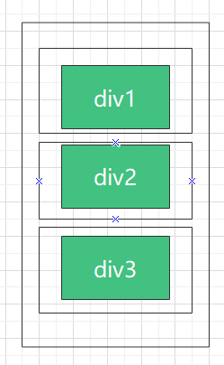

<blockquote style='padding: 10px; font-size: 1em; margin: 1em 0px; color: rgb(0, 0, 0); border-left: 5px solid rgba(0,189,170,1); background: rgb(239, 235, 233);line-height:1.5;'>
    <div>
        <div><i>But a thing isn't beautiful because it lasts.It's a privilege to be among them.</i></div>
        <div style="text-align:right;"><b>——Marvel·Vision</b></div>
    <div> 
    
</blockquote>

# 一、Space组件介绍
 
## 1.组件概述

<blockquote style='padding: 10px; font-size: 1em; margin: 1em 0px; color: rgb(0, 0, 0); border-left: 5px solid rgba(0,189,170,1); background: rgb(239, 235, 233);line-height:1.5;'>
    设置组件之间的间距。
</blockquote>


## 2.为什么需要这个组件
<blockquote style='padding: 10px; font-size: 1em; margin: 1em 0px; color: rgb(0, 0, 0); border-left: 5px solid rgba(0,189,170,1); background: rgb(239, 235, 233);line-height:1.5;'>
    <div>避免组件紧贴在一起，拉开统一的空间。1.适合行内元素的水平间距。2.可以设置各种水平对齐方式。</div>
</blockquote>

# 二、Space组件设计

<blockquote style='padding: 10px; font-size: 1em; margin: 1em 0px; color: rgb(0, 0, 0); border-left: 5px solid rgba(0,189,170,1); background: rgb(239, 235, 233);line-height:1.5;'>
    <div>总共只需要实现2个API：</div>
    <div>1.direction SPACE组件的间距方向。</div>
    <div>2.size SPACE组件的间距大小。</div>
</blockquote>



<blockquote style='padding: 10px; font-size: 1em; margin: 1em 0px; color: rgb(0, 0, 0); border-left: 5px solid rgba(0,189,170,1); background: rgb(239, 235, 233);line-height:1.5;'>
    如上图所示：如果没有space组件 正常情况下，三个div都是紧挨在一起的，有了space组件，三者之间相隔了统一的距离，其实就是在每个div子组件外层包裹了一个div。
</blockquote>

# 三、Space组件实战
```js

import React,{useContext } from 'react';
import classNames from '@packages/utils/classNames'; 
import PropTypes from 'prop-types';  
import childrenToArray from '@packages/utils/childrenToArray';
import capitalize from '@packages/utils/capitalize';
import {
    ConfigContext,
} from '@packages/core/ConfigProvider';  
import "./index.scss"; 

const spaceSize = {
    small: 8,
    default: 16,
    large: 24,
};

const Space=React.forwardRef((props,ref)=>{
    const {
        prefixCls:customizePrefixCls,
        className, 
        children,
        component:Component='div',
        direction="horizontal", 
        itemStyle,
        size="default"
    }=props;

    const prefixCls = useContext(ConfigContext)?.getPrefixCls("Space", customizePrefixCls);

    const items=childrenToArray(children);

    return (
        <Component ref={ref} className={classNames(
            prefixCls,className,
            direction?`${prefixCls}-${capitalize(direction)}`:`${prefixCls}-Horizontal`,
        )}>
            {
                items.map((child,i)=>(
                    <div 
                        className={`${prefixCls}-Item`}
                        key={`${prefixCls}-Item-${i}`}
                        style={
                            i === items.length - 1
                              ? {...itemStyle}
                              : {
                                  [direction === 'vertical' ? 'marginBottom' : 'marginRight']:
                                    typeof size === 'string' ? spaceSize[size] : size,
                                    ...itemStyle
                                }
                        }
                        
                    >
                        {child}     
                    </div>
                ))
            }
        </Component>
    )
});
 
export default Space;
```

# 四、Space组件设计核心要素

## 1.childrenToArray

<blockquote style='padding: 10px; font-size: 1em; margin: 1em 0px; color: rgb(0, 0, 0); border-left: 5px solid rgba(0,189,170,1); background: rgb(239, 235, 233);line-height:1.5;'>
    将children子元素转化成普通的数组方便遍历。
</blockquote>

```js
export default function childrenToArray(children){

    let ret=[];

    React.Children.forEach(children,(c)=>{
        ret.push(c);
    });

    return ret;

}
```

## 2.通过direction判断样式、size判断大小

```js
const spaceSize = {
    small: 8,
    default: 16,
    large: 24,
};
style={
                            i === items.length - 1
                              ? {...itemStyle}
                              : {
                                  [direction === 'vertical' ? 'marginBottom' : 'marginRight']:
                                    typeof size === 'string' ? spaceSize[size] : size,
                                    ...itemStyle
                                }
}
```

<blockquote style='padding: 10px; font-size: 1em; margin: 1em 0px; color: rgb(0, 0, 0); border-left: 5px solid rgba(0,189,170,1); background: rgb(239, 235, 233);line-height:1.5;'>
    <div>1.如果direction是vertical的话即垂直方向，使用marginBottom。如果是horizontal即水平方向时，使用marginRight。</div>
    <div>2.通过size的值获得大小值。</div>
    <div>3.space组件的最后一个元素不施加样式效果。</div>

</blockquote>