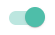

<blockquote style='padding: 10px; font-size: 1em; margin: 1em 0px; color: rgb(0, 0, 0); border-left: 5px solid rgba(0,189,170,1); background: rgb(239, 235, 233);line-height:1.5;'>
    <div>
        <div><i>You gave me a home.</i></div>
        <div style="text-align:right;"><b>——Marvel·Phoenix</b></div>
    <div> 
    
</blockquote>
 
# 一、Switch组件介绍

## 1.组件概述

<blockquote style='padding: 10px; font-size: 1em; margin: 1em 0px; color: rgb(0, 0, 0); border-left: 5px solid rgba(0,189,170,1); background: rgb(239, 235, 233);line-height:1;'>
   开关选择器。
</blockquote>

## 2.为什么需要这个组件

<blockquote style='padding: 10px; font-size: 1em; margin: 1em 0px; color: rgb(0, 0, 0); border-left: 5px solid rgba(0,189,170,1); background: rgb(239, 235, 233);line-height:1。5;'>
    1.需要表示开关状态/两种状态之间的切换时；<br />
    2.和 checkbox的区别是，切换 switch 会直接触发状态改变，而 checkbox 一般用于状态标记，需要和提交操作配合。
</blockquote>

# 二、Switch组件设计
  

## 原理解析



<blockquote style='padding: 10px; font-size: 1em; margin: 1em 0px; color: rgb(0, 0, 0); border-left: 5px solid rgba(0,189,170,1); background: rgb(239, 235, 233);line-height:1。5;'>
    一个最常用的表单元素组件之一，Switch组件分为2个部分。一个是圆球部分，一个是保持不变的一个块级div。
</blockquote> 

# 三、Switch组件实战

## 1、代码实战

```js
import React, { useEffect,useContext } from 'react';
import classNames from '@packages/utils/classNames'; 
import ButtonBase from '@packages/core/ButtonBase';
import useControlled from "@packages/hooks/useControlled";
import createChainedFunction from '@packages/utils/createChainedFunction';
import {
    ConfigContext
} from '@packages/core/ConfigProvider';
import capitalize from '@packages/utils/capitalize';
import Paper from '@packages/core/Paper';
import "./index.scss"; 

const Switch = React.forwardRef((props, ref) => {
    const {
        Component = "span", 
        prefixCls:customizePrefixCls,
        className,
        onChange: onChangeProp,
        defaultChecked,
        checked: checkedProp,
        value,  
        color="primary"
    } = props;

    const prefixCls=useContext(ConfigContext)?.getPrefixCls("Switch",customizePrefixCls);

    const [isChecked, setChecked] = useControlled({
        controlled: checkedProp,
        default: Boolean(defaultChecked)
    });

    const onChange = createChainedFunction(onChangeProp);

    const handleChangeSwitch = (event) => {
        const checkFlag = event.target.checked;
        setChecked(checkFlag);
        onChange?.(checkFlag, event);
    } 
 

    return (
        <label
            className={
                classNames(
                    prefixCls,className,
                    {
                        [`${prefixCls}-${capitalize(color)}`]:color,
                        [`${prefixCls}-Checked`]:isChecked
                    }
                )
            }
        > 
            <ButtonBase
                className={
                    classNames(
                        `${prefixCls}-BaseRipple`, 
                    )
                }
                centerRipple 
            >
                <Component
                    className={
                        classNames(
                            `${prefixCls}-BaseRipple-InputWrapper`,
                        )
                    }
                >
                    <input
                        type="checkbox"
                        className={
                            classNames(
                                `${prefixCls}-BaseRipple-InputWrapper-Input`
                            )
                        }
                        onChange={handleChangeSwitch} 
                        checked={isChecked}
                        name={name}
                        value={value}
                        ref={ref}
                    />

                    <Paper className={
                        classNames(
                            `${prefixCls}-BaseRipple-InputWrapper-Thumb`, 
                        )
                    } /> 

                </Component>
            </ButtonBase>

      
            <Component
                className={
                    classNames(
                        `${prefixCls}-FixBlock`,   
                    )
                }
            />  
        </label>
    )
})

export default Switch;
``` 

## 2、Switch组件的目录结构

```js
|-Switch.js 
|-index.js
|-index.scss
```

# 四、Switch组件设计核心要素

## 1.input[type="checkbox"]

```js
<input
    type="checkbox"
    className={
        classNames(
            `${prefixCls}-BaseRipple-InputWrapper-Input`
        )
    }
    onChange={handleChangeSwitch} 
    checked={isChecked}
    name={name}
    value={value}
    ref={ref}
/> 
```

<blockquote style='padding: 10px; font-size: 1em; margin: 1em 0px; color: rgb(0, 0, 0); border-left: 5px solid rgba(0,189,170,1); background: rgb(239, 235, 233);line-height:1。5;'>
为什么要使用checkbox，因为checkbox可以切换true和false2种状态。
</blockquote>


## 2.transform

<blockquote style='padding: 10px; font-size: 1em; margin: 1em 0px; color: rgb(0, 0, 0); border-left: 5px solid rgba(0,189,170,1); background: rgb(239, 235, 233);line-height:1.5;'>
    使用translate来实现switch的切换。
</blockquote>

```css
&.#{$prefixCls}-Checked{
        .#{$prefixCls}-FixBlock{ 
            background-color: currentColor;
        }
        .#{$prefixCls}-BaseRipple{
            color:currentColor;
            transform: translateX(20px);
        }
}
```

 