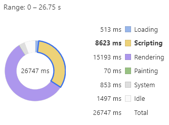
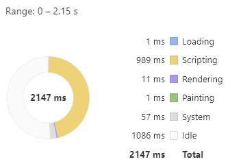
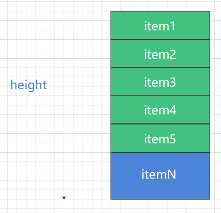
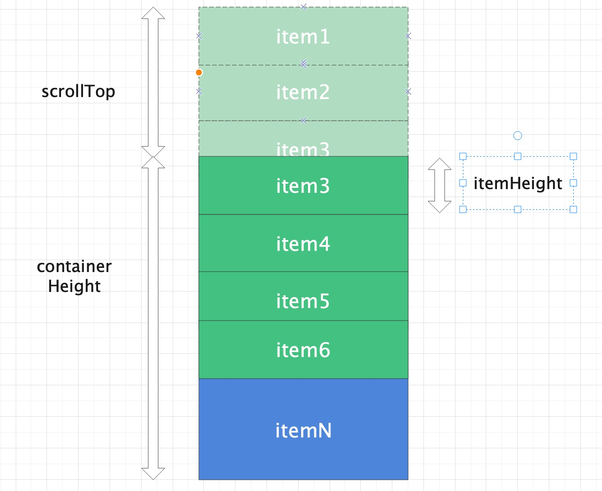
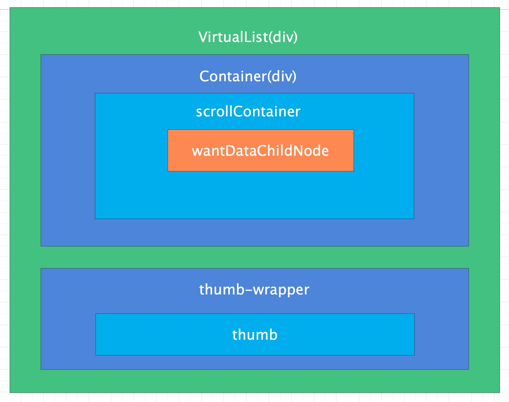

<blockquote style='padding: 10px; font-size: 1em; margin: 1em 0px; color: rgb(0, 0, 0); border-left: 5px solid rgba(0,189,170,1); background: rgb(239, 235, 233);line-height:1.5;'>
    <div>
        <div><i>I am a destiny.</i></div>
        <div style="text-align:right;"><b>——Marvel·Thanos</b></div>
    <div> 
    
</blockquote>
 
# 一、Virtual-List组件介绍

## 1.组件概述

<blockquote style='padding: 10px; font-size: 1em; margin: 1em 0px; color: rgb(0, 0, 0); border-left: 5px solid rgba(0,189,170,1); background: rgb(239, 235, 233);line-height:1;'>
    根据上文，虚拟列表是按需显示思路的一种实现，即虚拟列表是一种根据滚动容器元素的可视区域来渲染长列表数据中某一个部分数据的技术。
</blockquote>

## 2.为什么需要这个组件

```js
//不使用虚拟列表
{new Array(100000).fill("").map((_,index)=>index+1).map(index=> <div style={{backgroundColor:`rgba(${Math.floor(Math.random()*255)},${Math.floor(Math.random()*255)},${Math.floor(Math.random()*255)},1)`}}>
                <div><div><div>{index}</div></div></div>
                <div><div><div>{index}</div></div></div>
                <div><div><div>{index}</div></div></div>
            </div>)}
//使用虚拟列表
<VirtualList data={new Array(100000).fill("").map((_,index)=>index+1)} height={800} itemHeight={30} itemKey="id">
                {index=> <div style={{backgroundColor:`rgba(${Math.floor(Math.random()*255)},${Math.floor(Math.random()*255)},${Math.floor(Math.random()*255)},1)`}}>
                    <div><div><div>{index}</div></div></div>
                    <div><div><div>{index}</div></div></div>
                    <div><div><div>{index}</div></div></div>
                </div>} 
            </VirtualList>
```

<blockquote style='padding: 10px; font-size: 1em; margin: 1em 0px; color: rgb(0, 0, 0); border-left: 5px solid rgba(0,189,170,1); background: rgb(239, 235, 233);line-height:1。5;'>
    列表形态的数据格式是一种非常常见的数据展示格式。 <br />
    如果某用户需要有10000条数据在客户端进行展示，那么会产生什么影响呢？<br />
    如上代码：<br />
    1.第一种情况下：在不使用虚拟列表时，浏览器渲染100000条数据时,如下图所示,总渲染时间超过25s，在页面上表现得非常卡顿，这对于用于的体验来说是致命的。<br />
    <br />
    2.在第二种情况下：在使用虚拟列表时，浏览器渲染100000条数据时，如下图所示，总渲染事件仅仅花了1s，在页面上表现的十分流程，并没有卡顿感。<br />
    <br />
</blockquote>

# 二、Virtual-List组件设计
  

## 原理解析

<blockquote style='padding: 10px; font-size: 1em; margin: 1em 0px; color: rgb(0, 0, 0); border-left: 5px solid rgba(0,189,170,1); background: rgb(239, 235, 233);line-height:1。5;'>
    虚拟列表本质上是按需渲染。按需渲染是指根据容器元素的高度以及列表项元素的高度来渲染数据。<br >
    <br />
    如上图所示，假设容器元素的高度是500px,而列表项元素的height是50px,那么容器元素内此时最多可以显示10个元素项，也就是说当元素初始化的时候，实际上我们只需要渲染十条数据，而不是1000个数据项。<br />
</blockquote> 

```js
//初始化渲染数据
const wantData=originData.splice(0,Math.ceil(containerHeight/itemHeight));
```

<blockquote style='padding: 10px; font-size: 1em; margin: 1em 0px; color: rgb(0, 0, 0); border-left: 5px solid rgba(247, 31, 85,1); background: rgb(239, 235, 233);line-height:1。5;'>
1.wantData:代表需要展示的数据。<br />
2.originData:代表原始的数据。<br />
3.containerHeight:代表容器元素高度。<br />
4.itemHeight:表示列表项高度。<br />
5.scrollTop:表示容器元素Y轴滚动值。  
</blockquote> 

<blockquote style='padding: 10px; font-size: 1em; margin: 1em 0px; color: rgb(0, 0, 0); border-left: 5px solid rgba(0,189,170,1); background: rgb(239, 235, 233);line-height:1。5;'>
    如下图所示，当元素滚动位置如上图所示时：根据前面的计算，此时在容器元素内所能展示的第一个数据项应该是 3，最后一个数据项应该是 13 而不是 12，因为列表项元素 3 是只是部分隐藏了。那么，此时根据 originalData 进行对应的数据项截取即可。
    <br />
</blockquote> 

```js
const from=Math.floor(scrollTop/itemHeight);
const to=Math.ceil((scrollTop+containerHeight)/itemHeight); 
const wantData = originalData.slice(from, to)
```

<blockquote style='padding: 10px; font-size: 1em; margin: 1em 0px; color: rgb(0, 0, 0); border-left: 5px solid rgba(0,189,170,1); background: rgb(239, 235, 233);line-height:1。5;'>
    这里我们大概就简述完了我们虚拟滚动的大部分内容。
</blockquote> 


# 三、Virtual-List组件设计核心要素

## 1.组件框架结构大体简述




<blockquote style='padding: 10px; font-size: 1em; margin: 1em 0px; color: rgb(0, 0, 0); border-left: 5px solid rgba(0,189,170,1); background: rgb(239, 235, 233);line-height:1。5;'>
    在这里我们要设计这个组件分为2个部分：虚拟列表的主体部分container、滚动条thumb。既然我们需要自己实现虚拟滚动，那么浏览器原生的滚动条必然满足不了我们的需求。
    <br />
    <br />
    VirtualList是组件的最外层的div，主要是为了放置组件的2个主要部分的div的，可以设置<i>position:"relative"</i>为滚动条提供一个父元素定位，滚动条实现时可以使用<i>position:"absolute"</i>很方便实现定位。
    <br />
    <br />
    Container是我们前章节中提到一个高度容器，这里我们设置一个固定高度：<i>height:props.height</i>,因为这里的滚动条我们自己实现，所以我们使用<i>overflow:hidden</i>来隐藏滚动条。
    <br />
    <br />
    ScrollContainer是一个高度为所有元素总高度的一个容器：这里我们需要设置一个<i>height:item.length*item.width</i>,同时为了实现元素向上移动，向下移动时有那种平移的效果，我们需要设置<i>transform:translateY(srollTop px)</i>
    <br />
    <br />
    WantDataChildNode则是我们实际需要在页面渲染的节点，每次滚动条滚动都需要重新渲染新的节点。
    <br />
    <br />
    Thumb-Wrapper是滚动条的容器，一般就是滚动条所在的那个在浏览器右侧的滚动条垂直容器。
    <br />
    <br />
    Thumb是我们的滚动条，这里我们需要实现可以移动滚动条实现列表的滚动、点击滚动条所在容器可以实现列表的移动、在滚轮一定时间内没有滚动或者没有没有拖动滚动条时，滚动条自己隐藏/显示等。
</blockquote> 

<blockquote style='padding: 10px; font-size: 1em; margin: 1em 0px; color: rgb(0, 0, 0); border-left: 5px solid rgba(0,189,170,1); background: rgb(239, 235, 233);line-height:1。5;'>
    根据前文我们可以得出虚拟列表的大致代码结构如下：
</blockquote> 

```js

import React ,{ useContext } from 'react';
import PropTypes from 'prop-types'; 
import {
    ConfigContext
} from '@packages/core/ConfigProvider';
import classNames from '@packages/utils/classNames';
import "./index.scss";

const List=React.forwardRef((props,ref)=>{

    const {
        height,
        prefixCls:customizePrefixCls
    }=props;

    const preficCls=useContext(ConfigContext)?.getPrefixCls("VirtualList",customizePrefixCls);

    const containerStyle={
        height,
        overflow:"hidden"
    };

    return <div className={preficCls} style={{position:"relative"}}>

        <div className={`${preficCls}-Container`} style={containerStyle}>
            <div ></div>
        </div>

        <div className={`${prefixCls}-ThumbWrapper`} style={{position:"absolute",width:8,right:0,top:0,bottom:0}}>
            <div className={`${prefixCls}-Thumb`}></div>
        </div>


    </div>
});

List.propTypes = {
    //显示区域的容器高度
    height:PropTypes.oneOfType([
        PropTypes.string,
        PropTypes.number
    ])
};

export default List;
```

## 2.初始化时应该需要怎么处理？

<blockquote style='padding: 10px; font-size: 1em; margin: 1em 0px; color: rgb(0, 0, 0); border-left: 5px solid rgba(0,189,170,1); background: rgb(239, 235, 233);line-height:1.5;'>
    我们回想一下，如果在不使用虚拟列表的情况下，无论是初次渲染还是后期的渲染都会花费巨大的时间，这是为什么呢？
    <br />
    <br />
    因为浏览器每次都要渲染100000个节点，那么我们在初次渲染时就必须控制住渲染节点的数量，那么如何控制渲染节点的数量是我们需要实现的重中之重，默认情况下列表未滚动，也就是scrollTop=0，如果需要计算出初次渲染需要渲染的节点数，必然要结合容器高度和列表的高度：<i>初次渲染节点数=容器高度/单个列表高度</i>。
    <br />
    <br />
    但是在未渲染节点时，我们是无法获取列表的高度的，这个时候itemHeight的属性就起到了关键性作用，即如果在列表没有渲染到页面上时，使用itemHeight来替代单个列表的高度。
</blockquote> 
  