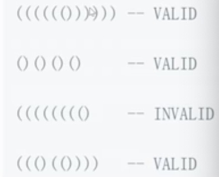

# 第一章 简介

## 1.数据结构与算法是什么？

### 1.数据结构：计算机存储、组织数据的方式，就像锅碗瓢盆。
### 2.算法：一系列解决问题的清晰指令，就像食谱。
### 3.程序=数据结构+算法。
### 4.数据结构为算法提供服务，算法围绕数据结构操作。
### 5.栈、队列、链表有序的连成一串
### 6.集合、字典无序
### 7.树、堆、图有一定的连接关系


# 第二章 时间复杂度和空间复杂度

## 1.时间复杂度是什么？

### 1.一个函数，用大O表示，比如O(1)、O(n)....

### 2.定性描述该算法的运行时间

### 3.时间复杂度O(1)
因为每次执行代码文件 代码永远只会被执行一次 所以时间复杂度为O(1)

```js
let i=0;
i+=1;
```

### 4.时间复杂度O(n)

因为每次执行代码文件 for循环里面的代码被执行n次 所以时间复杂度为O(n)

```js
for(let i=0;i<n;i++){
    console.log(i);
}
```

### 5.时间复杂度O(1)+O(n)=O(n)

如果前后代码执行的复杂度不同，那么整个时间复杂度取增长趋势更快的复杂度，如下： 复杂度为O(n)

```js
let i=0;
i+=1;
for(let i=0;i<n;i++){
    console.log(i);
}
```

### 6.时间复杂度O(n)+O(n)=O(n^2)

如下 相乘时间复杂度

```js
for(let i=0;i<n;i+=1){
    for(let j=0;j<n;j+=1){
        console.log(i,j);
    }
}
```

### 7.时间复杂度O(logN)

```js
let i=1;
while(i<n){
    console.log(i);
    i*=2;
}
```


## 2.空间复杂度是什么？

### 1.一个函数，用大O表示，比如O(1)、O(n)、O(n^2)

### 2.算法在运行过程中临时占用存储空间大小的度量


### 3.空间复杂度O(1)
因为它只声明了单个变量 单个变量所占用的内存永远是1个 永远是恒定的内存

```js
let i=0;
i+=1;
```

### 4.空间复杂度O(n)

给数组添加了多个值，相当于给内存添加了多个内存单元 

```js
const list=[];
for(let i=0;i<n;i++){
    list.push(i);
}
```

### 5.空间复杂度O(n^2)

```js
const matrix=[];
for(let i=0;i<n;i++){
    matrix.push([]);
    for(let j=0;j<n;j+=1){
        matrix[i].push(j);
    }
}
```

# 第三章 栈简介

## 栈是什么？

### 1.一个后进先出的数据结构

### 2.Javascript中没有栈，但可以用Array实现栈的所有功能

## 什么场景下使用栈

### 1.需要后进先出的场景

十进制转二进制、判断字符串的括号是否有效、函数调用堆栈

### 2.十进制转二进制

### 3.有效的括号



>越靠后的座括号 对应的右括号

>左括号入栈，右括号出栈 最后栈空了就是合法的

### 4.函数调用堆栈

>最后调用的函数 最先执行完

>JS解释器使用栈来控制函数的调用顺序

## LeetCode20 有效的括号

解题思路：

> 1.新建一个栈

> 2.扫描字符串，遇到左括号入栈，遇到和栈顶括号类型匹配的右括号就出栈 类型不匹配直接判断不合法

> 3.最后栈空了就合法 否则不合法


# 第三章 队列简介